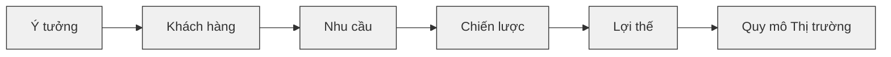
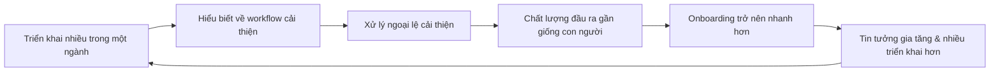

# Day 16 - Chiến lược Sản phẩm AI & Phân tích Thị trường

> **Câu hỏi cốt lõi:** *"Làm sao đi từ một ý tưởng ban đầu đến một sản phẩm có cơ hội thắng thật sự?"*

---

### 🗺️ 1. Bản đồ Kiến thức Sản phẩm AI (AI Product Knowledge Map)

Để hiểu rõ quy trình từ ý tưởng đến sản phẩm, chúng ta cần nắm vững các yếu tố sau:

---

### 📌 2. Nguyên tắc Cốt lõi (Core Principles)

- **Tôn trọng ý tưởng:** Tôn trọng ý tưởng ban đầu, nhưng đừng vội tin vào phiên bản định nghĩa sản phẩm đầu tiên của nó.
- **Khách hàng:** Xác định khách hàng mục tiêu một cách cụ thể và rõ ràng.
- **Nhu cầu:** Nhu cầu thực sự phải được xác định dựa trên những vấn đề mà khách hàng đang gặp phải, không chỉ là xu hướng công nghệ.

---

### 📐 3. Định nghĩa Khách hàng (Customer Definition)

#### 3.1. Định nghĩa Khách hàng Kém (Bad Customer Definition)
- **Ví dụ:** "Bất kỳ doanh nghiệp nào có hotline"
- **Vấn đề:** Quá rộng và không cụ thể.

#### 3.2. Định nghĩa Khách hàng Tốt (Better Customer Definition)
- **Ví dụ:** "Nhà xe thường xuyên nhỡ cuộc gọi giờ cao điểm"
- **Lý do mạnh hơn:** 
  - Workflow lặp lại
  - Mất doanh thu rõ ràng
  - Cấp bách rõ ràng

---

### 🔍 4. Xác định Nhu cầu (Need Identification)

#### 4.1. Nhu cầu Thực sự (Real Need)
- **Quy tắc:** Nhu cầu thực sự phải tồn tại ngay cả khi không có AI.
- **Ví dụ:** "Mất doanh thu khi bị nhỡ cuộc gọi."

#### 4.2. Viết lại Nhu cầu theo JTBD (Jobs To Be Done)
- **Công thức:** Khi [tình huống], tôi muốn [động cơ], để tôi có thể [kết quả mong muốn].
- **Ví dụ:** "Khi lượng cuộc gọi tăng đột biến và tổng đài bị quá tải, nhà xe muốn vẫn tiếp nhận được cuộc gọi của khách đúng nghiệp vụ, để không mất doanh thu vé chỉ vì không nghe máy kịp."

---

### 🛠️ 5. Chiến lược Sản phẩm (Product Strategy)

#### 5.1. Câu tuyên bố Chiến lược (Strategy Statement)
- **Công thức:** Đối với [khách hàng mục tiêu] mà gặp khó khăn với [nhu cầu chưa được phục vụ], sản phẩm của chúng tôi giúp họ [kết quả cốt lõi] thông qua [cách tiếp cận đặc biệt], không giống như [các lựa chọn hiện tại], vì chúng tôi có thể tận dụng [lợi thế].

#### 5.2. Giả thuyết Lợi thế (Moat Hypothesis)
- **Ví dụ:** Vòng lặp học theo ngành giúp cải thiện chất lượng đầu ra và tăng tốc độ onboarding.

---

### 📊 6. Quy mô Thị trường (Market Size)

#### 6.1. Định nghĩa TAM / SAM / SOM
| Thuật ngữ | Cách hiểu làm việc |
|-----------|---------------------|
| **TAM**   | Tổng không gian thị trường nếu bài toán được phục vụ toàn diện. |
| **SAM**   | Phần thị trường phù hợp với segment và phạm vi hiện tại. |
| **SOM**   | Phần thực tế có thể giành được trong ngắn hạn. |

---

### ✅ 7. Đầu ra Bắt buộc (Mandatory Outputs)

Trước khi kết thúc Day 16, mỗi nhóm cần có:
1. Ý tưởng được diễn giải lại
2. Customer / Segment Card
3. 2-3 nhu cầu chưa được phục vụ với bằng chứng
4. 1 câu tuyên bố chiến lược
5. 1 giả thuyết lợi thế
6. 1 cái nhìn ban đầu về TAM / SAM / SOM
7. 1 ghi chú định vị ngắn gọn cho Day 17

---

### 🚀 8. Kết nối đến Day 17

- **Day 16 đã trả lời:**
  - Cơ hội thực sự phía sau ý tưởng
  - Khách hàng đầu tiên là ai
  - Nhu cầu thực sự là gì
  - Nước đi sản phẩm đúng
  - Lợi thế có thể gia tăng theo thời gian
  - Thị trường có đáng để theo đuổi không

- **Day 17 sẽ trả lời:**
  - Chúng ta sẽ xây dựng cái gì trước?
  - Những gì sẽ vào MVP?
  - Cách viết PRD như thế nào?
  - Những giả thuyết nào cần xác thực?

> **Cảm ơn!**  
> Hẹn gặp lại tại Day 17.