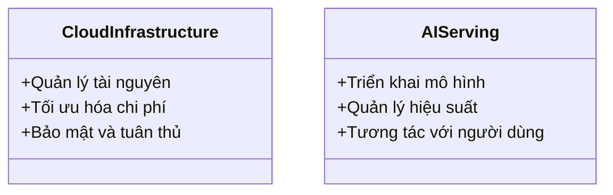

# Day 16 - Hạ Tầng Cloud cho AI (Cloud Infrastructure for AI)

> **Câu hỏi cốt lõi:** *"Bạn đã từng triển khai mô hình lên cloud chưa? Quyết định nào phù hợp với stack AI của bạn?"*

---

### 🗺️ 1. Bản đồ Kiến thức Hạ Tầng Cloud cho AI (Knowledge Map)

#### 1.1. So sánh Cloud Providers cho AI
Mỗi nhà cung cấp cloud có những ưu điểm và nhược điểm riêng, phù hợp với các loại workload khác nhau:

| Provider    | GPU Flagship                   | Điểm Mạnh                                                 | Khi Nào Chọn                                     |
| :---------- | :----------------------------- | :-------------------------------------------------------- | :----------------------------------------------- |
| AWS         | P5 (H100 8x), P5e (H200)       | Ecosystem rộng nhất, Bedrock, SageMaker HyperPod          | Broadest ecosystem + enterprise compliance       |
| GCP         | A3 Mega (H100 8x), TPU v5p     | PyTorch/JAX, GKE GPU auto-provisioning, Vertex AI         | Heavy PyTorch training + TPU interest            |
| Azure       | ND H100 v5, ND H200 v5         | OpenAI Service exclusive, Prompt Flow LLMOps              | Microsoft stack + OpenAI API                     |
| VN Cloud    | T4/V100 (Viettel, VNG, FPT)    | Giá 60-70% global, data residency NĐ13                    | Compliance NĐ13, data residency                  |
| Specialized | H100/H200 (Lambda, RunPod)     | Rẻ hơn 40–70%, pure GPU, GMI Cloud $2.10/hr H100           | Cost-sensitive + team có infra skills            |

#### 1.2. Mô Hình Cloud cho AI Workloads
Phân loại các mô hình cloud dựa trên mức độ quản lý và kiểm soát:

| AI-aaS    | OpenAI API / Bedrock / Vertex AI (pay-per-token)          | Nhanh nhất, không cần infra         |
| :-------- | :-------------------------------------------------------- | :---------------------------------- |
| PaaS      | SageMaker / Azure ML / AI Platform (managed training + serving) | Managed scaling, ít ops             |
| IaaS      | EC2 GPU / GCE / Azure VM (full control, self-manage)     | Full GPU control, cần ops           |
| Physical  | On-premise / Colocation (max control, max effort)         | Max control, max effort             |

---

### 📌 2. Khái niệm Cơ bản & Từ khóa Nền tảng (Core Concepts & Glossary)

| Thuật ngữ | Khái niệm Kỹ thuật & Bản chất | Tại sao cần quan tâm? |
| :--- | :--- | :--- |
| **GPU Instance Types** | Các loại GPU khác nhau với thông số kỹ thuật và chi phí khác nhau. | Lựa chọn GPU phù hợp giúp tối ưu hóa chi phí và hiệu suất cho các tác vụ AI. |
| **Terraform** | Công cụ Infrastructure as Code (IaC) cho phép quản lý hạ tầng cloud. | Giúp tự động hóa việc triển khai và quản lý hạ tầng, giảm thiểu lỗi do con người. |
| **Container Orchestration** | Quản lý và tự động hóa việc triển khai, mở rộng và quản lý container. | Đảm bảo tính sẵn sàng và khả năng mở rộng cho các ứng dụng AI. |
| **Networking & Storage Strategy** | Chiến lược kết nối và lưu trữ dữ liệu cho các ứng dụng AI. | Tối ưu hóa hiệu suất và chi phí cho việc truyền tải và lưu trữ dữ liệu. |

---

### 📐 3. Quy tắc, Công thức & Tham số Kỹ thuật (Hard Rules & Formulas)

#### 3.1. Chi phí GPU theo loại
| GPU    | VRAM         | Giá/hr      | Bandwidth  | Use Case                     |
| :----- | :----------- | :---------- | :--------- | :--------------------------- |
| T4     | 16 GB        | $0.35       | 320 GB/s   | Inference nhỏ (≤7B)          |
| H100   | 80 GB HBM3   | $2.99–4.31  | 3.35 TB/s  | Pre-training (giảm từ $8.0!) |

#### 3.2. Quy tắc chọn GPU
- **Inference:** Sử dụng T4 hoặc L40S cho các mô hình nhỏ.
- **Fine-tuning:** Sử dụng A100 cho các mô hình trung bình.
- **Pre-training:** Sử dụng H100 cho các mô hình lớn.

---

### 💻 4. Hành trang Kỹ thuật & Mã nguồn (Technical Hands-on)

#### 4.1. Terraform cho AI Stack
```hcl
resource "aws_instance" "gpu" {
  instance_type = "g5.xlarge"
  ami           = "ami-nvidia-cuda-12"

  root_block_device {
    volume_size = 200
    volume_type = "gp3"
  }

  tags = { Name = "ai-inference" }
}
```

#### 4.2. Triển khai Kubernetes cho AI Serving
```mermaid
graph LR
    Client --> Ingress_ALB;
    Ingress_ALB[Ingress / ALB] --> K8sCluster;

    subgraph K8sCluster
        vLLM_Pod_1(vLLM Pod<br>GPU: 1 A10G)
        vLLM_Pod_2(vLLM Pod<br>GPU: 1 A10G)
        SGLang_Pod(SGLang Pod<br>GPU: 1 H100)

        HPA(HPA<br>GPU metrics)
        GPU_Operator(GPU Operator<br>(NVIDIA))
        Karpenter(Karpenter<br>Auto-provision)

        vLLM_Pod_1 --> HPA;
        vLLM_Pod_2 --> HPA;
        SGLang_Pod --> HPA;

        GPU_Operator --> vLLM_Pod_1;
        GPU_Operator --> vLLM_Pod_2;
        GPU_Operator --> SGLang_Pod;

        Karpenter --> GPU_Operator;

        S3_Model_Weights[(S3 Model Weights<br>(Init container pre-download))];
    end
```

---

### 🧠 5. Tư duy Chuyển dịch: Từ Cloud Infrastructure đến AI Serving

Sự chuyển dịch từ hạ tầng cloud đến việc phục vụ AI yêu cầu sự hiểu biết sâu sắc về các lớp hạ tầng và cách chúng tương tác với nhau.



> [!WARNING]  
> **Cảnh báo quan trọng:** Việc lựa chọn cloud provider và cấu hình hạ tầng không chỉ ảnh hưởng đến chi phí mà còn đến hiệu suất và khả năng mở rộng của ứng dụng AI. Hãy cân nhắc kỹ lưỡng trước khi quyết định.

---

### 🔑 6. Tổng Kết – Key Takeaways

1. **Lựa chọn cloud provider** phụ thuộc vào loại workload và yêu cầu tuân thủ.
2. **Terraform/Pulumi** giúp quản lý hạ tầng cloud một cách hiệu quả và có thể tái sử dụng.
3. **Serving stack 2026** bao gồm các công nghệ như vLLM, SGLang, và LMDeploy, phù hợp với từng use case cụ thể.

---

### 📅 7. Tiếp Theo & Bài Tập

**Ngày 17: Data Pipeline Engineering**  
"Airflow DAGs, Kafka streaming, ETL/ELT cho AI data — xây pipeline không để data bẩn phá model."

> **Bài Tập & Chuẩn Bị:**
> - Hoàn thành Lab 16: Cloud AI Environment Setup.
> - Cài đặt Docker Compose cho Airflow (pre-lab N17).
> - Đọc trước: Apache Airflow TaskFlow API docs.

--- 

Cảm ơn bạn đã tham gia buổi học hôm nay!