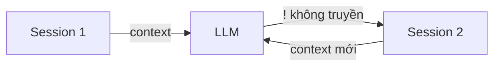
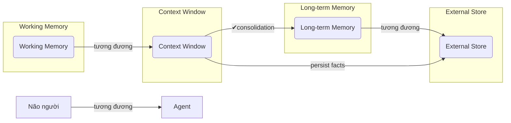
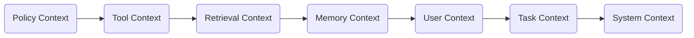
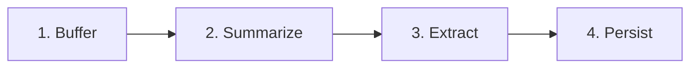
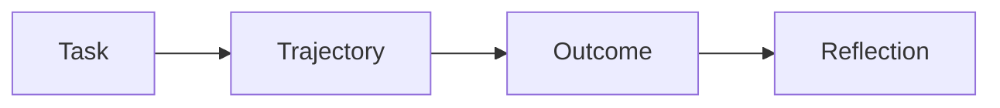
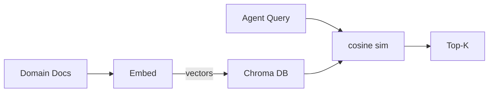

# Day 17 - Memory Systems for Agents

> **Câu hỏi cốt lõi:** *"Tại sao agent của bạn quên mọi thứ sau mỗi conversation – và làm sao fix nó đúng cách?"*

---

### 🗺️ 1. Bản đồ Kiến thức Hệ thống (Structured Knowledge Map)

Để hiểu rõ về hệ thống bộ nhớ cho agents, chúng ta sẽ khám phá các khía cạnh sau:

#### 1.1. Tại sao Agent “quên”?
- **Context Window:** Giới hạn dung lượng bộ nhớ tạm thời (~128K tokens).
- **Stateless Agents:** Mỗi API call là một request độc lập, không có persistent state.



#### 1.2. Analogy: Bộ nhớ Agent giống não người
- **Context Window = RAM:** Nhanh, tạm thời.
- **External Store = Ổ cứng:** Chậm hơn, bền vững, gần như vô hạn (Redis, Vector DB).



---

### 📌 2. Khái niệm Cơ bản & Từ khóa Nền tảng (Core Concepts & Glossary)

| Thuật ngữ | Khái niệm Kỹ thuật & Bản chất | Tại sao cần quan tâm? |
| :--- | :--- | :--- |
| **Context Window** | Bộ nhớ tạm thời cho các cuộc hội thoại hiện tại. | Giới hạn khả năng nhớ của agent trong mỗi session. |
| **External Store** | Bộ nhớ bền vững lưu trữ thông tin qua các session. | Cung cấp khả năng nhớ lâu dài cho agent. |
| **Short-term Memory** | Bộ nhớ tạm thời, chứa thông tin gần nhất. | Giúp agent phản hồi nhanh chóng trong cuộc hội thoại. |
| **Long-term Memory** | Bộ nhớ lưu trữ thông tin bền vững. | Giúp agent nhớ các thông tin quan trọng qua các session. |
| **Episodic Memory** | Lưu trữ các trải nghiệm có thứ tự. | Giúp agent học từ các tình huống trước đó. |
| **Semantic Memory** | Lưu trữ kiến thức chung và thông tin ngữ nghĩa. | Cung cấp thông tin nền tảng cho agent. |

---

### 📐 3. Quy tắc, Công thức & Tham số Kỹ thuật (Hard Rules & Formulas)

#### 3.1. 7 Context Layers – Kiến trúc thông tin cho Agent
- **Policy Context:** Quy tắc an toàn.
- **Tool Context:** Kết quả từ các công cụ.
- **Retrieval Context:** Kết quả từ RAG.
- **Memory Context:** Thông tin đã nhớ.
- **User Context:** Thông tin người dùng.
- **Task Context:** Mục tiêu và hướng dẫn.
- **System Context:** Persona và ràng buộc.



#### 3.2. Token Budget – Phân bổ context window
- **10%** Short-term memory
- **4%** Long-term facts
- **3%** Episodic memory
- **3%** Semantic knowledge

---

### 💻 4. Hành trang Kỹ thuật & Mã nguồn (Technical Hands-on)

#### 4.1. Memory Management Flow
- **Buffer → Summarize → Store:** Chỉ ghi nhớ sau khi hoàn thành nhiệm vụ.



#### 4.2. LangGraph Memory State – Code-Level
```python
class MemoryState(TypedDict):
    messages: list[BaseMessage]
    user_profile: dict         # long-term
    episodes: list[dict]       # episodic
    semantic_hits: list[str]   # semantic
    memory_budget: int         # tokens left

def retrieve_memory(state):
    query = state["messages"][-1].content
    return {
        "user_profile": redis.hgetall(uid),
        "episodes": find_similar(query, k=3),
        "semantic_hits": chroma.query(query),
    }
```

---

### 🧠 5. Tư duy Chuyển dịch: Từ Agent Truyền thống đến Agent Thông minh

#### 5.1. Episodic Memory – Learning từ Past Trajectories
- Lưu tuple mỗi episode: (task, trajectory, outcome, reflection).



#### 5.2. Semantic Memory – Vector DB cho Knowledge Retrieval
- Encode domain knowledge → embeddings → Chroma/Pinecone.



---

### 🔍 6. Tổng kết – Key Takeaways
1. Không có “one size fits all" – production agent cần ít nhất short-term + long-term.
2. Memory retrieval quality quyết định agent quality – bad retrieval = irrelevant context.
3. Memory write-back cần careful design: nhớ gì, khi nào ghi, xử lý conflict ra sao.
4. Privacy không phải afterthought – GDPR compliance cần thiết kế từ đầu.

---

### 📅 7. Tiếp theo & Bài tập
- Hoàn thành Lab 17: Multi-Memory Agent + benchmark.
- Đọc: Anthropic "Building Effective Agents” (mục Context Engineering).

---

### 💬 8. Hỏi & Đáp
- Memory nào là “must-have” cho production agent?
- Khi nào thì dùng framework (Mem0, Zep) vs tự build?