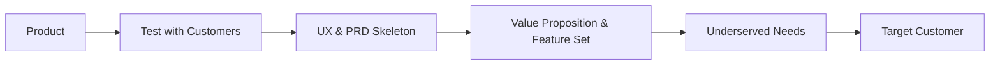

# Day 17 - PRD & Product Market Fit

> “The only thing that matters is getting to product/market fit.”  
> — Marc Andreessen

---

### 🗺️ 1. Bản đồ Kiến thức Hệ thống (Structured Knowledge Map)

Hành trình xây dựng sản phẩm từ chiến lược đến sản phẩm có thể đo lường được được thể hiện qua các tầng trong Lean Product Pyramid:

---

### 📌 2. Khái niệm Cơ bản & Từ khóa Nền tảng (Core Concepts & Glossary)

| Thuật ngữ | Khái niệm Kỹ thuật & Bản chất | Tại sao cần quan tâm? |
| :--- | :--- | :--- |
| **MVP (Minimum Viable Product)** | Sản phẩm tối thiểu có thể ra mắt để kiểm chứng giả thuyết cốt lõi. | Giúp tiết kiệm thời gian và chi phí, đồng thời kiểm tra nhanh chóng nhu cầu thị trường. |
| **PRD (Product Requirements Document)** | Tài liệu mô tả các yêu cầu sản phẩm, không phải kỹ thuật. | Là công cụ đồng thuận giữa các bên liên quan về "Cái gì" và "Tại sao". |
| **PMF (Product-Market Fit)** | Tình trạng khi sản phẩm đáp ứng nhu cầu của thị trường một cách hiệu quả. | Đo lường thành công và khả năng phát triển của sản phẩm. |
| **Hypothesis Testing** | Quy trình kiểm tra giả thuyết về tính năng sản phẩm. | Giúp xác định tính khả thi và giá trị của các tính năng trước khi phát triển. |

---

### 📐 3. Quy tắc, Công thức & Tham số Kỹ thuật (Hard Rules & Formulas)

#### 3.1. Công thức Giả thuyết
Chúng tôi tin rằng **[Tính năng X]** sẽ giúp **[Nhóm khách hàng Y]** đạt được **[Kết quả Z]**.  
Chúng tôi sẽ biết mình đúng khi thấy **[Chỉ số Metric M]** đạt **[Ngưỡng Threshold T]**.

#### 3.2. Đo lường PMF
| Chỉ số | Cách đo | Ngưỡng PMF |
|---|---|---|
| Sean Ellis Test | “Bạn thất vọng thế nào nếu không còn dùng được sản phẩm?” | >40% “Rất thất vọng” |
| Retention Rate | Tỷ lệ giữ chân sau N ngày/tháng | D30 >10% (B2C), D30 >30% (SaaS) |
| Actionable Metric | Số lượng hành vi cốt lõi mang lại giá trị thực | Tùy sản phẩm |

---

### 💻 4. Hành trang Kỹ thuật & Mã nguồn (Technical Hands-on)

#### 4.1. MVP Boundary Template
Xác định ranh giới MVP của ý tưởng của bạn:

*   **In-Scope**: Tính năng cốt lõi bắt buộc để test giả thuyết.
*   **Out-of-Scope**: Tính năng tốt nhưng không cần cho MVP.
*   **Non-Goals**: Ranh giới đỏ — sản phẩm sẽ KHÔNG làm.

> **Kill question**: Cắt thêm 1 tính năng trong In-Scope, khách hàng còn nhận được giá trị cốt lõi không?  
> Nếu CÓ → chuyển sang Out-of-Scope.

#### 4.2. PRD Skeleton Template
| | |
|---|---|
| **Problem** | (1 câu) ................................................................................ |
| **Target User** | (Ai?) ................................................................................. |
| **User Story #1** | As a ............................ I want ............................ so that ............................ |
| **User Story #2** | As a ............................ I want ............................ so that ............................ |

**AI-Specific (bắt buộc):**
| | |
|---|---|
| **Model Selection** | Tại sao chọn model này? .............................................................................. |
| **Data Source** | Lấy dữ liệu từ đâu? .................................................................................. |
| **Fallback UX** | Khi AI sai / không tự tin → .......................................................................... |

---

### 🧠 5. Tư duy Chuyển dịch: Từ Ý Tưởng đến Bản Thiết Kế (Mindset Shift)

Sự chuyển mình từ ý tưởng đến sản phẩm thực tế yêu cầu sự rõ ràng trong từng bước:

| **Day 16 đã trả lời** | **Day 17 đã trả lời** |
|---|---|
| ✔ Customer Segment & Need Map | ✔ MVP Boundary Sheet |
| ✔ Value Proposition & Strategy | ✔ PRD Skeleton + Fallback UX |
| ✔ Moat Hypothesis | ✔ Hypothesis Table |
| ✔ Initial Market Sizing | ✔ PMF Scorecard |

---

### 💡 6. Kết luận

Hãy lưu kỹ 5 tài liệu này — đây là hành trang bước vào giai đoạn build thực tế.  
Chúc các bạn xây dựng được sản phẩm thật sự giá trị!