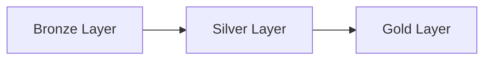
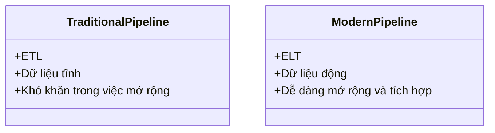

# Day 17 - Xây Dựng Đường Ống Dữ Liệu (Data Pipeline Engineering)

> **Câu hỏi cốt lõi:** *"Pipeline của bạn đang nuôi model, hay đang đầu độc nó?"*

---

### 🗺️ 1. Bản đồ Kiến thức Hệ thống (Structured Knowledge Map)

Để hiểu rõ về cách xây dựng đường ống dữ liệu hiệu quả cho AI, chúng ta sẽ khám phá các khía cạnh chính của pipeline:

#### 1.1. Quy trình ETL vs ELT
- **ETL (Extract, Transform, Load):** Truyền thống, dữ liệu được trích xuất, biến đổi và sau đó tải lên kho dữ liệu.
- **ELT (Extract, Load, Transform):** Dữ liệu được trích xuất và tải lên kho dữ liệu trước, sau đó mới được biến đổi. Đây là phương pháp hiện đại, thường được sử dụng trong môi trường đám mây.

#### 1.2. Kiến trúc Medallion
- **Bronze:** Dữ liệu thô, không thay đổi.
- **Silver:** Dữ liệu đã được xác thực và làm sạch.
- **Gold:** Dữ liệu đã được tổng hợp và sẵn sàng cho việc sử dụng trong AI.



---

### 📌 2. Khái niệm Cơ bản & Từ khóa Nền tảng (Core Concepts & Glossary)

| Thuật ngữ | Khái niệm Kỹ thuật & Bản chất | Tại sao cần quan tâm? |
| :--- | :--- | :--- |
| **Data Pipeline** | Chuỗi các bước xử lý dữ liệu từ nguồn đến đích. | Quyết định chất lượng và độ tin cậy của mô hình AI. |
| **Deduplication** | Quá trình loại bỏ các bản ghi trùng lặp trong dữ liệu. | Ngăn chặn việc mô hình ghi nhớ và tạo ra thông tin sai lệch. |
| **Validation Gates** | Các điểm kiểm tra chất lượng dữ liệu trong pipeline. | Đảm bảo dữ liệu sạch và phù hợp trước khi đưa vào mô hình. |
| **Streaming Ingestion** | Quá trình nhập dữ liệu theo thời gian thực. | Cung cấp dữ liệu mới ngay lập tức cho mô hình AI. |
| **Data Contracts** | Thỏa thuận giữa các nhóm sản xuất và tiêu thụ dữ liệu. | Đảm bảo chất lượng và tính nhất quán của dữ liệu. |

---

### 📐 3. Quy tắc, Công thức & Tham số Kỹ thuật (Hard Rules & Formulas)

#### 3.1. Quy trình ETL/ELT
- **ETL:** 
  $$\text{ETL}(D) = \text{Extract}(D) \rightarrow \text{Transform}(D) \rightarrow \text{Load}(D)$$
- **ELT:** 
  $$\text{ELT}(D) = \text{Extract}(D) \rightarrow \text{Load}(D) \rightarrow \text{Transform}(D)$$

#### 3.2. Medallion Architecture
- **Bronze Layer:** 
  - Dữ liệu thô, không thay đổi.
- **Silver Layer:** 
  - Dữ liệu đã được làm sạch và xác thực.
- **Gold Layer:** 
  - Dữ liệu đã được tổng hợp và sẵn sàng cho việc sử dụng.

#### 3.3. Validation Gates
- **Quarantine:** 
  - Dữ liệu không đạt yêu cầu sẽ được chuyển vào khu vực cách ly để xử lý sau.

---

### 💻 4. Hành trang Kỹ thuật & Mã nguồn (Technical Hands-on)

#### 4.1. Mã gọi API cho Streaming Ingestion
```python
from kafka import KafkaProducer

producer = KafkaProducer(bootstrap_servers='localhost:9092')

def send_data(data):
    producer.send('topic_name', value=data)
```

#### 4.2. Ví dụ về Pipeline với Airflow
```python
from airflow.decorators import dag, task

@dag(schedule="0 2 * * *", catchup=False)
def data_pipeline():
    @task
    def extract():
        # Logic để trích xuất dữ liệu
        pass

    @task
    def transform(data):
        # Logic để biến đổi dữ liệu
        pass

    @task
    def load(data):
        # Logic để tải dữ liệu
        pass

    data = extract()
    transformed_data = transform(data)
    load(transformed_data)

data_pipeline()
```

---

### 🧠 5. Tư duy Chuyển dịch: Từ Truyền thống đến Hiện đại

Sự chuyển dịch từ ETL sang ELT và Medallion Architecture đã thay đổi cách thức xử lý dữ liệu:



> [!WARNING]  
> **Cảnh báo quan trọng:** Một pipeline không hiệu quả có thể dẫn đến việc mô hình AI hoạt động kém, gây lãng phí tài nguyên và thời gian. Hãy đảm bảo rằng pipeline của bạn luôn được tối ưu hóa và kiểm tra chất lượng.

---

### 🔑 6. Tổng kết — Key Takeaways
1. **Pipeline là một dependency của model:** Đảm bảo rằng pipeline của bạn luôn sạch và hiệu quả.
2. **Orchestrate và validate:** Sử dụng Airflow hoặc Dagster để quản lý luồng dữ liệu và đảm bảo chất lượng.
3. **Idempotency và Data Contracts:** Đảm bảo rằng dữ liệu luôn được kiểm tra và duy trì chất lượng tại nguồn.

---

### 📅 7. Tiếp theo
**Ngày 18: Data Lakehouse Architecture**  
- Hoàn thành Lab 17: pipeline ingest → validate → transform → load với dedup và quality gate.

---

**Cảm ơn!**  
Hãy chuẩn bị cho bài học tiếp theo và luôn nhớ rằng chất lượng dữ liệu là chìa khóa cho thành công của mô hình AI.