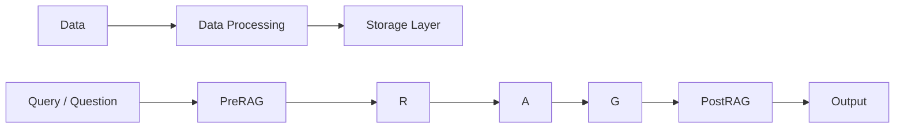
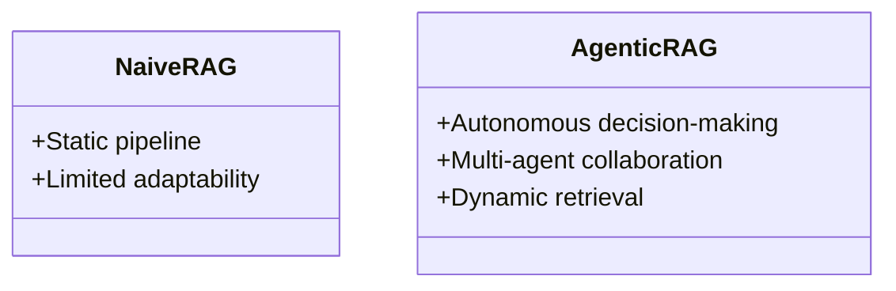

# Day 18 - Agent Builder

> **Câu hỏi cốt lõi:** *"Tại sao RAG pipeline demo chạy tốt nhưng production accuracy chỉ đạt 60% — ingestion hay retrieval đang giết bạn?"*

---

### 🗺️ 1. Bản đồ Kiến thức Hệ thống (Structured Knowledge Map)

Để tối ưu hóa việc tiếp cận kiến thức về RAG (Retrieval-Augmented Generation), chúng ta sẽ phân tích các thành phần chính của pipeline RAG và các vấn đề thường gặp:

#### 1.1. Tổng quan RAG Pipeline
Mô hình RAG bao gồm hai phần chính: **OFFLINE** và **ONLINE**.



### 📌 2. Khái niệm Cơ bản & Từ khóa Nền tảng (Core Concepts & Glossary)

| Thuật ngữ | Khái niệm Kỹ thuật & Bản chất | Tại sao cần quan tâm? |
| :--- | :--- | :--- |
| **RAG (Retrieval-Augmented Generation)** | Kỹ thuật kết hợp giữa retrieval và generation để cải thiện chất lượng câu trả lời. | Tăng cường độ chính xác và độ tin cậy của các câu trả lời từ mô hình. |
| **Ingestion Pipeline** | Quy trình thu thập và xử lý dữ liệu đầu vào. | Đảm bảo dữ liệu chất lượng cao cho mô hình. |
| **Enrichment Pipeline** | Quy trình làm giàu thông tin cho dữ liệu. | Cung cấp ngữ cảnh và thông tin bổ sung cho mô hình. |
| **PreRAG** | Giai đoạn xử lý truy vấn trước khi thực hiện retrieval. | Tối ưu hóa truy vấn để cải thiện kết quả tìm kiếm. |
| **Hybrid Search** | Kết hợp giữa tìm kiếm BM25 và Dense Vector. | Tăng cường khả năng tìm kiếm chính xác và hiệu quả. |

---

### 📐 3. Quy tắc, Công thức & Tham số Kỹ thuật (Hard Rules & Formulas)

#### 3.1. Các bước Fix trong RAG Pipeline
1. **Fix OFFLINE - Ingestion Pipeline:**
   - **Chunking:** Chia nhỏ tài liệu thành các phần có thể quản lý.
   - **Embedding:** Chọn mô hình nhúng phù hợp cho dữ liệu.
   - **Enrichment:** Làm giàu thông tin cho từng chunk.

2. **Fix ONLINE - PreRAG:**
   - **Query Transform:** Sử dụng HyDE để cải thiện truy vấn.
   - **Corrective RAG:** Đánh giá chất lượng kết quả tìm kiếm và điều chỉnh nếu cần.

3. **Fix ONLINE - Retrieval & Augment:**
   - **Hybrid Search:** Kết hợp BM25 và Dense Vector để tối ưu hóa tìm kiếm.
   - **Augmentation:** Thêm thông tin bổ sung trước khi đưa vào LLM.

---

### 💻 4. Hành trang Kỹ thuật & Mã nguồn (Technical Hands-on)

#### 4.1. Mã gọi API cho RAG
Dưới đây là ví dụ mã nguồn cho việc gọi API trong Python để thực hiện RAG:

```python
import requests

def call_rag_api(query):
    response = requests.post("http://your-rag-api-endpoint", json={"query": query})
    return response.json()

query = "Tại sao RAG pipeline demo chạy tốt nhưng production accuracy chỉ đạt 60%?"
result = call_rag_api(query)
print("Kết quả:", result)
```

---

### 🧠 5. Tư duy Chuyển dịch: Từ Naive RAG đến Agentic RAG

Sự chuyển mình từ RAG truyền thống sang Agentic RAG cho phép các agent tự quyết định khi nào và cách thức thực hiện retrieval:



* **Naive RAG:** Chỉ hoạt động theo quy trình cố định, không có khả năng tự điều chỉnh.
* **Agentic RAG:** Cho phép các agent tự động điều chỉnh quy trình dựa trên ngữ cảnh và yêu cầu cụ thể.

> [!WARNING]  
> **Cảnh báo quan trọng cho kỹ sư tương lai:** Việc chuyển đổi sang Agentic RAG không phải lúc nào cũng cần thiết. Đối với các truy vấn đơn giản, RAG truyền thống có thể đủ. Hãy cân nhắc kỹ lưỡng trước khi áp dụng.

---

### 🔍 6. Đánh giá và Tối ưu hóa RAG Pipeline

#### 6.1. Đo lường chất lượng RAG
Sử dụng các chỉ số như Faithfulness, Context Recall, và Context Precision để đánh giá hiệu suất của RAG pipeline.

```python
from ragas import evaluate
from ragas.metrics import (
    faithfulness, answer_relevancy,
    context_precision, context_recall,
)

dataset = {
    "question": questions,
    "answer": answers,
    "contexts": retrieved_chunks,
    "ground_truth": ground_truths,
}

result = evaluate(dataset,
                  metrics=[faithfulness,
                           answer_relevancy,
                           context_precision,
                           context_recall])
print(result) # DataFrame
```

---

### 🔑 7. Tổng kết – Key Takeaways

1. **RAG = OFFLINE** (Ingestion + Enrichment) + **ONLINE** (PreRAG → R → A → G → PostRAG).
2. **Fix OFFLINE:** Tập trung vào Chunking, Embedding và Enrichment Pipeline.
3. **Fix ONLINE:** Tối ưu hóa PreRAG, Hybrid Search và Augmentation.
4. **Đánh giá:** Sử dụng RAGAS và phân tích lỗi để cải thiện chất lượng.
5. **Beyond:** Khám phá Agentic RAG và các giới hạn cơ bản của RAG.

---

### 📅 8. Tiếp theo & Bài tập

- Hoàn thành Lab 18: Production RAG pipeline + RAGAS report.
- Đọc tài liệu liên quan đến GraphRAG và các nghiên cứu mới nhất trong lĩnh vực này.

---

Cảm ơn bạn đã tham gia vào buổi học hôm nay!