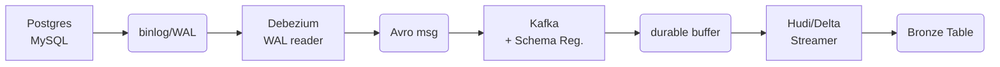
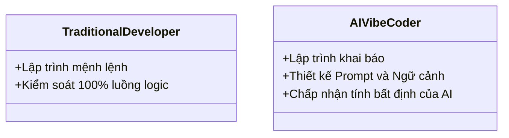

# Day 18 - Data Lakehouse Architecture

> **Câu hỏi cốt lõi:** *"Lakehouse = ACID + cheap storage + AI workloads. Câu trả lời cho 3 era: Traditional, ML, LLM."*

---

### 🗺️ 1. Bản đồ Kiến thức Hệ thống (Structured Knowledge Map)

#### 1.1. Sự Tiến hóa của Nền tảng Dữ liệu (Evolution of Data Platforms)
Mô tả sự chuyển mình từ Data Warehouse đến Data Lakehouse qua ba thập kỷ:

| 2000s | 2010s | 2020s |
|---|---|---|
| **Data Warehouse** | **Data Lake** | **Data Lakehouse** |
| Structured, SQL<br>Fast queries<br>Đắt, kém flexible | Cheap, flexible<br>Any format<br>"Data swamp" | ACID + cheap storage<br>Open formats<br>Best of both |

#### 1.2. Ba Thời Kỳ của Phần Mềm (3 Eras of Software)
Mỗi thời kỳ có đặc điểm riêng về khối lượng công việc và yêu cầu lưu trữ:

| Aspect | Traditional (1990s-2010) | ML Era (~2012-2022) | LLM Era (2022+) |
|---|---|---|---|
| Workload | OLTP txn, BI reports | Feature eng, batch train/infer | Pretraining, fine-tune, RAG, eval |
| Data shape | Tabular, 3NF normalized | Tabular + semi-structured | Text + multimodal + embeddings |
| Volume | GB-TB | TB-PB | PB+ raw, 10¹² + tokens |
| Latency | ms (txn), hours (BI) | Min-hours (batch ML) | Hours (train) + sub-100ms (RAG) |
| Schema | Schema-on-write | Schema-on-read or hybrid | Hybrid + lineage + contracts |
| Compliance | SOX, PCI, GDPR | + bias audit, fairness | + training data provenance, copyright |

---

### 📌 2. Khái niệm Cơ bản & Từ khóa Nền tảng (Core Concepts & Glossary)

| Thuật ngữ | Khái niệm Kỹ thuật & Bản chất | Tại sao cần quan tâm? |
| :--- | :--- | :--- |
| **Lakehouse** | Kiến trúc kết hợp giữa Data Lake và Data Warehouse, hỗ trợ ACID và lưu trữ chi phí thấp. | Cung cấp nền tảng cho các khối lượng công việc AI/ML hiện đại. |
| **Delta Lake** | Hệ thống lưu trữ dữ liệu hỗ trợ ACID transactions, time travel và schema enforcement. | Đảm bảo tính toàn vẹn dữ liệu và khả năng phục hồi. |
| **Apache Iceberg** | Định dạng bảng mở cho Data Lakehouse, hỗ trợ hidden partitioning và schema evolution. | Tối ưu hóa hiệu suất truy vấn và quản lý dữ liệu lớn. |
| **Medallion Architecture** | Mô hình lưu trữ dữ liệu phân lớp: Bronze (raw), Silver (clean), Gold (analytics). | Tạo ra quy trình làm việc rõ ràng cho việc xử lý và phân tích dữ liệu. |

---

### 📐 3. Quy tắc, Công thức & Tham số Kỹ thuật (Hard Rules & Formulas)

#### 3.1. Delta Lake Transaction Log
Cấu trúc của Delta Lake transaction log:

```
_delta_log/
  ├── 000.json
  ├── 001.json
  ├── 002.json
  └── 003.json
```
- **ACID**: Atomicity, Consistency, Isolation, Durability trên S3.
- **Concurrency**: Phát hiện xung đột lạc quan.

#### 3.2. Time Travel API
Cách truy vấn lịch sử dữ liệu trong Delta Lake:

```python
# Version-based
df = spark.read.format("delta").option("versionAsOf", 5).load(path)

# Timestamp-based
df = spark.read.format("delta").option("timestampAsOf", "2025-01-15 00:00:00").load(path)

# Restore
DeltaTable.forPath(spark, path).restoreToVersion(10)
```

---

### 💻 4. Hành trang Kỹ thuật & Mã nguồn (Technical Hands-on)

#### 4.1. Delta Lake Thao Tác Quan Trọng
Một số thao tác quan trọng trong Delta Lake:

- **Ghi dữ liệu**: `df.write.format("delta").save(path)`
- **MERGE**: Cập nhật hoặc chèn dữ liệu mới vào bảng.
- **VACUUM**: Dọn dẹp dữ liệu cũ, giữ lại tối thiểu 168 giờ.

#### 4.2. CDC Pattern: Postgres → Lakehouse
Sơ đồ quy trình CDC từ Postgres đến Lakehouse:



---

### 🧠 5. Tư duy Chuyển dịch: Traditional Dev sang AI Vibe Coder

Sự chuyển mình từ lập trình truyền thống sang lập trình AI:



---

### 🔑 6. Tổng kết – Key Takeaways
1. Lakehouse = ACID + object storage + open formats.
2. Format war kết thúc: Iceberg + Delta UniForm = de facto standard.
3. Time travel + branching = "git checkout" cho dataset.
4. LLM era cần thêm tầng: Vector DB, embedding versioning.
5. Production ops trifecta: Catalog + Data Contracts + Lineage.

---

### 📚 7. Tài liệu Tham khảo
- Case studies từ Netflix, Uber, Apple về việc áp dụng Lakehouse.
- Tài liệu về Delta Lake và Apache Iceberg.

---

### 💬 8. Hỏi & Đáp
Câu hỏi về Lakehouse, Delta/Iceberg, Medallion, Catalog, Data Contracts, hay AI/LLM workloads?