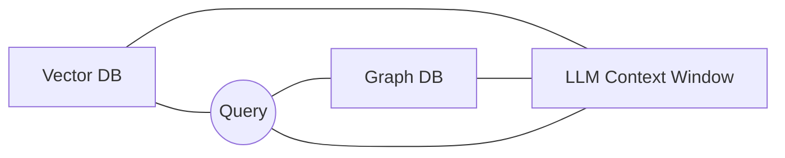

# Day 19 - GraphRAG & Knowledge Graphs

> **Câu hỏi cốt lõi:** *"Khi user hỏi về mối quan hệ giữa 5 entities — flat RAG trả lời sai, GraphRAG trả lời đúng — tại sao?"*

---

### 🗺️ 1. Bản đồ Kiến thức Hệ thống (Structured Knowledge Map)

#### 1.1. Vấn đề của RAG: Khi Vector Search thất bại
- **Bài toán:** Relational QA mà Vector RAG không trả lời được.
- **Các loại query Flat RAG struggle:**
  1. Multi-hop relational: “A liên kết B qua C”
  2. Global thematic: “Tổng quan chủ đề X trong corpus”
  3. Cross-document: “So sánh policy A với B”

#### 1.2. Giải pháp mang tên GraphRAG
- **GraphRAG:** Hiểu được các kết nối mang tính cấu trúc, tìm kiếm trên một "mạng lưới" các mối quan hệ thay vì chỉ các đoạn văn bản.
- **Kết quả:** Suy luận đa bước (multi-hop) chính xác và khả năng tóm tắt toàn cục toàn bộ tập dữ liệu.

---

### 📌 2. Khái niệm Cơ bản & Từ khóa Nền tảng (Core Concepts & Glossary)

| Thuật ngữ | Khái niệm Kỹ thuật & Bản chất | Tại sao cần quan tâm? |
| :--- | :--- | :--- |
| **Knowledge Graph (KG)** | Đồ thị có hướng với các thực thể (nodes), mối quan hệ (edges) và bộ ba (triples). | Cung cấp khả năng truy xuất thông tin dựa trên cấu trúc thay vì chỉ dựa vào nội dung văn bản. |
| **Triple** | Cấu trúc (Chủ thể) → [Vị ngữ / Mối quan hệ] → (Tân ngữ). | Là đơn vị cốt lõi để cấu trúc hóa kiến thức. |
| **Graph Traversal** | Quá trình duyệt qua các node và edge trong đồ thị. | Cho phép truy xuất thông tin liên quan đến các thực thể một cách hiệu quả. |
| **Entity Extraction** | Nhận diện và trích xuất các thực thể từ văn bản. | Là bước quan trọng để xây dựng Knowledge Graph chính xác. |
| **Coreference Resolution** | Xác định các đại từ trong văn bản để liên kết với thực thể đúng. | Giúp tránh tạo ra các node bị cô lập trong đồ thị. |

---

### 📐 3. Quy tắc, Công thức & Tham số Kỹ thuật (Hard Rules & Formulas)

#### 3.1. Quy trình Xây dựng Knowledge Graph
1. **Đọc các đoạn văn bản (Chunks):** Phân tích và nạp dữ liệu thô từ nguồn tài liệu.
2. **Giải quyết Đồng tham chiếu:** Xử lý các đại từ để xác định đúng thực thể.
3. **Trích xuất Thực thể & Phân giải:** Nhận diện và chuẩn hóa các đối tượng trong văn bản.
4. **Trích xuất Mối quan hệ (Triples):** Xây dựng các liên kết Chủ thể - Quan hệ - Đối tượng.
5. **Xóa trùng lặp và đẩy vào Neo4j:** Tối ưu hóa dữ liệu và lưu trữ vào cơ sở dữ liệu đồ thị.

#### 3.2. Sơ đồ Kiến trúc Hybrid


---

### 💻 4. Hành trang Kỹ thuật & Mã nguồn (Technical Hands-on)

#### 4.1. Cypher: Ngôn ngữ truy vấn Graph
```cypher
MATCH (p:Person)-[:CO_FOUNDED]->(c:Company)
WHERE c.name = 'OpenAI'
RETURN p.name
```

#### 4.2. Quy trình GraphRAG
1. **Query Processing:** Trích xuất thực thể từ câu hỏi.
2. **Seed Node Matching:** Tìm các thực thể trong Graph DB.
3. **Graph Traversal:** Khám phá khu vực xung quanh các node gốc.
4. **Textualization:** Chuyển đổi dữ liệu đồ thị thành văn bản.
5. **Generation:** LLM tổng hợp câu trả lời cuối cùng.

---

### 🧠 5. Tư duy Chuyển dịch: Từ RAG đến GraphRAG

- **Vector RAG:** Tìm kiếm sự tương đồng về mặt ngữ nghĩa.
- **GraphRAG:** Hiểu mối quan hệ giữa các khái niệm, cho phép suy luận đa bước chính xác hơn.

> [!WARNING]  
> **Cảnh báo:** GraphRAG không nên thay thế Vector Search; nó nên bổ trợ lẫn nhau để tối ưu hóa khả năng truy xuất thông tin.

---

### 🔍 6. Đánh giá & Benchmarking

- **Tính toàn diện:** Câu trả lời có giải quyết trọn vẹn và đầy đủ câu hỏi không?
- **Tính đa dạng:** Thông tin cung cấp có phong phú và đa chiều không?
- **Tính chính xác:** Mức độ tin cậy của các sự kiện được nêu ra.

---

### 📈 7. Chiến lược Doanh nghiệp & ROI

- **Flat RAG:** Rẻ khi xây dựng và truy vấn, phù hợp cho các tài liệu dùng một lần.
- **GraphRAG:** Đắt khi xây dựng nhưng truy vấn chính xác hơn, phù hợp cho tri thức cốt lõi của doanh nghiệp.

---

### 🏁 8. Tổng kết – Key Takeaways

1. Knowledge graphs cho phép multi-hop reasoning mà flat RAG không làm được.
2. Chất lượng trích xuất thực thể là bottleneck — đầu tư vào NER và coreference resolution.
3. "Graph quality beats Graph size" — 1000 high-quality triples beats 100K noisy ones.
4. GraphRAG pipeline là production-ready starting point — tùy chỉnh entity extraction cho domain của bạn.

---

### 📚 9. Tiếp theo & Bài tập

- **Ngày 20:** Multi-Agent Systems
- **Hoàn thành Lab 19:** GraphRAG agent + benchmark report

---

### ❓ 10. Hỏi & Đáp

Khi nào nên dùng GraphRAG thay Flat RAG? Hybrid approach có đáng đầu tư không?