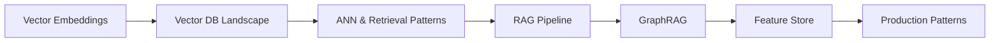
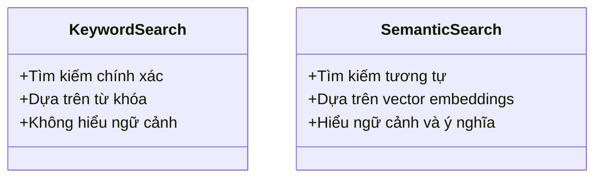

# Day 19 - RAG Data

> **Câu hỏi cốt lõi:** *"SQL database trả về exact match. Nhưng AI cần “tương tự” — semantic search. Tại sao SQL không đủ cho AI search, và vector database thực sự lưu gì?"*

---

### 🗺️ 1. Bản đồ Kiến thức Hệ thống (Structured Knowledge Map)

Hệ thống RAG (Retrieval-Augmented Generation) bao gồm các thành phần chính từ Vector Store đến Feature Store:



---

### 📌 2. Khái niệm Cơ bản & Từ khóa Nền tảng (Core Concepts & Glossary)

| Thuật ngữ | Khái niệm Kỹ thuật & Bản chất | Tại sao cần quan tâm? |
| :--- | :--- | :--- |
| **Vector Embeddings** | Chuyển đổi văn bản thành các vector số học để dễ dàng so sánh và tìm kiếm. | Cung cấp khả năng tìm kiếm ngữ nghĩa, vượt qua giới hạn của tìm kiếm từ khóa truyền thống. |
| **Vector Database** | Cơ sở dữ liệu lưu trữ các vector embeddings cho phép tìm kiếm nhanh chóng và hiệu quả. | Hỗ trợ các ứng dụng AI cần truy xuất thông tin dựa trên độ tương đồng. |
| **Hybrid Search** | Kết hợp giữa tìm kiếm từ khóa (BM25) và tìm kiếm vector (ANN) để tối ưu hóa độ chính xác. | Tăng cường khả năng tìm kiếm với độ chính xác cao hơn và tốc độ nhanh hơn. |
| **Feature Store** | Nơi lưu trữ và quản lý các đặc trưng (features) cho mô hình học máy. | Đảm bảo tính nhất quán giữa quá trình huấn luyện và triển khai mô hình. |

---

### 📐 3. Quy tắc, Công thức & Tham số Kỹ thuật (Hard Rules & Formulas)

#### 3.1. Công thức Tương đồng Cosine
Tương đồng giữa hai vector được tính bằng công thức:

$$\text{Cosine Similarity} = \frac{A \cdot B}{|A| \times |B|}$$

Trong đó:
- $A$ và $B$ là các vector.
- Giá trị nằm trong khoảng [0, 1], với >0.85 được coi là rất tương tự.

#### 3.2. Các Mô hình Embedding Năm 2026
| Model | Dim | Cost |
|---|---|---|
| text-embedding-3-small | 1536 | $0.02/M |
| text-embedding-3-large | 3072 | $0.13/M |
| bge-m3 | 1024 | self-host |
| PhoBERT | 768 | self-host |

---

### 💻 4. Hành trang Kỹ thuật & Mã nguồn (Technical Hands-on)

#### 4.1. Triển khai Vector Database với Qdrant
Dưới đây là cách triển khai mã nguồn gọi API cơ bản trong Python:

```python
from qdrant_client import QdrantClient

client = QdrantClient(url='http://localhost:6333')

# Tạo collection
client.recreate_collection(
    collection_name='my_collection',
    vector_size=1536,
    distance='Cosine'
)

# Thêm vector
client.upload_collection(
    collection_name='my_collection',
    vectors=[...],  # danh sách các vector
    payload=[...]   # metadata tương ứng
)

# Tìm kiếm vector
results = client.search(
    collection_name='my_collection',
    query_vector=[...],  # vector truy vấn
    limit=10
)
```

#### 4.2. Triển khai Feature Store với Feast
Cách định nghĩa và phục vụ các đặc trưng trong Feast:

```python
from feast import Feature, FeatureView, Entity, Repo

# Định nghĩa Feature View
feature_view = FeatureView(
    name="user_features",
    entities=["user_id"],
    features=[
        Feature(name="user_embedding", dtype="float32"),
        Feature(name="last_interaction", dtype="timestamp")
    ],
    ttl=timedelta(days=30),
    source="my_source_table"
)

# Lấy các đặc trưng trực tuyến
online_features = feast_client.get_online_features(feature_view)
```

---

### 🧠 5. Tư duy Chuyển dịch: Từ Truy vấn Từ Khóa đến Tìm Kiếm Ngữ Nghĩa

Sự chuyển dịch từ tìm kiếm từ khóa sang tìm kiếm ngữ nghĩa trong RAG:



* **Tìm kiếm từ khóa:** Chỉ trả về kết quả chính xác dựa trên từ khóa.
* **Tìm kiếm ngữ nghĩa:** Có khả năng tìm kiếm dựa trên ý nghĩa và ngữ cảnh của văn bản.

> [!WARNING]  
> **Cảnh báo quan trọng:** Đảm bảo rằng mô hình embedding được sử dụng trong quá trình huấn luyện và triển khai là nhất quán để tránh sai lệch trong kết quả.

---

### 🔍 6. Thực tiễn Tốt nhất trong RAG

- **Top-K:** Sử dụng 5-10 cho RAG, 20-50 trước khi reranker.
- **Embedding Model Consistency:** Đảm bảo rằng mô hình embedding được sử dụng trong huấn luyện và inference là giống nhau.
- **Query Rewriting:** Sử dụng các kỹ thuật như HyDE để cải thiện độ chính xác của truy vấn.

---

### 📊 7. Đánh giá và Quan sát

#### 7.1. Các chỉ số Đánh giá
- **Recall@k:** Tỷ lệ tài liệu liên quan trong top-k.
- **MRR:** Vị trí trung bình của kết quả đúng đầu tiên.

#### 7.2. Các chỉ số Quan sát
- **P99 Search Latency:** Thời gian tìm kiếm ở mức 99%.
- **Embedding Cache Hit Rate:** Tỷ lệ hit của cache embedding.

---

### 🔑 8. Tổng kết – Key Takeaways

1. **Hybrid Search** (BM25 + Vector + RRF) mang lại **91% recall** so với 78% chỉ sử dụng tìm kiếm ngữ nghĩa.
2. **GraphRAG** là lựa chọn tốt khi câu trả lời yêu cầu mối quan hệ giữa các thực thể.
3. **Feature Store** cung cấp tính nhất quán giữa quá trình huấn luyện và triển khai, đảm bảo độ chính xác cao cho mô hình.

---

### 📅 9. Tiếp theo & Bài tập

**Ngày 20: Model Serving & Inference Optimization**  
"Model accuracy 95% nhưng latency 3 giây — user đợi không nổi."

---

### 🙋 Hỏi & Đáp

Câu hỏi về Vector DB, Hybrid Search, GraphRAG, hay Feature Store?