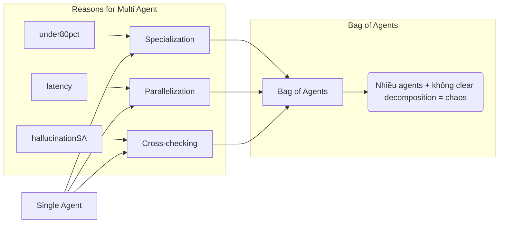
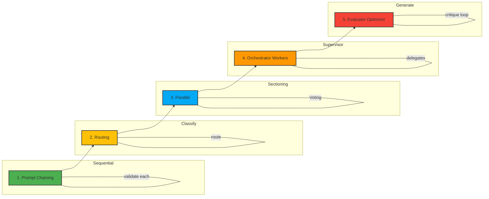
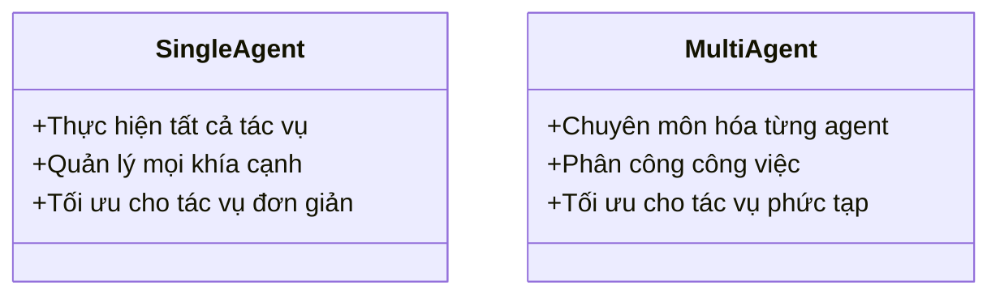

# Day 20 - Multi-Agent Systems

> **Câu hỏi cốt lõi:** *"Khi một agent không đủ — Supervisor, Debate, Parallel patterns giải quyết bài toán như thế nào?"*

---

### 🗺️ 1. Bản đồ Kiến thức Hệ thống (Structured Knowledge Map)

Để hiểu rõ về Multi-Agent Systems, chúng ta sẽ khám phá các lý do cần nhiều agent và các mẫu workflow agentic:

#### 1.1. Tại sao cần nhiều Agent?
- **Specialization:** Mỗi agent chuyên môn hóa trong một lĩnh vực cụ thể.
- **Parallelization:** Thực hiện các tác vụ đồng thời để giảm độ trễ.
- **Cross-checking:** Giảm thiểu hiện tượng hallucination thông qua việc kiểm tra chéo.



#### 1.2. Ví dụ thực tiễn về Multi-Agent
| Use case              | Cấu trúc agent                                                                                                                                                                                                                                                                          | Điểm học viên cần nhớ                                                                                                                                                                     |
| :-------------------- | :-------------------------------------------------------------------------------------------------------------------------------------------------------------------------------------------------------------------------------------------------------------------------------------- | :---------------------------------------------------------------------------------------------------------------------------------------------------------------------------------------- |
| Customer support triage | Triage agent route sang Billing / Refund / FAQ agent.                                                                                                                                                                                                                               | Mỗi intent có specialist riêng; sai route thì user nhận câu trả lời sai.                                                                          |
| Code review assistant | Planner chia task, Code agent sửa, Test agent chạy test, Reviewer agent critique.                                                                                                                                                                                                        | Multi-agent hữu ích khi cần plan-implement-verify, nhưng phải có test/CI làm ground truth.                                                                                             |
| Research report       | Searcher thu thập nguồn, Analyst trích insight, Writer viết, Critic fact-check.                                                                                                                                                                                                        | Dễ so sánh single vs multi-agent theo quality, latency, cost.                                                                                                   |
| Enterprise workflow   | ADK agent teams phối hợp với tools và observability.                                                                                                                                                                                                                                   | Production không chỉ là prompt: cần deploy, evaluate, trace, auth, guardrails.                                                                                                          |
| Role-based automation | CrewAI crews: role, goal, tools, task.                                                                                                                                                                                                                                               | Tốt để prototype nhanh khi muốn học viên thấy “agent như một vai trò trong team".                                                                                                       |
| Conversational AI     | AutoGen: group chat (concurrent conversation, interruptible).                                                                                                                                                                                                                         | Dùng để minh họa debate.                                                                                                                                                                  |

---

### 📌 2. Khái niệm Cơ bản & Từ khóa Nền tảng (Core Concepts & Glossary)

| Thuật ngữ | Khái niệm Kỹ thuật & Bản chất | Tại sao cần quan tâm? |
| :--- | :--- | :--- |
| **Supervisor Pattern** | Kiến trúc Hub-Spoke cho phép một agent điều phối và phân công công việc cho các agent khác. | Cung cấp sự rõ ràng trong ownership và dễ dàng debug. |
| **Debate Agents** | Hai agent tranh luận để đưa ra câu trả lời cuối cùng. | Giảm hallucination và tăng độ chính xác cho các quyết định quan trọng. |
| **Parallel Execution** | Thực hiện các tác vụ đồng thời để tối ưu hóa thời gian xử lý. | Cần có chiến lược hợp nhất trạng thái cẩn thận để tránh lỗi. |

---

### 📐 3. Quy tắc, Công thức & Tham số Kỹ thuật (Hard Rules & Formulas)

#### 3.1. 5 Agentic Workflow Patterns
Các mẫu workflow agentic từ đơn giản đến phức tạp:



---

### 💻 4. Hành trang Kỹ thuật & Mã nguồn (Technical Hands-on)

#### 4.1. Supervisor Pattern Implementation
Mã nguồn cho Supervisor Pattern trong Python:

```python
class SupervisorState(TypedDict):
    messages: list[BaseMessage]
    next_worker: str
    worker_results: dict[str, str]
    final_answer: str

def supervisor(state):
    response = llm.invoke(
        system="Route task to workers",
        tools=[search, analyze, write],
        messages=state["messages"]
    )
    return {"next_worker": response.tool}
```

#### 4.2. Debate Agents Implementation
Mã nguồn cho Debate Agents:

```python
class DebateAgent:
    def __init__(self, agent_a, agent_b):
        self.agent_a = agent_a
        self.agent_b = agent_b

    def debate(self):
        answer_a = self.agent_a.answer()
        answer_b = self.agent_b.answer()
        critique_a = self.agent_a.critique(answer_b)
        critique_b = self.agent_b.critique(answer_a)
        final_answer = self.judge_synthesize(answer_a, answer_b, critique_a, critique_b)
        return final_answer
```

---

### 🧠 5. Tư duy Chuyển dịch: Từ Single Agent đến Multi-Agent

Sự chuyển đổi từ single agent sang multi-agent không chỉ là về số lượng mà còn về cách thức hoạt động và tổ chức:



---

### 🔑 6. Tổng kết - Key Takeaways

1. **Supervisor là kiến trúc multi-agent thực tiễn nhất** — rõ ràng trong ownership và dễ dàng debug.
2. **Debate giảm hallucination** 15-25% nhưng tốn 2-3× chi phí — chỉ dùng cho các quyết định quan trọng.
3. **Parallel execution cắt giảm độ trễ** nhưng cần chiến lược hợp nhất trạng thái cẩn thận — “parallel ≠ always faster”.

---

### 📚 7. Tài liệu Tham khảo (References)

- **Anthropic:** Building effective agents [Anthropic](https://www.anthropic.com/engineering/building-effective-agents)
- **OpenAI:** Agents SDK orchestration [OpenAI](https://developers.openai.com/api/docs/guides/agents/orchestration)
- **MAST paper:** Why Do Multi-Agent LLM Systems Fail? [arXiv](https://arxiv.org/abs/2503.13657)

---

### 🗣️ 8. Hỏi & Đáp
- Supervisor vs Debate vs Parallel — khi nào dùng pattern nào? 
- Single agent có khi nào đủ?

---

Cảm ơn bạn đã tham gia vào buổi học hôm nay!