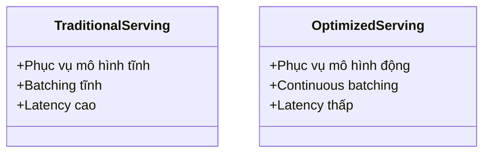

# Day 20 - Model Serving & Inference Optimization

> **Câu hỏi cốt lõi:** *"Model accuracy 95% nhưng latency 3 giây. User đợi không nổi, churn tăng 40%. Model tốt nhưng serve chậm = product thất bại.”*

---

### 🗺️ 1. Bản đồ Kiến thức Hệ thống (Structured Knowledge Map)

Để tối ưu hóa việc phục vụ mô hình và tối ưu hóa suy diễn, chúng ta sẽ khám phá các khía cạnh chính sau:

#### 1.1. Latency Taxonomy
- **TTFT** (Time To First Token): Thời gian từ request đến token đầu tiên.
- **TPOT** (Time Per Output Token): Thời gian trung bình giữa mỗi token đầu ra.
- **E2E Latency**: Tổng thời gian từ TTFT và TPOT.
- **Throughput**: Số lượng tokens/s toàn hệ thống.
- **Goodput**: Số lượng yêu cầu/s thỏa mãn TTFT và TPOT SLO.

#### 1.2. Quantization
- **FP16, FP8, AWQ 4-bit, NVFP4**: Các phương pháp giảm dung lượng bộ nhớ và tăng throughput.

#### 1.3. KV Cache & Attention Optimization
- **PagedAttention**: Tối ưu hóa bộ nhớ và tăng tốc độ phục vụ.

#### 1.4. Serving Engines
- So sánh 8 engines phục vụ chính: vLLM, SGLang, NVIDIA Dynamo, llm-d, LMDeploy, TensorRT-LLM, Ollama, llama.cpp.

---

### 📌 2. Khái niệm Cơ bản & Từ khóa Nền tảng (Core Concepts & Glossary)

| Thuật ngữ | Khái niệm Kỹ thuật & Bản chất | Tại sao cần quan tâm? |
| :--- | :--- | :--- |
| **Throughput** | Số lượng tokens/s toàn hệ thống ở saturation, không có SLO constraint. | Đo lường hiệu suất của mô hình trong điều kiện tối đa. |
| **Goodput** | Số lượng yêu cầu/s thỏa mãn TTFT và TPOT SLO. | Metric quan trọng nhất cho sản phẩm trong môi trường sản xuất. |
| **Quantization** | Giảm độ chính xác của mô hình để tiết kiệm bộ nhớ và tăng tốc độ. | Cần thiết để tối ưu hóa hiệu suất mà không làm giảm chất lượng quá nhiều. |
| **KV Cache** | Bộ nhớ tạm thời cho các key-value pairs trong quá trình suy diễn. | Giúp tăng tốc độ phục vụ bằng cách tái sử dụng thông tin đã tính toán. |
| **PagedAttention** | Kỹ thuật tối ưu hóa bộ nhớ cho KV cache thông qua virtual memory pages. | Tăng throughput và giảm độ trễ trong phục vụ mô hình. |

---

### 📐 3. Quy tắc, Công thức & Tham số Kỹ thuật (Hard Rules & Formulas)

#### 3.1. Công thức Latency
- **E2E Latency**: 
$$\text{E2E Latency} = \text{TTFT} + \text{TPOT} \times (N-1)$$

#### 3.2. Quantization VRAM Usage
| Format      | VRAM Usage (8B) | VRAM Usage (70B) | Quality                 |
|:------------|:----------------|:------------------|:------------------------|
| FP16        | 15.8 GB         | 140 GB            | Baseline                |
| FP8         | 7.9 GB          | 70 GB             | <1% drop                |
| AWQ 4-bit   | 4.5 GB          | 40 GB             | ~1pt MMLU               |

---

### 💻 4. Hành trang Kỹ thuật & Mã nguồn (Technical Hands-on)

#### 4.1. Mã gọi API chuẩn
Dưới đây là cách triển khai mã nguồn gọi API cơ bản trong Python:

```python
import requests

def call_model_api(input_text):
    response = requests.post("http://your-model-api-endpoint", json={"input": input_text})
    return response.json()

result = call_model_api("Giải thích về KV Cache.")
print("Kết quả:", result)
```

#### 4.2. Tuning Model Serving
- **Chọn quantization**: Sử dụng FP8 cho production Hopper, AWQ 4-bit cho general.
- **Tối ưu hóa KV Cache**: Sử dụng PagedAttention để giảm độ trễ và tăng throughput.

---

### 🧠 5. Tư duy Chuyển dịch: Từ Truyền thống đến AI Vibe Coder

Sự chuyển mình từ các phương pháp truyền thống sang các phương pháp tối ưu hóa hiện đại trong phục vụ mô hình:



> [!WARNING]  
> **Cảnh báo quan trọng cho kỹ sư tương lai:** Luôn tối ưu hóa Goodput @SLO để đảm bảo thành công trong sản phẩm. Hãy benchmark P50/P95/P99 trước khi triển khai.

---

### 🔑 6. Tổng kết – Key Takeaways

1. **Quantization 2026**: FP8/NVFP4 cho production cloud, AWQ 4-bit cho general, GGUF Q4_K_M cho edge.
2. **Serving**: vLLM v1 và SGLang là cốt lõi cho production. Disaggregated scale: llm-d / Dynamo.
3. **Goodput @SLO**: Quyết định thành công trong sản xuất — luôn benchmark trước khi deploy.

---

### ❓ Hỏi & Đáp
Câu hỏi nào về Quantization, vLLM/SGLang, SLA, hay Milestone 1?