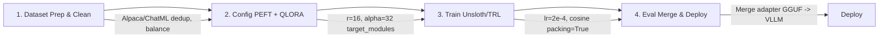

# Day 21 - Fine-tuning LLMs — Từ Full Fine-tune đến LoRA/QLoRA

> **Câu hỏi cốt lõi:** *"Khi nào nên fine-tune — và khi nào prompt engineering đủ rồi?"*

---

### 🗺️ 1. Bản đồ Kiến thức Hệ thống (Structured Knowledge Map)

#### 1.1. Quy trình quyết định giữa Prompt Engineering, RAG và Fine-tune
Mô hình quyết định cho việc lựa chọn giữa các phương pháp:

```mermaid
graph LR
    A[Few-shot prompt đạt 80%+ accuracy?]
    A -- Có --> B[Prompt đủ rồi]
    A -- Không --> C[Cần knowledge mới / cập nhật?]
    C -- Có --> D[Dùng RAG]
    C -- Không --> E[Volume > 50k/day hoặc latency-critical?]
    E -- Có --> F[Fine-tune ROI positive]
    E -- Không --> G[API fine-tune (OpenAI/Anthropic)]
```

---

### 📌 2. Khái niệm Cơ bản & Từ khóa Nền tảng (Core Concepts & Glossary)

| Thuật ngữ | Khái niệm Kỹ thuật & Bản chất | Tại sao cần quan tâm? |
| :--- | :--- | :--- |
| **Fine-tuning** | Quá trình điều chỉnh mô hình đã được huấn luyện trước để cải thiện hiệu suất trên một tác vụ cụ thể. | Cần thiết khi mô hình không đáp ứng yêu cầu cụ thể của người dùng. |
| **LoRA (Low-Rank Adaptation)** | Kỹ thuật cho phép thêm các cập nhật low-rank vào mô hình mà không cần thay đổi trọng số gốc. | Giúp tiết kiệm tài nguyên và thời gian huấn luyện. |
| **QLoRA** | Kỹ thuật fine-tuning sử dụng 4-bit quantization kết hợp với LoRA. | Giúp huấn luyện mô hình lớn trên phần cứng hạn chế mà không làm giảm chất lượng. |
| **RAG (Retrieval-Augmented Generation)** | Kỹ thuật kết hợp giữa truy xuất thông tin và sinh văn bản để cải thiện độ chính xác. | Cung cấp thông tin bổ sung cho mô hình, đặc biệt trong các tác vụ yêu cầu kiến thức cụ thể. |

---

### 📐 3. Quy tắc, Công thức & Tham số Kỹ thuật (Hard Rules & Formulas)

#### 3.1. Cơ chế hoạt động của LoRA
LoRA cho phép cập nhật trọng số một cách hiệu quả mà không cần thay đổi toàn bộ mô hình:

$$h = W_0x + B \cdot A \cdot x$$

Trong đó:
- $W_0$: Trọng số gốc của mô hình.
- $B$: Ma trận low-rank.
- $A$: Ma trận cập nhật.

#### 3.2. So sánh chi phí giữa các phương pháp fine-tuning
| Phương pháp  | VRAM (7B) | Params train | Thời gian | GPU tối thiểu |
| :------------ | :-------- | :----------- | :-------- | :------------ |
| Full Fine-tune | ~60 GB    | 100%         | $$$$      | A100 80GB     |
| LoRA (fp16)   | ~28 GB    | ~1%          | $$        | A100 40GB     |
| QLoRA (4-bit) | ~10 GB    | ~1%          | $$        | RTX 3090 24GB |

---

### 💻 4. Hành trang Kỹ thuật & Mã nguồn (Technical Hands-on)

#### 4.1. Quy trình chuẩn bị dữ liệu và huấn luyện


#### 4.2. Cấu hình mã nguồn cho Unsloth và TRL
```python
from unsloth import FastLanguageModel
from trl import SFTTrainer

model, tok = FastLanguageModel.from_pretrained(
    "unsloth/Qwen2.5-7B-bnb-4bit",
    max_seq_length=2048, load_in_4bit=True
)
model = FastLanguageModel.get_peft_model(
    model, r=16, lora_alpha=32,
    target_modules=["q_proj","k_proj","v_proj","o_proj","gate_proj","up_proj","down_proj"]
)
trainer = SFTTrainer(
    model=model, train_dataset=dataset,
    dataset_text_field="text",
    packing=True # 2x throughput
)
trainer.train()
```

---

### 🧠 5. Tư duy Chuyển dịch: Từ Fine-tuning đến LoRA/QLoRA

LoRA và QLoRA giúp giảm thiểu chi phí và tài nguyên trong quá trình fine-tuning, cho phép các mô hình lớn được huấn luyện trên phần cứng hạn chế mà vẫn đảm bảo chất lượng đầu ra.

> [!IMPORTANT]  
> **Quy tắc vàng thiết kế Hệ thống:**  
> Luôn đánh giá chất lượng dữ liệu trước khi bắt đầu quá trình fine-tuning. 500 mẫu hoàn hảo có giá trị hơn 10,000 mẫu kém chất lượng.

---

### 🔍 6. Tổng kết – Key Takeaways

1. **QLoRA democratize fine-tuning** — consumer GPU (RTX 3090) đủ cho 7B-8B models.
2. **Dataset quality** là yếu tố quan trọng nhất — 500 perfect > 10k noisy.
3. **Sequence packing** là free 2x speedup – luôn bật packing=True.
4. **LoRA adapters are composable** — serve nhiều adapters cùng lúc trên 1 base model.

---

### ❓ Hỏi & Đáp

Khi nào thì fine-tune thực sự cần thiết? Bạn có use case cụ thể nào muốn thảo luận?