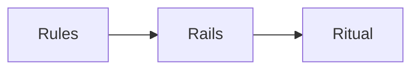
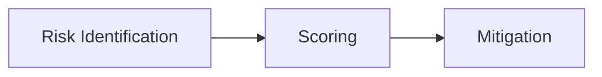
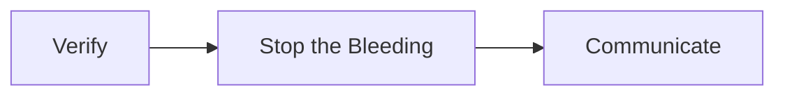
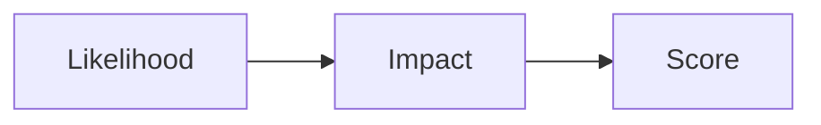

# Day 21 - AI Governance & Risk

> **Câu hỏi cốt lõi:** *"Làm sao để 1 sự cố AI không làm cạn runway của bạn?"*

---

### 🗺️ 1. Bản đồ Kiến thức Hệ thống (Structured Knowledge Map)

Để tối ưu hóa việc tiếp cận kiến thức về quản trị AI và rủi ro, chúng ta sẽ khám phá 3 khía cạnh chính: 3 R's của quản trị, Risk Register và Incident Playbook.

#### 1.1. 3 R's của Quản trị Startup (3 R's of Startup Governance)
Mô hình quản trị đơn giản nhưng hiệu quả cho startup AI:



- **Rules:** Chính sách ngắn gọn, dễ hiểu.
- **Rails:** Công cụ tự động hóa để đảm bảo tuân thủ.
- **Ritual:** Thói quen và hành vi của đội ngũ.

#### 1.2. Risk Register
Phân loại và đánh giá rủi ro theo tháng runway:



- **Risk Identification:** Xác định các rủi ro tiềm ẩn.
- **Scoring:** Đánh giá khả năng xảy ra và tác động.
- **Mitigation:** Lập kế hoạch giảm thiểu rủi ro.

#### 1.3. Incident Playbook
Kế hoạch ứng phó sự cố cho founder:



- **Verify:** Xác minh sự cố.
- **Stop the Bleeding:** Ngăn chặn thiệt hại.
- **Communicate:** Thông báo đến khách hàng và đội ngũ.

---

### 📌 2. Khái niệm Cơ bản & Từ khóa Nền tảng (Core Concepts & Glossary)

| Thuật ngữ | Khái niệm Kỹ thuật & Bản chất | Tại sao cần quan tâm? |
| :--- | :--- | :--- |
| **Governance** | Hệ thống quy tắc và quy trình để quản lý rủi ro và tuân thủ. | Đảm bảo startup có thể phát triển mà không gặp rủi ro pháp lý. |
| **Risk Register** | Danh sách các rủi ro tiềm ẩn và tác động của chúng đến hoạt động của startup. | Giúp founder nhận diện và quản lý rủi ro hiệu quả. |
| **Incident Playbook** | Kế hoạch hành động khi xảy ra sự cố. | Đảm bảo phản ứng nhanh chóng và hiệu quả trong tình huống khủng hoảng. |

---

### 📐 3. Quy tắc, Công thức & Tham số Kỹ thuật (Hard Rules & Formulas)

#### 3.1. Công thức Risk Register
Công thức để xác định rủi ro:

```
If [cause]
Then [event]
Leading to [impact in tháng runway]
```

#### 3.2. Scoring Rủi ro
Đánh giá rủi ro dựa trên khả năng xảy ra và tác động:



- **Likelihood (1-5):** Khả năng xảy ra.
- **Impact (1-5):** Tác động đến tháng runway.

---

### 💻 4. Hành trang Kỹ thuật & Mã nguồn (Technical Hands-on)

#### 4.1. Xây dựng 3 R's cho Startup
- **Rules:** Viết 1 trang Notion với các quy tắc bảo mật AI.
- **Rails:** Sử dụng các công cụ như NextDNS để chặn dữ liệu nhạy cảm.
- **Ritual:** Thiết lập các cuộc họp hàng tuần để xem xét rủi ro.

#### 4.2. Risk Register
- **Xác định 3 rủi ro lớn nhất:** 
  - Rủi ro từ vendor (thay đổi chính sách).
  - Rủi ro từ khách hàng (chatbot cung cấp thông tin sai).
  - Rủi ro từ founder (không đủ thời gian xử lý sự cố).

#### 4.3. Incident Playbook
- **Phản ứng trong 30 phút đầu:** 
  - Xác minh sự cố.
  - Ngăn chặn thiệt hại.
  - Thông báo đến khách hàng.

---

### 🧠 5. Tư duy Chuyển dịch: Từ “thắng” sang “không chết”

Sự chuyển dịch tư duy từ việc chỉ tập trung vào chiến thắng sang việc đảm bảo sự sống còn cho startup là rất quan trọng. 

> [!WARNING]  
> **Cảnh báo quan trọng cho kỹ sư tương lai:** Quản trị không chỉ là một chính sách, mà là một phần thiết yếu trong việc xây dựng một startup bền vững. Hãy luôn chuẩn bị cho những rủi ro có thể xảy ra và có kế hoạch ứng phó rõ ràng.

---

### 📅 6. Kết luận & Hướng tới Ngày 22

**Day 21 đã trang bị:**
* ✓ 3 R's của startup governance — Rules / Rails / Ritual (lightweight, founder-led)
* ✓ Risk Register theo tháng runway — không theo $/Twitter mentions
* ✓ Founder always-on-call playbook — 30-phút response + customer comm template
* ✓ AI-augmented risk discovery — founder bias + AI superpowers

Ngày 22 sẽ tập trung vào các vấn đề pháp lý liên quan đến AI, bao gồm EU AI Act và Luật AI tại Việt Nam. Hãy chuẩn bị cho những thách thức mới!

---

Cảm ơn bạn đã tham gia!