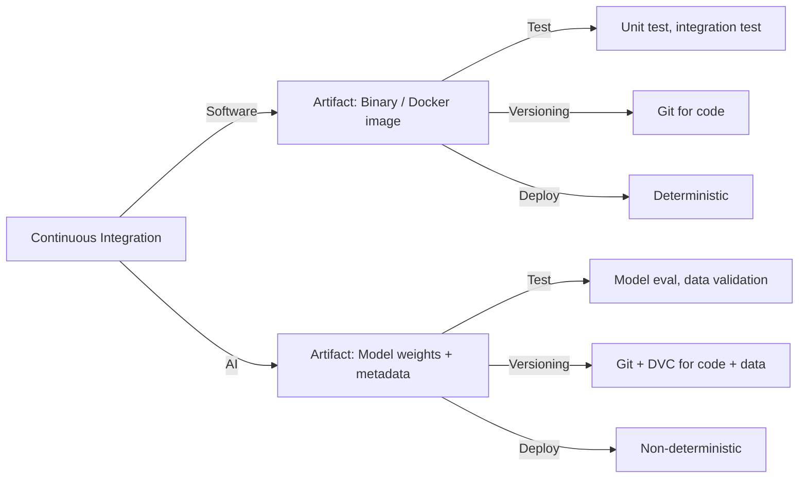
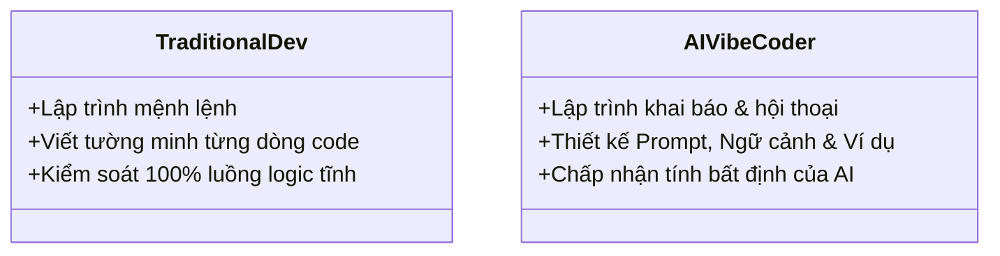

# Day 21 - CI/CD cho Hệ thống AI (CI/CD for AI Systems)

> **Câu hỏi cốt lõi:** *"Code thay đổi mỗi ngày — model cũng vậy. CI/CD cho AI khác gì CI/CD cho software thông thường?"*

---

### 🗺️ 1. Bản đồ Kiến thức Hệ thống (Structured Knowledge Map)

#### 1.1. CI/CD cho Hệ thống AI
Mô tả sự khác biệt giữa CI/CD cho phần mềm truyền thống và CI/CD cho hệ thống AI:



---

### 📌 2. Khái niệm Cơ bản & Từ khóa Nền tảng (Core Concepts & Glossary)

| Thuật ngữ | Khái niệm Kỹ thuật & Bản chất | Tại sao cần quan tâm? |
| :--- | :--- | :--- |
| **MLflow** | Nền tảng mã nguồn mở để quản lý vòng đời ML, bao gồm theo dõi thí nghiệm và quản lý mô hình. | Giúp theo dõi, so sánh và quản lý vòng đời mô hình một cách hệ thống. |
| **DVC (Data Version Control)** | Công cụ quản lý phiên bản dữ liệu, pipelines và reproducibility cho ML. | Giúp tái tạo kết quả và quản lý dữ liệu hiệu quả. |
| **GitHub Actions** | Dịch vụ CI/CD tích hợp với GitHub cho phép tự động hóa quy trình phát triển phần mềm. | Tự động hóa test, train và deploy mô hình AI. |
| **Canary Deployment** | Chiến lược triển khai cho phép phát hiện lỗi sớm bằng cách chuyển hướng một phần lưu lượng đến mô hình mới. | Giảm thiểu rủi ro khi phát hành mô hình mới. |
| **Eval Gate** | Cơ chế so sánh mô hình mới với mô hình sản xuất để đảm bảo không có sự suy giảm hiệu suất. | Bảo vệ an toàn trước khi triển khai mô hình mới. |

---

### 📐 3. Quy tắc, Công thức & Tham số Kỹ thuật (Hard Rules & Formulas)

#### 3.1. MLflow: Theo dõi Thí nghiệm
Mã Python để theo dõi thí nghiệm trong MLflow:

```python
import mlflow
from mlflow.models import infer_signature

mlflow.set_experiment("sentiment-v2")

with mlflow.start_run(run_name="lr_0001_ep10"):
    mlflow.log_param("lr", 0.001)
    mlflow.log_param("epochs", 10)
    mlflow.log_param("batch_size", 32)

    for epoch in range(10):
        loss = train_one_epoch(model, loader)
        acc = evaluate(model, val_loader)

        mlflow.log_metric("train_loss", loss, step=epoch)
        mlflow.log_metric("val_accuracy", acc, step=epoch)

    mlflow.log_artifact("confusion_matrix.png")
    mlflow.sklearn.log_model(model, "model", signature=infer_signature(X_val, y_pred))
```

#### 3.2. DVC: Quản lý Phiên bản Dữ liệu
Cách sử dụng DVC để quản lý dữ liệu:

```bash
git init && dvc init
dvc add data/training_set.parquet
git add data/training_set.parquet.dvc .gitignore
git commit -m "track training dataset v1"
dvc push
```

#### 3.3. CI Pipeline Architecture cho AI Projects
Mô hình kiến trúc CI Pipeline cho các dự án AI:

```mermaid
graph LR
    A[git push / PR] --> B[Data Validation]
    B --> C[Model Training]
    C --> D[Eval Gate]
    D --> E[Deploy (if pass)]
    style A fill:#3f6e9e,color:#fff
    style B fill:#55a044,color:#fff
    style C fill:#da7c2a,color:#fff
    style D fill:#c0422c,color:#fff
    style E fill:#55a044,color:#fff
```

---

### 💻 4. Hành trang Kỹ thuật & Mã nguồn (Technical Hands-on)

#### 4.1. GitHub Actions: Cấu trúc Workflow YAML
Cấu trúc workflow cho CI/CD trong GitHub Actions:

```yaml
name: AI CI/CD Pipeline
on:
  push:
    branches: [main]
  pull_request:
    branches: [main]
env:
  MLFLOW_TRACKING_URI: ${{ secrets.MLFLOW_TRACKING_URI }}
  AWS_ACCESS_KEY_ID: ${{ secrets.AWS_ACCESS_KEY_ID }}
jobs:
  data-validation:
    runs-on: ubuntu-latest
    steps:
      - uses: actions/checkout@v4
      - uses: actions/setup-python@v5
        with: { python-version: "3.11" }
      - run: pip install -r requirements.txt
      - run: dvc pull data/
      - run: great_expectations checkpoint run data_quality
```

#### 4.2. CI Job: Eval Gate
Mã Python cho Eval Gate:

```python
import mlflow, sys

def eval_gate(new_model_uri, prod_model_uri, threshold=0.02):
    client = mlflow.MlflowClient()
    new_model = mlflow.sklearn.load_model(new_model_uri)
    prod_model = mlflow.sklearn.load_model(prod_model_uri)

    new_acc = evaluate(new_model, X_test, y_test)
    prod_acc = evaluate(prod_model, X_test, y_test)

    delta = new_acc - prod_acc
    if delta < -threshold:
        sys.exit(1)  # GitHub Actions job fails — blocks deploy
```

---

### 🧠 5. Tư duy Chuyển dịch: Từ Dev Truyền thống sang AI Vibe Coder

Sự chuyển mình từ lập trình truyền thống sang lập trình AI:



> [!WARNING]  
> **Cảnh báo quan trọng cho kỹ sư tương lai:** Hãy học cách làm chủ cả hai kỹ năng lập trình truyền thống và AI để tạo ra các sản phẩm bền vững trong môi trường thực tế.