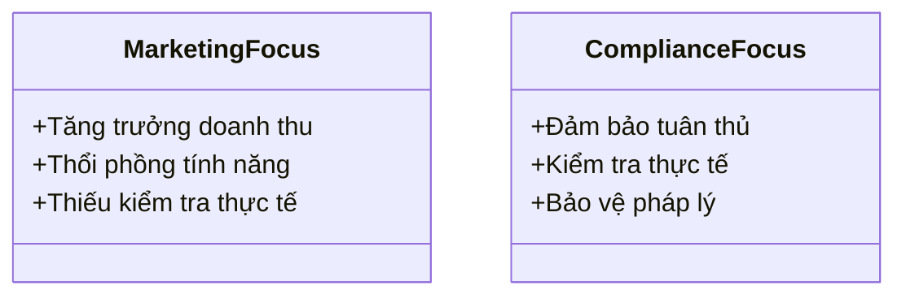

# Day 22 - AI Compliance

> **Câu hỏi trung tâm hôm nay:** *"Sản phẩm bạn đã có phanh. Nhưng bạn có giấy phép lưu hành không?"*

---

### 🗺️ 1. Bản đồ Kiến thức Tuân thủ AI (AI Compliance Knowledge Map)

Để hiểu rõ về tuân thủ pháp lý trong lĩnh vực AI, chúng ta sẽ phân tích các yếu tố chính cần thiết cho một sản phẩm AI an toàn và hợp pháp:

#### 1.1. Các yếu tố cần thiết cho tuân thủ
- **Giấy phép lái xe:** Pháp lý cho phép vận hành AI.
- **Đăng kiểm xe:** Hồ sơ tuân thủ và đánh giá rủi ro.
- **Bảo hiểm:** Hồ sơ chứng cứ để bảo vệ khi có sự cố.

---

### 📌 2. Khái niệm Cơ bản & Từ khóa Nền tảng (Core Concepts & Glossary)

| Thuật ngữ | Khái niệm Kỹ thuật & Bản chất | Tại sao cần quan tâm? |
| :--- | :--- | :--- |
| **Điều 198 - Tội Lừa dối khách hàng** | Hành vi gian dối trong việc cung cấp thông tin về sản phẩm/dịch vụ. | Có thể dẫn đến truy tố hình sự và phạt tù từ 1 đến 5 năm. |
| **Điều 324 - Tội Rửa tiền** | Hành vi xử lý thanh toán biết rõ có dấu hiệu phạm tội. | Founder có thể bị truy tố nếu biết dấu hiệu nhưng vẫn tiếp tục hoạt động. |
| **Luật BVDLCN (PDPL)** | Luật bảo vệ dữ liệu cá nhân, yêu cầu tuân thủ nghiêm ngặt. | Vi phạm có thể bị phạt đến 10 lần doanh thu từ vi phạm. |
| **Luật AI Việt Nam** | Quy định về việc phân loại AI theo mức độ rủi ro. | Cần phân loại để xác định nghĩa vụ tuân thủ. |

---

### 📐 3. Quy tắc, Công thức & Tham số Kỹ thuật (Hard Rules & Formulas)

#### 3.1. Nguyên tắc Tuân thủ
- **Phân loại rủi ro AI:** Theo Điều 9 Luật AI VN, AI được phân thành 3 tầng: Cao, Trung bình, Thấp.
- **Nghĩa vụ thông báo:** Các sản phẩm AI ở tầng cao và trung bình phải thông báo cho Bộ KH&CN.

#### 3.2. Cấu thành tội phạm theo Điều 198
1. Có hoạt động bán hàng/dịch vụ.
2. Có thông tin sai sự thật.
3. Khách hàng tin và mua dựa vào đó.
4. Founder biết rõ hoặc biết rõ là không biết.

---

### 💻 4. Hành trang Kỹ thuật & Mã nguồn (Technical Hands-on)

#### 4.1. Hồ sơ chứng cứ bảo vệ founder
| # | Loại hồ sơ                           | Cập nhật khi                                   | Mục đích bảo vệ                                      |
| - | ------------------------------------ | ----------------------------------------------- | ---------------------------------------------------- |
| 1 | Nhật ký kiểm thử claim AI            | Mỗi feature mới + hằng quý                      | Chống Điều 198 (kiểu Kera)                           |
| 2 | Hồ sơ rà soát điều khoản vendor       | Hằng quý + khi vendor đổi                       | Chống rủi ro vendor + vi phạm điều khoản            |
| 3 | Nhật ký giám sát giao dịch bất thường | Hằng tuần                                       | Chống Điều 324 (kiểu Pips)                           |
| 4 | DPIA / CTIA đã nộp                     | 1 lần + khi đổi luồng dữ liệu                   | Tuân thủ PDPL Điều 30                                |
| 5 | Phê duyệt nội dung marketing         | Trước mỗi launch / livestream                   | Chống Điều 198 (founder ký xác nhận)                  |

---

### 🧠 5. Tư duy Chuyển dịch: Từ Marketing đến Tuân thủ

Sự chuyển dịch từ việc chỉ tập trung vào marketing sang việc đảm bảo tuân thủ pháp lý là rất quan trọng:

* **Marketing Focus:** Tập trung vào việc thu hút khách hàng mà không kiểm tra tính chính xác của thông tin.
* **Compliance Focus:** Đảm bảo rằng mọi thông tin đều chính xác và có thể chứng minh được.

> [!WARNING]  
> **Cảnh báo quan trọng cho kỹ sư tương lai:** Việc không tuân thủ có thể dẫn đến hậu quả pháp lý nghiêm trọng. Hãy luôn đảm bảo rằng các tuyên bố marketing của bạn có bằng chứng hỗ trợ.

---

### 📅 6. Lịch Tuân thủ & Deadline

| Ngày       | Sự kiện                                   |
| ---------- | ----------------------------------------- |
| 1/1/2026   | Luật BVDLCN (PDPL) có hiệu lực          |
| 1/3/2026   | Luật AI VN có hiệu lực                   |
| 2/8/2026   | EU AI Act có hiệu lực                    |
| 1/3/2027   | Hết ân hạn cho các sản phẩm AI           |

---

### 🔍 7. Workshop & Thực hành

#### 7.1. Rà soát claim marketing
- **Tình huống:** Rà soát mọi câu marketing để đảm bảo không có tuyên bố sai sự thật.
- **Bước thực hiện:** Phân loại các tuyên bố theo mức độ chứng minh được và viết lại phiên bản trung thực.

#### 7.2. Xác định luật áp dụng
- **Câu hỏi cần trả lời:**
  1. Có user nào quốc tịch EU không?
  2. Có xử lý dữ liệu cá nhân của công dân Việt không?
  3. AI của bạn ở tầng nào theo Luật AI VN?

---

### 📑 8. Đóng gói & Nộp bài

**Output cuối ngày:** 
- 4 file markdown + 1 file Excel
- Hồ sơ Tuân thủ Toàn diện

**Nộp bài:** File ZIP tên [Tên]_Day22.zip – nộp hệ thống trước 13:00.

---

### 🙏 9. Cảm ơn

Hôm nay đã trang bị cho bạn những kiến thức quan trọng về tuân thủ pháp lý trong lĩnh vực AI. Hãy luôn nhớ rằng, sự an toàn và tuân thủ pháp lý là nền tảng cho sự phát triển bền vững của sản phẩm AI.

**Tốc độ. An toàn. Mở rộng. Đủ cả ba.**