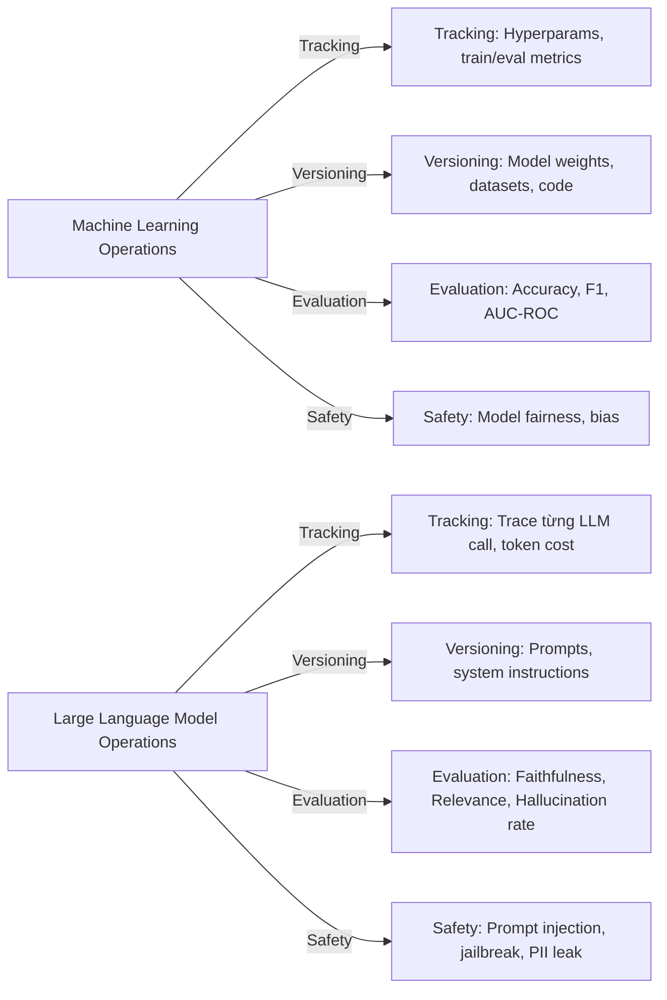
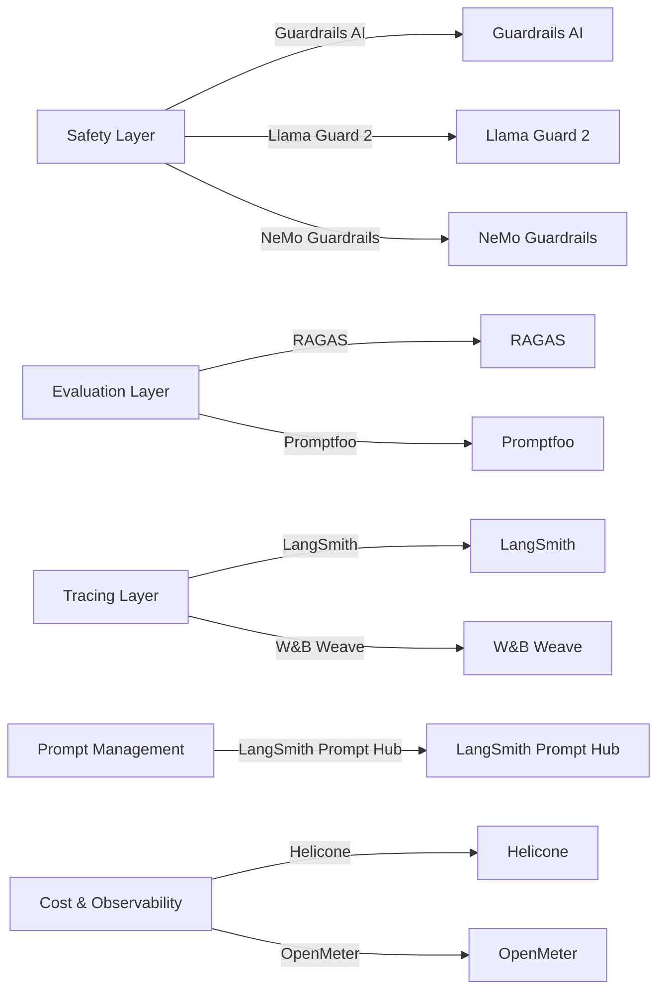
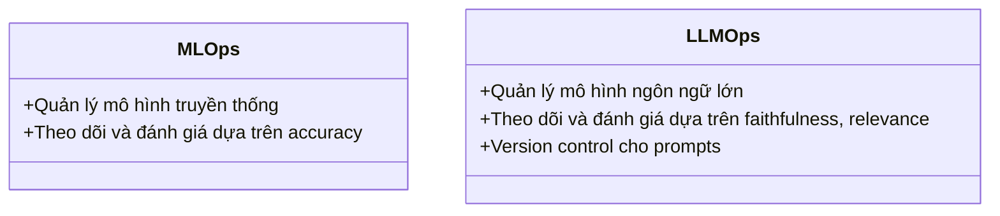

# Day 22 - LLMOps & Prompt Versioning

> **Câu hỏi cốt lõi:** *"Prompt thay đổi = behavior thay đổi."*

---

### 🗺️ 1. Bản đồ Kiến thức Hệ thống (Structured Knowledge Map)

#### 1.1. So sánh LLMOps và MLOps Truyền Thống
MLOps (Machine Learning Operations) và LLMOps (Large Language Model Operations) có những khác biệt quan trọng trong quy trình vận hành:



#### 1.2. LLMOps Stack 2025–2026
Các lớp công nghệ cần thiết cho LLMOps:



---

### 📌 2. Khái niệm Cơ bản & Từ khóa Nền tảng (Core Concepts & Glossary)

| Thuật ngữ | Khái niệm Kỹ thuật & Bản chất | Tại sao cần quan tâm? |
| :--- | :--- | :--- |
| **LLMOps** | Quy trình vận hành dành riêng cho các mô hình ngôn ngữ lớn, mở rộng từ MLOps với các thách thức đặc thù. | Đảm bảo hiệu suất và độ tin cậy của các ứng dụng LLM. |
| **Prompt Versioning** | Quá trình theo dõi và quản lý các phiên bản của prompt để đảm bảo tính nhất quán và khả năng phục hồi. | Giúp dễ dàng theo dõi thay đổi và khôi phục khi cần thiết. |
| **LangSmith** | Nền tảng observability cho các ứng dụng LLM, cho phép theo dõi, gỡ lỗi và phân tích. | Tối ưu hóa hiệu suất và phát hiện vấn đề trong thời gian thực. |
| **RAGAS** | Bộ chỉ số đánh giá cho các mô hình ngôn ngữ, tập trung vào độ tin cậy và tính liên quan. | Cung cấp cái nhìn sâu sắc về chất lượng đầu ra của mô hình. |
| **Guardrails** | Các biện pháp bảo vệ để đảm bảo an toàn cho đầu vào và đầu ra của mô hình LLM. | Ngăn chặn các vấn đề như rò rỉ thông tin cá nhân và tiêm nhiễm prompt. |

---

### 📐 3. Quy tắc, Công thức & Tham số Kỹ thuật (Hard Rules & Formulas)

#### 3.1. Các chỉ số cần theo dõi trong LLMOps
Các chỉ số quan trọng cần theo dõi để đảm bảo hiệu suất của mô hình:

| Metric | Threshold/Target |
|---|---|
| **Token Cost / Task** | **< $0.002** |
| **Hallucination Rate** | **< 5%** |
| **Faithfulness Score** | **> 0.8** |
| **Latency P95** | **< 3s** |

#### 3.2. Quy trình A/B Testing Prompts
Quy trình A/B testing cho các phiên bản prompt:

```mermaid
graph LR
    A[Traffic Router <br> (request_id hash % 2)] --> B{Prompt v1 <br> (concise style)}
    A --> C{Prompt v2 <br> (detailed style)}
    B -- 50% --> D(Evaluation: faithfulness · relevance · cost · latency)
    C -- 50% --> D
```

---

### 💻 4. Hành trang Kỹ thuật & Mã nguồn (Technical Hands-on)

#### 4.1. Cài đặt LangSmith và Tự động Ghi lại
Cách thiết lập LangSmith để theo dõi tự động:

```python
import os

# 1. Enable tracing
os.environ["LANGCHAIN_TRACING_V2"] = "true"
os.environ["LANGCHAIN_API_KEY"] = "ls_..."
os.environ["LANGCHAIN_PROJECT"] = "rag-prod"

# 2. Auto-instrument LangChain
from langchain_openai import ChatOpenAI
from langchain_core.prompts import ChatPromptTemplate

llm = ChatOpenAI(model="gpt-4o-mini")
prompt = ChatPromptTemplate.from_template("...")
chain = prompt | llm
```

#### 4.2. Ví dụ về Guardrails AI
Cách sử dụng Guardrails để bảo vệ đầu vào và đầu ra:

```python
from guardrails import Guard
from guardrails.hub import ValidJson, DetectPII, ToxicLanguage

# Build guard pipeline
guard = Guard().use_many(
    ValidJson(on_fail="reask"),
    DetectPII(pii_entities=["EMAIL", "PHONE", "SSN"], on_fail="fix"),
    ToxicLanguage(threshold=0.7, on_fail="noop")
)

# Wrap LLM call
result = guard(
    llm_api=openai.chat.completions.create,
    model="gpt-4o-mini",
    messages=[{"role": "user", "content": "Summarize: {document}"}],
    num_reasks=2
)
```

---

### 🧠 5. Tư duy Chuyển dịch: Từ MLOps sang LLMOps

Sự chuyển đổi từ MLOps sang LLMOps yêu cầu thay đổi tư duy trong việc quản lý và vận hành mô hình:



> [!WARNING]  
> **Cảnh báo quan trọng:** Việc không theo dõi và quản lý phiên bản của prompt có thể dẫn đến sự gia tăng chi phí và độ trễ không mong muốn. Hãy luôn thực hiện version control cho mọi thay đổi.

---

### 🔑 6. Key Takeaways

1. **Prompt là Code:** Cần quản lý và theo dõi như mã nguồn, không chỉ là văn bản.
2. **LLM-as-Judge:** Cung cấp khả năng đánh giá quy mô lớn nhưng cần được hiệu chỉnh định kỳ với đánh giá của con người.
3. **Guardrails:** Cần thiết cho an toàn, không chỉ dựa vào một điểm kiểm soát duy nhất.

---

### 📅 7. Tiếp Theo & Bài Tập Về Nhà

**Ngày 23 Preview:** Monitoring & Observability Stack

**Bài Tập Về Nhà:**
1. Hoàn thành Lab #22 và nộp báo cáo.
2. Cài Docker Compose cho Prometheus và Grafana.
3. Đọc trước hướng dẫn OpenTelemetry Python instrumentation.