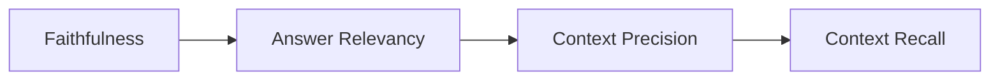
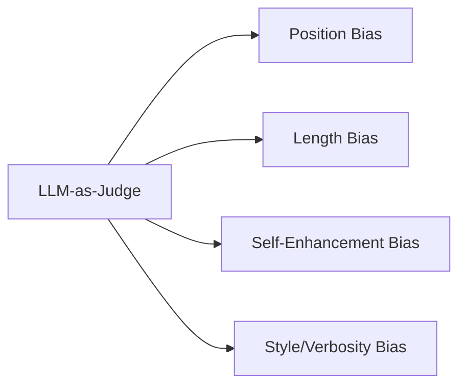
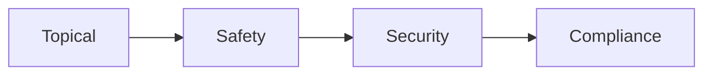
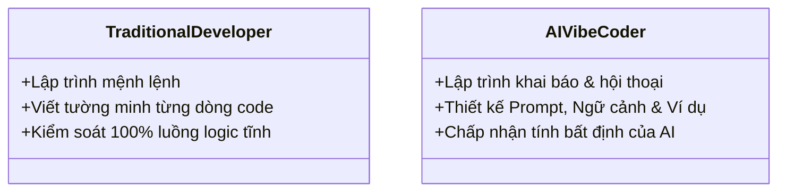

# Day 23 - Agent Builder

> **Câu hỏi cốt lõi:** *"Làm thế nào để đảm bảo rằng các tác nhân AI hoạt động hiệu quả và an toàn trong môi trường sản xuất?"*

---

### 🗺️ 1. Bản đồ Kiến thức Hệ thống (Structured Knowledge Map)

Để hiểu rõ về việc đo lường và bảo vệ các tác nhân AI, chúng ta sẽ khám phá các khía cạnh chính của RAGAS, LLM-as-Judge và Guardrails:

#### 1.1. RAGAS Framework
Mô hình RAGAS bao gồm 4 chỉ số cốt lõi để đánh giá hiệu suất của các tác nhân AI:



#### 1.2. LLM-as-Judge
Sử dụng LLM để đánh giá chất lượng câu trả lời và phát hiện các thiên lệch:



#### 1.3. Guardrails
Các trục bảo vệ cần thiết để đảm bảo an toàn và tuân thủ:



---

### 📌 2. Khái niệm Cơ bản & Từ khóa Nền tảng (Core Concepts & Glossary)

| Thuật ngữ | Khái niệm Kỹ thuật & Bản chất | Tại sao cần quan tâm? |
| :--- | :--- | :--- |
| **RAGAS** | Framework đánh giá hiệu suất của các tác nhân AI dựa trên 4 chỉ số: Faithfulness, Answer Relevancy, Context Precision, Context Recall. | Đảm bảo rằng các tác nhân AI hoạt động chính xác và hiệu quả. |
| **LLM-as-Judge** | Sử dụng mô hình ngôn ngữ lớn để đánh giá chất lượng câu trả lời và phát hiện thiên lệch. | Tăng cường khả năng đánh giá quy mô lớn mà không cần nhiều nhân lực. |
| **Guardrails** | Các biện pháp bảo vệ để ngăn chặn các hành vi không mong muốn từ các tác nhân AI. | Bảo vệ người dùng và đảm bảo tuân thủ quy định. |
| **Hallucination** | Hiện tượng khi mô hình tạo ra thông tin sai lệch nhưng tự tin. | Cần phát hiện và ngăn chặn để tránh thông tin sai lệch. |

---

### 📐 3. Quy tắc, Công thức & Tham số Kỹ thuật (Hard Rules & Formulas)

#### 3.1. RAGAS Metrics
Bốn chỉ số cốt lõi của RAGAS được định nghĩa như sau:

1. **Faithfulness**: Đo lường mức độ mà câu trả lời có được hỗ trợ bởi ngữ cảnh.
2. **Answer Relevancy**: Đánh giá mức độ liên quan của câu trả lời so với câu hỏi.
3. **Context Precision**: Đo lường độ chính xác của các đoạn ngữ cảnh được truy xuất.
4. **Context Recall**: Đánh giá mức độ đầy đủ của thông tin trong ngữ cảnh so với ground truth.

#### 3.2. Công thức Tính Faithfulness
Công thức tính Faithfulness được xác định như sau:

$$\text{Faithfulness} = \frac{\text{Số lượng claims verified True}}{\text{Tổng số claims}}$$

#### 3.3. NLI-Based Detection
Sử dụng NLI để phát hiện hallucination:

- **Premise**: Ngữ cảnh đã truy xuất.
- **Hypothesis**: Mỗi câu trong câu trả lời.
- **Kết quả**: Nếu entailment score < 0.5, đánh dấu là hallucination.

---

### 💻 4. Hành trang Kỹ thuật & Mã nguồn (Technical Hands-on)

#### 4.1. Thiết lập RAGAS
Dưới đây là cách triển khai mã nguồn để đánh giá hiệu suất của tác nhân AI bằng RAGAS:

```python
from ragas import evaluate
from ragas.metrics import (faithfulness, answer_relevancy,
                            context_precision, context_recall)
from datasets import Dataset

data = {
    "question": ["Doanh thu FPT 2023?"],
    "answer": ["50 nghin ty"],
    "contexts": [["FPT 2023 doanh thu 52,617 ty..."]],
    "ground_truth": ["52,617 ty"]
}

result = evaluate(Dataset.from_dict(data),
                  metrics=[faithfulness, answer_relevancy,
                           context_precision, context_recall],
                  llm=ChatOpenAI(model="gpt-4o-mini"))
```

#### 4.2. Tạo Test Set Tự Động
Sử dụng RAGAS để tự động tạo test set từ tài liệu:

```python
# Tạo test set với 3 phân phối
simple_questions = ["Doanh thu FPT 2023?"]
reasoning_questions = ["FPT tăng nhanh hơn năm trước không?"]
multi_context_questions = ["Cổ phiếu FPT có đáng đầu tư?"]
```

---

### 🧠 5. Tư duy Chuyển dịch: Từ Truyền thống đến AI Vibe Coder

Sự chuyển dịch từ lập trình truyền thống sang lập trình với AI yêu cầu tư duy mới:



> [!WARNING]  
> **Cảnh báo quan trọng cho kỹ sư tương lai:** Hãy luôn chú ý đến việc thiết kế các guardrails và đánh giá hiệu suất để đảm bảo rằng các tác nhân AI hoạt động an toàn và hiệu quả trong môi trường sản xuất.