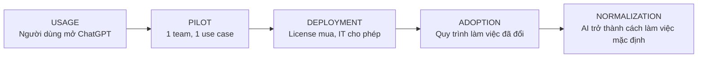
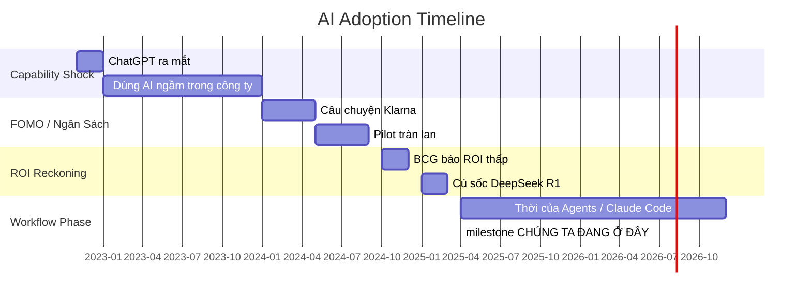
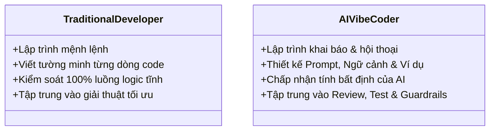

# Day 23 - Change Management & AI Adoption

> **Câu hỏi cốt lõi:** *"Công nghệ tốt nhưng nhân viên không dùng thì sao?"*

---

### 🗺️ 1. Bản đồ Kiến thức về Quản lý Thay đổi và Áp dụng AI (Knowledge Map on Change Management & AI Adoption)

Để hiểu rõ về quản lý thay đổi và áp dụng AI, chúng ta cần nắm vững các khía cạnh chính sau:

#### 1.1. Các Ngưỡng Áp Dụng AI (AI Adoption Thresholds)
Mô tả các giai đoạn khác nhau trong quá trình áp dụng AI:



#### 1.2. Thời gian Áp Dụng AI (AI Adoption Timeline)
Mô tả vòng cung hành vi của doanh nghiệp trong việc áp dụng AI:



---

### 📌 2. Khái niệm Cơ bản & Từ khóa Nền tảng (Core Concepts & Glossary)

| Thuật ngữ | Khái niệm Kỹ thuật & Bản chất | Tại sao cần quan tâm? |
| :--- | :--- | :--- |
| **ADKAR** | Mô hình quản lý thay đổi gồm Awareness, Desire, Knowledge, Ability, Reinforcement. | Giúp xác định các điểm nghẽn trong quá trình áp dụng AI. |
| **Capability Shock** | Sự ngạc nhiên về khả năng của AI và cách nó thay đổi quy trình làm việc. | Hiểu rõ khả năng của AI giúp tổ chức chuẩn bị tốt hơn cho việc áp dụng. |
| **Workflow Redesign** | Quá trình thay đổi quy trình làm việc để tích hợp AI. | Đảm bảo rằng AI được sử dụng hiệu quả và mang lại giá trị thực tế. |
| **Trust Signal** | Các chỉ số cho thấy người dùng có tin tưởng vào kết quả của AI hay không. | Tin tưởng là yếu tố quan trọng trong việc áp dụng AI thành công. |

---

### 📐 3. Quy tắc, Công thức & Tham số Kỹ thuật (Hard Rules & Formulas)

#### 3.1. Mô hình ADKAR
Mô hình ADKAR giúp xác định các điểm nghẽn trong quá trình áp dụng AI:

| Stage            | Câu hỏi chẩn đoán điểm nghẽn | “Fix sai" phổ biến cần tránh                       |
| :--------------- | :--------------------------- | :-------------------------------------------------- |
| **Awareness**    | Họ có biết tại sao cần thay đổi? | Cho đi training trước khi giải thích lý do         |
| **Desire**       | Họ có muốn tham gia không?    | Thêm hướng dẫn mà không xử lý nỗi sợ / động lực   |
| **Knowledge**    | Họ có biết làm thế nào?      | Diễn thuyết tạo động lực mà không training        |
| **Ability**      | Họ làm được trong workflow thật? | Workshop một lần mà không coaching                 |
| **Reinforcement** | Hành vi có gắn lại không?     | Sự kiện launch mà không có manager theo sát        |

---

### 💻 4. Hành trang Kỹ thuật & Mã nguồn (Technical Hands-on)

#### 4.1. Thiết kế Dashboard Hành Động
Khi xây dựng Dashboard Hành Động cho áp dụng AI, cần chú ý đến các yếu tố sau:

| Phần                       | Cần có                                              | Output           |
| :------------------------- | :-------------------------------------------------- | :--------------- |
| **A. Challenge + Product** | Thách thức, sản phẩm, người dùng, 2-4 workflow    | Scope lock       |
| **B. Root cause**          | Lens + evidence + case lesson                       | Diagnosis        |
| **C. Solution roadmap**    | 0-30/31-60/61-90 ngày, owner, dấu hiệu hoàn thành | Action plan      |
| **D. ROI Dashboard**       | Product-level + workflow-level metric; baseline, target, source, owner | Dashboard v1     |

---

### 🧠 5. Tư duy Chuyển dịch: Từ Truyền thống đến AI Vibe Coder

Sự chuyển mình từ lập trình truyền thống sang lập trình với AI:



> [!WARNING]  
> **Cảnh báo quan trọng cho kỹ sư tương lai:** Hãy học cách làm chủ cả hai kỹ năng lập trình truyền thống và lập trình với AI để tạo ra sản phẩm bền vững và hiệu quả.

--- 

### 📊 6. Tactics & Moves for AI Adoption

#### 6.1. 25 Tactics → 5 Adoption Moves
Các bước để tăng tốc độ áp dụng AI trong tổ chức:

```mermaid
graph LR
    subgraph AI ADOPTION STACK – đối chiếu 5 nước đi
        L1(L1 Cap<br>Capability<br>Shock)
        L2(L2 Org<br>Org<br>Absorption)
        L3(L3 Task<br>Task<br>Design)
        L4(L4 Wflw<br>Workflow<br>Redesign)
        L5(L5 Hum<br>Human<br>Change)
        L6(L6 Roll<br>Rollout<br>System)
        L7(L7 Val<br>Value<br>Measurement)
        L8(L8 Norm<br>Normalization)

        style L1 fill:#f9f,stroke:#333,stroke-width:2px
        style L2 fill:#f9f,stroke:#333,stroke-width:2px
        style L3 fill:#f9f,stroke:#333,stroke-width:2px
        style L4 fill:#f9f,stroke:#333,stroke-width:2px
        style L5 fill:#f9f,stroke:#333,stroke-width:2px
        style L6 fill:#f9f,stroke:#333,stroke-width:2px
        style L7 fill:#f9f,stroke:#333,stroke-width:2px
        style L8 fill:#f9f,stroke:#333,stroke-width:2px
    end
    
    M1(Move 1:<br>Giải thích vì sao) --- L1
    M1 --- L2
    M1 --- L3
    
    M2(Move 2:<br>Theo dõi + thưởng) --- L7
    M2 --- L5
    M2 --- L6
    
    M3(Move 3:<br>Cắt thủ tục thừa) --- L2
    M3 --- L6
    M3 --- L7
    
    M4(Move 4:<br>Người tiên phong) --- L5
    M4 --- L6
    M4 --- L7
    
    M5(Move 5:<br>Ưu tiên việc) --- L3
    M5 --- L4
    M5 --- L7
```

---

### 📈 7. Kết luận

Để áp dụng AI thành công, tổ chức cần phải thay đổi quy trình làm việc, xây dựng lòng tin và đo lường giá trị thực tế. Hãy luôn nhớ rằng việc áp dụng AI không chỉ là công nghệ mà còn là sự thay đổi trong tư duy và cách thức làm việc của con người.