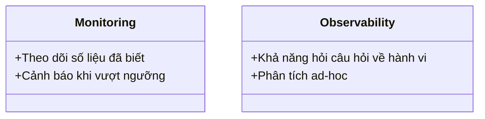

# Day 23 - RAG Data

> **Câu hỏi cốt lõi:** *"Model chạy tốt hôm qua — hôm nay accuracy drop 20%. Bạn phát hiện được không, và bao lâu?"*

---

### 🗺️ 1. Bản đồ Kiến thức Hệ thống (Structured Knowledge Map)

Bản đồ kiến thức về Monitoring & Observability được chia thành các khía cạnh chính:

#### 1.1. Bối cảnh & Sự tiến hóa của Observability
- **Monitoring:** Known-knowns, trả lời câu hỏi "X có hỏng không?".
- **Observability:** Property of the system, trả lời câu hỏi "Tại sao X hỏng?".

#### 1.2. Ba Trụ Cột của Observability
- **Metrics:** Số liệu theo thời gian (Prometheus).
- **Logs:** Hồ sơ sự kiện (Loki, ELK).
- **Traces:** DAG yêu cầu (Jaeger, Tempo).

#### 1.3. Golden Signals
- **Latency:** Thời gian phản hồi.
- **Traffic:** Số yêu cầu mỗi giây.
- **Errors:** Tỷ lệ lỗi.
- **Saturation:** Tỷ lệ sử dụng tài nguyên.

---

### 📌 2. Khái niệm Cơ bản & Từ khóa Nền tảng (Core Concepts & Glossary)

| Thuật ngữ | Khái niệm Kỹ thuật & Bản chất | Tại sao cần quan tâm? |
| :--- | :--- | :--- |
| **Observability** | Khả năng hỏi bất kỳ câu hỏi nào về hành vi của hệ thống mà không cần redeploy. | Giúp phát hiện vấn đề trước khi người dùng phàn nàn. |
| **Metrics** | Số liệu định lượng theo thời gian. | Cung cấp cái nhìn tổng quan về hiệu suất hệ thống. |
| **Logs** | Hồ sơ chi tiết về sự kiện. | Hỗ trợ phân tích sự cố và tìm kiếm nguyên nhân. |
| **Traces** | Theo dõi luồng yêu cầu trong hệ thống. | Giúp hiểu rõ hơn về hành vi của các dịch vụ trong pipeline. |
| **Drift** | Sự thay đổi trong phân phối dữ liệu đầu vào so với dữ liệu huấn luyện. | Cần theo dõi để đảm bảo chất lượng mô hình. |

---

### 📐 3. Quy tắc, Công thức & Tham số Kỹ thuật (Hard Rules & Formulas)

#### 3.1. Công thức Tính Toán Drift
- **Population Stability Index (PSI):**
$$\text{PSI} = \sum_i(p_i - q_i) \log\left(\frac{p_i}{q_i}\right)$$
- **Kullback-Leibler Divergence (KL):**
$$D_{KL}(P||Q) = \sum_i P_i \log\left(\frac{P_i}{Q_i}\right)$$

#### 3.2. Công thức Tính Toán SLO
- **SLO:** Tỷ lệ thành công trong một khoảng thời gian.
$$\text{SLO} = \frac{\text{Số yêu cầu thành công}}{\text{Tổng số yêu cầu}}$$

---

### 💻 4. Hành trang Kỹ thuật & Mã nguồn (Technical Hands-on)

#### 4.1. Cài đặt Prometheus và Grafana
```bash
# Cài đặt Prometheus
docker run -d -p 9090:9090 --name prometheus prom/prometheus

# Cài đặt Grafana
docker run -d -p 3000:3000 --name grafana grafana/grafana
```

#### 4.2. Đo lường Metrics trong Python
```python
from prometheus_client import Counter, Histogram

REQUEST_COUNT = Counter("inference_requests_total", "Total inference requests")
LATENCY = Histogram("inference_latency_seconds", "Inference duration")

@LATENCY.time()
def predict(input_text):
    # Logic dự đoán
    REQUEST_COUNT.inc()
```

---

### 🧠 5. Tư duy Chuyển dịch: Từ Monitoring đến Observability



> [!WARNING]  
> **Cảnh báo:** Chỉ dựa vào monitoring không đủ để phát hiện các vấn đề phức tạp trong hệ thống. Cần có observability để hiểu rõ nguyên nhân gốc rễ.

---

### 🔍 6. Tóm tắt & Kết luận

1. **Golden Signals** và **Ba Trụ Cột** là nền tảng cho việc xây dựng hệ thống observability hiệu quả.
2. **Drift** cần được theo dõi liên tục để đảm bảo chất lượng mô hình AI.
3. **SLO** và **Error Budget** là công cụ quan trọng để quản lý hiệu suất và độ tin cậy của dịch vụ.

---

### 📅 7. Tiếp theo

**Ngày 24:** Data Governance & Security — Bảo vệ dữ liệu nhạy cảm trong AI pipeline.

---

### 💡 8. Hỏi & Đáp

Câu hỏi về Prometheus, Grafana, Observability, Drift, SLO, hay bất kỳ khía cạnh nào khác liên quan đến chủ đề hôm nay?