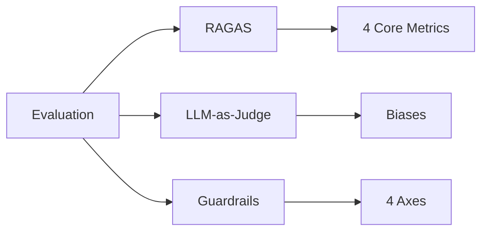
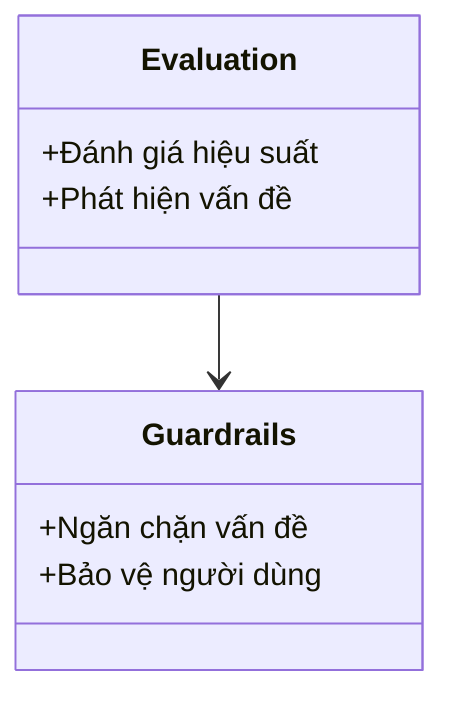

# Day 24 - RAGAS, LLM-as-Judge & Guardrails

> **Câu hỏi cốt lõi:** *"Tại sao việc đánh giá và bảo vệ các tác nhân AI lại quan trọng trong sản xuất?"*

---

### 🗺️ 1. Bản đồ Kiến thức Hệ thống (Structured Knowledge Map)

Để hiểu rõ về RAGAS và các khái niệm liên quan, chúng ta sẽ xem xét các thành phần chính của hệ thống đánh giá và bảo vệ tác nhân AI:



---

### 📌 2. Khái niệm Cơ bản & Từ khóa Nền tảng (Core Concepts & Glossary)

| Thuật ngữ | Khái niệm Kỹ thuật & Bản chất | Tại sao cần quan tâm? |
| :--- | :--- | :--- |
| **RAGAS** | Framework đánh giá cho các tác nhân AI, bao gồm 4 chỉ số cốt lõi: Faithfulness, Answer Relevancy, Context Precision, Context Recall. | Cung cấp tiêu chuẩn để đo lường hiệu suất của tác nhân AI. |
| **LLM-as-Judge** | Sử dụng mô hình ngôn ngữ lớn để đánh giá chất lượng câu trả lời của tác nhân AI. | Tăng khả năng mở rộng đánh giá từ 100 câu hỏi lên 100,000 câu hỏi. |
| **Guardrails** | Các biện pháp bảo vệ để ngăn chặn các vấn đề tiềm ẩn trong tương tác của người dùng với tác nhân AI. | Đảm bảo an toàn và tuân thủ quy định trong sản xuất. |
| **Biases** | Các thiên lệch có thể xảy ra trong quá trình đánh giá, bao gồm Position Bias, Length Bias, Self-Enhancement Bias, và Style Bias. | Cần được nhận diện và giảm thiểu để đảm bảo tính chính xác của đánh giá. |

---

### 📐 3. Quy tắc, Công thức & Tham số Kỹ thuật (Hard Rules & Formulas)

#### 3.1. RAGAS Framework — 4 Core Metrics
```mermaid
graph LR
    subgraph Generation
        A(Faithfulness) --> C(Answer Relevancy)
    end
    subgraph Retrieval
        B(Context Precision) --> D(Context Recall)
    end
    A --> |Answer ↔ Context (hallucination)| Generation
    C --> |Answer ↔ Question (on-topic)| Generation
    B --> |Retrieved chunks ranked (NDCG)| Retrieval
    D --> |Coverage with ground truth (completeness)| Retrieval
```

#### 3.2. Công thức Tính Faithfulness
$$\text{Faithfulness} = \frac{\text{Verified True Claims}}{\text{Total Claims}}$$

#### 3.3. Công thức Tính Answer Relevancy
1. Tạo câu hỏi ngược từ câu trả lời.
2. Đo cosine similarity giữa câu hỏi gốc và các câu hỏi ngược.

---

### 💻 4. Hành trang Kỹ thuật & Mã nguồn (Technical Hands-on)

#### 4.1. Thiết lập RAGAS
```python
from ragas import evaluate
from ragas.metrics import (faithfulness, answer_relevancy,
                            context_precision, context_recall)
from datasets import Dataset

data = {
    "question": ["Doanh thu FPT 2023?"],
    "answer": ["50 nghin ty"],
    "contexts": [["FPT 2023 doanh thu 52,617 ty..."]],
    "ground_truth": ["52,617 ty"]
}

result = evaluate(Dataset.from_dict(data),
                  metrics=[faithfulness, answer_relevancy,
                           context_precision, context_recall],
                  llm=ChatOpenAI(model="gpt-4o-mini"))
```

#### 4.2. Phát hiện Hallucination
Sử dụng NLI để kiểm tra tính chính xác của câu trả lời:
```python
def detect_hallucination(answer, context):
    # Kiểm tra tính hợp lý giữa câu trả lời và ngữ cảnh
    entailment_score = nli_check(answer, context)
    return entailment_score < 0.5
```

---

### 🧠 5. Tư duy Chuyển dịch: Từ Đánh giá đến Bảo vệ

Việc đánh giá và bảo vệ tác nhân AI không chỉ là một bước đơn lẻ mà là một quy trình liên tục:



> [!WARNING]  
> **Cảnh báo quan trọng:** Việc không có hệ thống đánh giá và bảo vệ rõ ràng có thể dẫn đến những rủi ro pháp lý nghiêm trọng và mất lòng tin từ người dùng.

---

### 🔍 6. Kết luận & Hướng đi tiếp theo

1. **Đánh giá không phải là tùy chọn.** RAGAS và LLM-as-Judge là tiêu chuẩn tối thiểu.
2. **Bảo vệ đa lớp.** Cần có nhiều lớp bảo vệ để đảm bảo an toàn cho người dùng.
3. **Giảm thiểu thiên lệch.** Cần nhận diện và giảm thiểu các thiên lệch trong quá trình đánh giá.

> **Tiếp theo:** *Reliability & Production-Ready Agent* — Học cách phục hồi khi LLM gặp sự cố trong sản xuất.

---

### 📚 Tài liệu Tham khảo

1. RAGAS Documentation — docs.ragas.io.
2. Zheng et al. 2023, "LLM-as-a-Judge with MT-Bench and Chatbot Arena".
3. Chen et al. 2024, "Humans or LLMs as the Judge? A Study on Judgement Bias".
4. Manakul et al. 2023, "SelfCheckGPT: Zero-Resource Black-Box Hallucination Detection".
5. Farquhar et al. 2024, "Detecting hallucinations using semantic entropy" - Nature paper.

--- 

### ❓ Hỏi & Đáp

Eval và Guardrails là hai mặt của một đồng xu. Đánh giá giúp phát hiện vấn đề; bảo vệ ngăn chặn vấn đề đến tay người dùng. Cả hai bắt đầu từ định nghĩa rõ ràng về chất lượng.