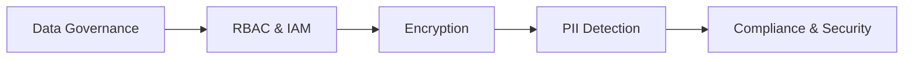

# Day 24 - Data Governance & Security

> **Câu hỏi cốt lõi:** *"AI xử lý data nhạy cảm của người dùng – bạn có thể chứng minh data đó được bảo vệ đúng cách không?"*

---

### 🗺️ 1. Bản đồ Kiến thức Hệ thống (Structured Knowledge Map)

Để hiểu rõ về quản trị dữ liệu và bảo mật trong AI, chúng ta sẽ khám phá các khía cạnh chính sau:

#### 1.1. Khung Quản trị Dữ liệu (Data Governance Framework)
- **Data Catalog:** Quản lý và phân loại dữ liệu.
- **Classification:** Phân loại dữ liệu theo mức độ nhạy cảm.
- **Lineage:** Theo dõi nguồn gốc và biến đổi dữ liệu.
- **Business Glossary:** Định nghĩa các thuật ngữ kinh doanh.

#### 1.2. Nguyên tắc Quyền truy cập tối thiểu (Principle of Least Privilege)
- **RBAC (Role-Based Access Control):** Phân quyền dựa trên vai trò.
- **IAM (Identity and Access Management):** Quản lý danh tính và quyền truy cập.

#### 1.3. Chiến lược Mã hóa (Encryption Strategy)
- **At Rest:** Mã hóa dữ liệu khi lưu trữ.
- **In Transit:** Mã hóa dữ liệu khi truyền tải.

#### 1.4. Phát hiện và Ẩn danh PII (PII Detection & Anonymization)
- **Presidio:** Công cụ phát hiện và ẩn danh thông tin cá nhân.

#### 1.5. Tuân thủ và Kiểm tra Bảo mật (Compliance & Security Testing)
- **Compliance:** Các yêu cầu pháp lý như GDPR, ISO 27001.
- **Security Testing:** Kiểm tra bảo mật định kỳ và tự động.

---

### 📌 2. Khái niệm Cơ bản & Từ khóa Nền tảng (Core Concepts & Glossary)

| Thuật ngữ | Khái niệm Kỹ thuật & Bản chất | Tại sao cần quan tâm? |
| :--- | :--- | :--- |
| **RBAC** | Phân quyền truy cập dựa trên vai trò người dùng. | Đảm bảo quyền truy cập tối thiểu cho từng vai trò. |
| **PII (Personally Identifiable Information)** | Thông tin có thể xác định cá nhân. | Bảo vệ thông tin nhạy cảm để tránh rò rỉ dữ liệu. |
| **Encryption** | Quy trình mã hóa dữ liệu để bảo vệ thông tin. | Ngăn chặn truy cập trái phép vào dữ liệu. |
| **Compliance** | Tuân thủ các quy định pháp lý về bảo mật dữ liệu. | Đảm bảo hoạt động hợp pháp và bảo vệ quyền lợi người dùng. |

---

### 📐 3. Quy tắc, Công thức & Tham số Kỹ thuật (Hard Rules & Formulas)

#### 3.1. Quy tắc Quyền truy cập tối thiểu
| Vai trò | Đọc | Ghi | Không thể |
| :---------- | :---------- | :------------- | :--------------------- |
| Admin | Tất cả dữ liệu | Tất cả dữ liệu | — |
| ML Engineer | Dữ liệu huấn luyện | Tài sản mô hình | Xóa dữ liệu sản xuất |
| Data Analyst | Thống kê tổng hợp | Báo cáo | Dữ liệu PII thô |
| Intern | Dữ liệu sandbox | Chỉ sandbox | Truy cập sản xuất |

#### 3.2. Chiến lược Mã hóa
- **At Rest:** Sử dụng AES-256 cho S3, EBS, cơ sở dữ liệu.
- **In Transit:** TLS 1.3 bắt buộc cho truyền tải dữ liệu.

---

### 💻 4. Hành trang Kỹ thuật & Mã nguồn (Technical Hands-on)

#### 4.1. Mã gọi API cho Presidio
```python
from presidio_analyzer import AnalyzerEngine
from presidio_anonymizer import AnonymizerEngine

analyzer = AnalyzerEngine()
anonymizer = AnonymizerEngine()

# Phát hiện PII trong văn bản tiếng Việt
text = "Nguyen Van A, CCCD 012345678901"
results = analyzer.analyze(
    text=text,
    language="vi",
    entities=["PERSON", "PHONE_NUMBER", "EMAIL_ADDRESS"]
)
```

#### 4.2. Mã hóa Dữ liệu với KMS
```python
import boto3

# Quy trình mã hóa envelope
kms = boto3.client("kms")

# Tạo khóa dữ liệu (DEK)
response = kms.generate_data_key(
    KeyId="alias/ai-training-data",
    KeySpec="AES_256"
)
plaintext_dek = response["Plaintext"]
encrypted_dek = response["CiphertextBlob"]
```

---

### 🧠 5. Tư duy Chuyển dịch: Từ Quản trị Dữ liệu đến Bảo mật AI



> [!IMPORTANT]  
> **Quy tắc vàng trong Quản trị Dữ liệu:**  
> "Governance phải được tích hợp từ đầu, không thể thêm vào sau." 

---

### 🔑 6. Tóm tắt & Key Takeaways

1. Quản trị dữ liệu phải được xây dựng từ đầu, không thể thêm vào sau.
2. PII trong dữ liệu huấn luyện là trách nhiệm – cần ẩn danh trước khi đưa vào pipeline.
3. Tuân thủ các tiêu chuẩn như SOC2/ISO27001 là lợi thế cạnh tranh.

---

### 📅 7. Tiếp theo

**Ngày 25:** GPU FinOps & Cost Optimization + Quiz + Milestone 2  
- Hoàn thành Lab 24: Data Governance & PII Pipeline.
- Ôn tập Chapter 5: CI/CD, LLMOps, Monitoring, Governance.