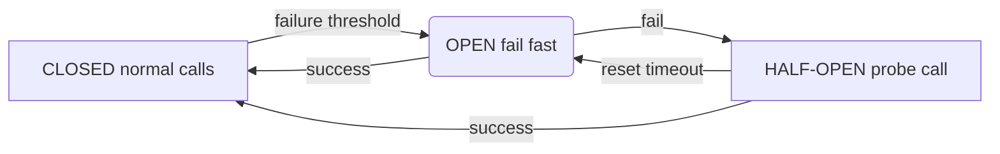
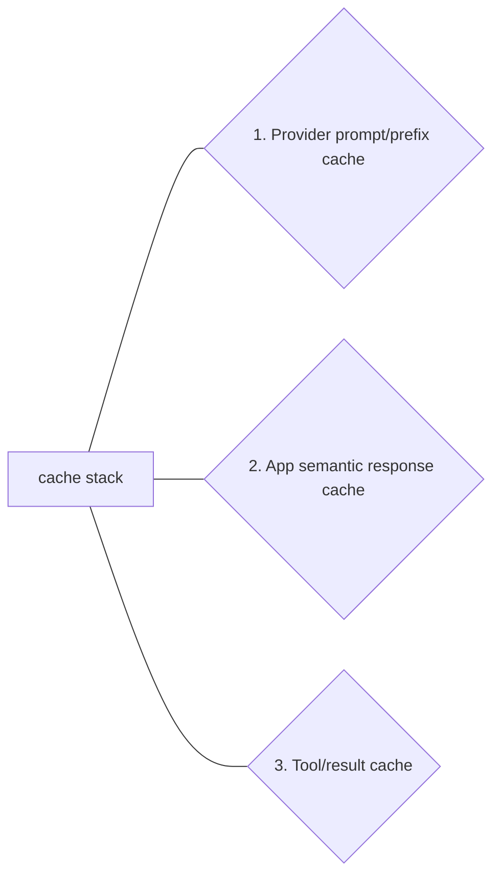

# Day 25 - Circuit Breakers, Caching & Re-liability for Production Agents

> **Câu hỏi cốt lõi:** *"Khi LLM provider timeout trong production, agent của bạn sẽ tự phục hồi hay làm sập cả workflow?"*

---

### 🗺️ 1. Bản đồ Kiến thức Hệ thống (Structured Knowledge Map)

Để tối ưu hóa việc tiếp cận kiến thức về độ tin cậy của agents trong sản xuất, chúng ta sẽ xem xét các khía cạnh chính như sau:

#### 1.1. Các Chế độ Lỗi (Failure Modes)
Reliability bắt đầu từ việc gọi đúng tên lỗi: 
- **Transient**: Lỗi tạm thời từ provider (429/500/timeout).
- **Degraded**: Độ trễ tăng cao (P95).
- **Outage**: Provider không phản hồi.
- **Orchestration Loop**: Lỗi trong quá trình xử lý.
- **Tool/Cache Failure**: Lỗi trong cache hoặc tool.
- **Business Action Error**: Hành động kinh doanh không thành công.

#### 1.2. Circuit Breaker & Fallback
Circuit breaker giúp ngắt gọi provider đang hỏng; fallback chain giữ trải nghiệm người dùng ở mức chấp nhận được.



#### 1.3. Caching & Cost Budgeting
Cache đúng chỗ có thể giảm latency/cost; cache sai chỗ tạo stale answer và hallucination ổn định.



---

### 📌 2. Khái niệm Cơ bản & Từ khóa Nền tảng (Core Concepts & Glossary)

| Thuật ngữ | Khái niệm Kỹ thuật & Bản chất | Tại sao cần quan tâm? |
| :--- | :--- | :--- |
| **Circuit Breaker** | Cơ chế ngắt kết nối khi phát hiện lỗi, giúp ngăn chặn lỗi lan rộng. | Đảm bảo hệ thống không bị sập khi gặp lỗi từ provider. |
| **Fallback** | Chuỗi các phương án dự phòng khi không thể sử dụng phương án chính. | Giúp duy trì trải nghiệm người dùng ngay cả khi có sự cố. |
| **Caching** | Lưu trữ tạm thời kết quả để giảm thời gian truy xuất và chi phí. | Tối ưu hóa hiệu suất và giảm tải cho hệ thống. |
| **Observability** | Khả năng theo dõi và phân tích hoạt động của hệ thống. | Giúp phát hiện và khắc phục sự cố kịp thời. |
| **SLO (Service Level Objective)** | Mục tiêu về mức độ dịch vụ mà hệ thống cần đạt được. | Đảm bảo chất lượng dịch vụ cho người dùng. |

---

### 📐 3. Quy tắc, Công thức & Tham số Kỹ thuật (Hard Rules & Formulas)

#### 3.1. Circuit Breaker Code
```python
class CircuitBreaker:
    def call(self, fn, *args, **kwargs):
        if self.state == "OPEN":
            if not self.ready_to_probe():
                raise CircuitOpenError()
            self.state = "HALF_OPEN"
        try:
            result = fn(*args, **kwargs)
            self.record_success()
            return result
        except Exception:
            self.record_failure()
            raise
```

#### 3.2. Fallback Ladder


#### 3.3. Caching Layers


---

### 💻 4. Hành trang Kỹ thuật & Mã nguồn (Technical Hands-on)

#### 4.1. Metrics Instrumentation
```python
REQUESTS = Counter("agent_requests_total", ["provider", "status", "route"])
LATENCY = Histogram("agent_latency_seconds", ["provider", "route"])
CACHE_HITS = Counter("cache_hits_total", ["cache_type"])
CIRCUIT_STATE = Gauge("circuit_state", ["provider"]) # 0 closed, 1 open, 2 half-open
```

#### 4.2. Chaos Testing Scenarios
1. Primary provider timeout 100%.
2. Primary provider intermittent 50%.
3. Cache returns stale candidate.
4. Cost cap gần cạn.

---

### 🧠 5. Tư duy Chuyển dịch: Reliability Engineering

Reliability engineering giúp agent fail gracefully, đo được, và có thể cải thiện bằng dữ liệu. Các điểm chính cần nhớ:
1. Circuit breaker + fallback là minimum viable reliability cho agent production.
2. Cache có ROI cao nhưng cần guardrail: TTL, threshold, invalidation.
3. Metrics phải bao phủ latency, availability, cost, cache, circuit state và quality.
4. Chaos/load test biến giả định thành bằng chứng; report định lượng giúp chấm điểm công bằng.

---

### 📚 6. Tài liệu tham khảo (References)
1. Microsoft Azure Architecture Center: Circuit Breaker pattern.
2. Release It! Design and Deploy Production-Ready Software, Michael Nygard.
3. Prometheus client Python: Counter, Gauge, Histogram docs.
4. LiteLLM documentation: routing, retries, fallbacks.
5. Langfuse documentation: LLM observability, traces, cost and latency metrics.

--- 

### 💬 7. Hỏi & Đáp
*Hãy chuẩn bị các câu hỏi liên quan đến các khái niệm đã học để thảo luận và làm rõ hơn trong buổi học tiếp theo.*