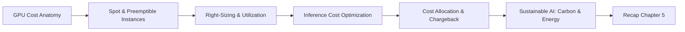
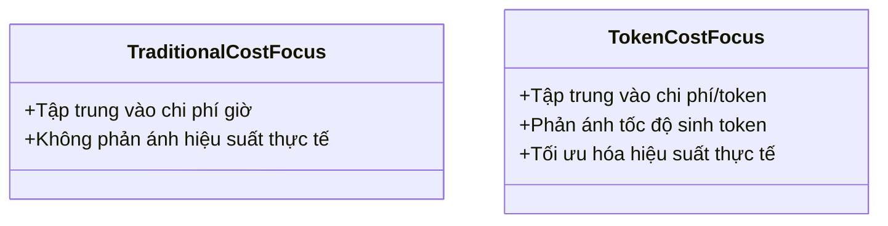

# Day 25 - RAG Data

> **Câu hỏi cốt lõi:** *"Bạn đang tiêu bao nhiêu cho GPU mỗi ngày? Và bao nhiêu % là lãng phí?"*

---

### 🗺️ 1. Bản đồ Kiến thức Vận Hành GPU (GPU Operations Knowledge Map)

Để tối ưu hóa chi phí GPU, chúng ta cần hiểu rõ các khía cạnh sau:



---

### 📌 2. Khái niệm Cơ bản & Từ khóa Nền tảng (Core Concepts & Glossary)

| Thuật ngữ | Khái niệm Kỹ thuật & Bản chất | Tại sao cần quan tâm? |
| :--- | :--- | :--- |
| **GPU Cost Anatomy** | Phân tích chi phí GPU bao gồm chi phí ẩn, chi phí idle và chi phí over-provisioning. | Hiểu rõ các yếu tố này giúp phát hiện lãng phí và tối ưu hóa ngân sách. |
| **Spot Instances** | Instances có giá rẻ hơn 60-70% so với on-demand, nhưng có thể bị ngắt kết nối. | Tiết kiệm chi phí lớn nếu biết cách quản lý và sử dụng hiệu quả. |
| **Right-Sizing** | Điều chỉnh kích thước GPU để phù hợp với workload thực tế. | Giúp giảm thiểu chi phí không cần thiết do over-provisioning. |
| **Inference Cost Optimization** | Tối ưu hóa chi phí inference thông qua batching, caching và các kỹ thuật khác. | Giảm chi phí trên mỗi token sinh ra, tối ưu hóa hiệu suất. |
| **Cost Allocation** | Phân bổ chi phí cho các nhóm và dự án khác nhau. | Giúp theo dõi và quản lý ngân sách hiệu quả hơn. |
| **Sustainable AI** | Tối ưu hóa chi phí và carbon thông qua lựa chọn thời điểm và mô hình. | Đảm bảo phát triển bền vững và tiết kiệm chi phí. |

---

### 📐 3. Quy tắc, Công thức & Tham số Kỹ thuật (Hard Rules & Formulas)

#### 3.1. Phân tích Chi phí GPU
- **Chi phí ẩn:** Chi phí chuyển dữ liệu, NAT gateway, và quản lý bí mật.
- **Chi phí lãng phí:** GPU idle, instances over-provisioned, và dung lượng dự trữ không sử dụng.

#### 3.2. Công thức Tính Chi phí trên mỗi Token
$$\text{Cost/token} = \frac{\text{Cost/hour}}{\text{Tokens/s} \times 3600}$$

#### 3.3. KPI cho GPU Utilization
- **Mục tiêu:** GPU utilization > 70% cho hiệu suất tối ưu.
- **Hành động nếu thấp:** Tối ưu hóa kernel, điều chỉnh kích thước batch, và gom workload.

---

### 💻 4. Hành trang Kỹ thuật & Mã nguồn (Technical Hands-on)

#### 4.1. Audit GPU Utilization
Sử dụng lệnh sau để đo GPU utilization:
```bash
nvidia-smi dmon
```

#### 4.2. Batching Requests
Tối ưu hóa throughput bằng cách nhóm các yêu cầu:
- Nhóm 10 yêu cầu mỗi batch.
- Tăng throughput lên 8x, giảm chi phí mỗi yêu cầu 85%.

#### 4.3. Checkpoint Strategy
Lưu trạng thái mô hình mỗi epoch hoặc mỗi 30 phút để có thể tiếp tục từ bất kỳ instance nào.

---

### 🧠 5. Tư duy Chuyển dịch: Tối ưu hóa Chi phí GPU

Sự chuyển dịch từ việc chỉ tập trung vào chi phí giờ sang chi phí trên mỗi token là rất quan trọng trong việc tối ưu hóa hiệu suất và chi phí:



---

### 🔑 6. Tổng kết – Key Takeaways

1. **GPU Cost Anatomy:** Phân tích chi phí GPU bao gồm chi phí ẩn và chi phí lãng phí.
2. **Spot Instances:** Tiết kiệm 60-70% chi phí với chiến lược checkpoint và mixed fleet.
3. **Inference Optimization:** Sử dụng batching, caching và các kỹ thuật khác để giảm chi phí/token.

> [!IMPORTANT]  
> **Lưu ý quan trọng:** Tối ưu hóa chi phí GPU không chỉ là giảm giá mà còn là tối ưu hóa hiệu suất và sử dụng tài nguyên hiệu quả.

--- 

### 📅 7. Tiếp theo & Bài tập

**Chương 6: Tổng Hợp – MCP/A2A Infrastructure**  
- Hoàn thành Lab 25 và chuẩn bị cho Milestone 2 demo.  
- Đọc trước: Anthropic MCP specification và Google A2A protocol overview.