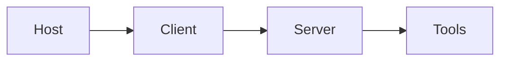

# Day 26 - Agent Builder

> **Câu hỏi cốt lõi:** *"MCP giải quyết vấn đề gì mà function calling thông thường không giải quyết được?"*

---

### 🗺️ 1. Bản đồ Kiến thức Hệ thống (Structured Knowledge Map)

#### 1.1. Vấn đề N×M và tại sao cần MCP
MCP giúp giảm thiểu số lượng adapter cần thiết cho việc tích hợp giữa nhiều provider khác nhau:

- **Trước MCP:** N×M connections (ví dụ: 3 × 3 = 9 adapters)
- **Sau MCP:** N+M connections (ví dụ: 3 + 3 = 6 adapters)

MCP giống như USB-C – một chuẩn kết nối cho mọi thiết bị, giúp viết một lần và chạy ở mọi nơi.

#### 1.2. MCP Architecture
MCP bao gồm các thành phần chính: Host, Client, Server và Tools.



- Host tin tưởng Client (cùng một quá trình)
- Client xác thực Server (xác thực)
- Server xác thực tất cả các đầu vào

---

### 📌 2. Khái niệm Cơ bản & Từ khóa Nền tảng (Core Concepts & Glossary)

| Thuật ngữ | Khái niệm Kỹ thuật & Bản chất | Tại sao cần quan tâm? |
| :--- | :--- | :--- |
| **MCP (Model Context Protocol)** | Chuẩn hóa tích hợp công cụ giữa các provider khác nhau. | Giảm thiểu số lượng adapter cần thiết, tăng tính tương thích. |
| **Function Calling** | Phương pháp gọi hàm truyền thống, phụ thuộc vào định dạng của từng provider. | Khó khăn trong việc thay đổi provider do phải viết lại adapter. |
| **MCP Primitives** | Các thành phần cơ bản của MCP: Tools, Resources, Prompts, Sampling, Elicitation. | Cung cấp khả năng mở rộng và linh hoạt cho việc tích hợp. |

---

### 📐 3. Quy tắc, Công thức & Tham số Kỹ thuật (Hard Rules & Formulas)

#### 3.1. MCP Primitives
MCP bao gồm các primitive sau:

| Primitive | Vai trò | Ai kiểm soát? | Ví dụ |
| :------- | :-------- | :----------- | :--------------------------------------- |
| Tools | Callable functions | LLM quyết định gọi | `query_db()`, `send_email()` |
| Resources | Read-only data (URI) | App cung cấp context | `file://docs/guide.md` |
| Prompts | Reusable templates | User chọn | `summarize-code template` |
| Sampling | LLM completions | Server yêu cầu | Server gọi LLM qua host |
| Elicitation | Structured input | Server hỏi user | Form input qua host UI |

---

### 💻 4. Hành trang Kỹ thuật & Mã nguồn (Technical Hands-on)

#### 4.1. Build MCP Server với Python SDK
Dưới đây là cách xây dựng một MCP server đơn giản với FastMCP:

```python
from mcp.server.fastmcp import FastMCP
mcp = FastMCP("sales-db")

@mcp.tool()
async def query_sales(region: str, quarter: str) -> dict:
    """Query sales data by region and quarter."""
    result = await db.query(region=region, quarter=quarter)
    return result.to_dict()

@mcp.resource("sales://schema")
async def get_schema() -> str:
    return db.get_schema_ddl()
```

#### 4.2. Bảo mật trong MCP
MCP cần đảm bảo các yếu tố bảo mật sau:

1. **Transport:** Sử dụng OAuth 2.0 cho SSE/HTTP, mã hóa TLS.
2. **Validation:** Xác thực tất cả đầu vào ở phía server.
3. **Permissions:** Mỗi tool chỉ có quyền cần thiết.
4. **Audit:** Ghi lại mọi cuộc gọi tool và kết quả.

---

### 🧠 5. Tư duy Chuyển dịch: Từ Function Calling đến MCP

MCP không chỉ đơn thuần là một chuẩn mới cho việc gọi hàm, mà còn là một hệ sinh thái cho việc tích hợp công cụ, cho phép:

- **Tool Discovery:** Agent tìm kiếm công cụ đúng lúc cần.
- **Context Control:** Quản lý ngữ cảnh một cách linh hoạt.
- **Multi-client Interoperability:** Tương tác giữa nhiều client một cách mượt mà.

---

### 🔍 6. Các Trường Hợp Sử Dụng Thực Tế (Real Use Cases)

MCP có giá trị lớn nhất khi kết hợp ngữ cảnh, hành động và chính sách lại với nhau. Một số server MCP phổ biến:

| Server | Loại | Dùng để làm gì |
| :-------------- | :---------- | :--------------------------------------------- |
| GitHub MCP | official | repo, issue, PR, code search |
| Sentry MCP | official | errors, stack trace, release regression |
| OpenAI Docs MCP | official | docs search + page fetch |

---

### ⚠️ 7. Các Lưu Ý Quan Trọng (Key Takeaways)

1. MCP chuẩn hóa tích hợp công cụ, không cần xây dựng adapter tùy chỉnh cho từng provider.
2. MCP Inspector là công cụ thiết yếu cho developer - kiểm tra cục bộ trước khi tích hợp LLM.
3. Sử dụng Resources và Prompts để tiêm ngữ cảnh động, không chỉ giới hạn ở Tools.
4. Mô tả tool quyết định thành bại – LLM chọn tool dựa trên tên và mô tả.

---

### 📅 8. Tiếp theo & Bài tập

**Ngày 27: Human-in-the-Loop UX**  
"Tools connected — tiếp theo thiết kế tương tác người-agent: khi nào agent tự quyết, khi nào cần xin phép?”  

- Hoàn thành Lab 26: MCP server + Inspector test.
- Đọc: MCP Specification (modelcontextprotocol.io/spec).