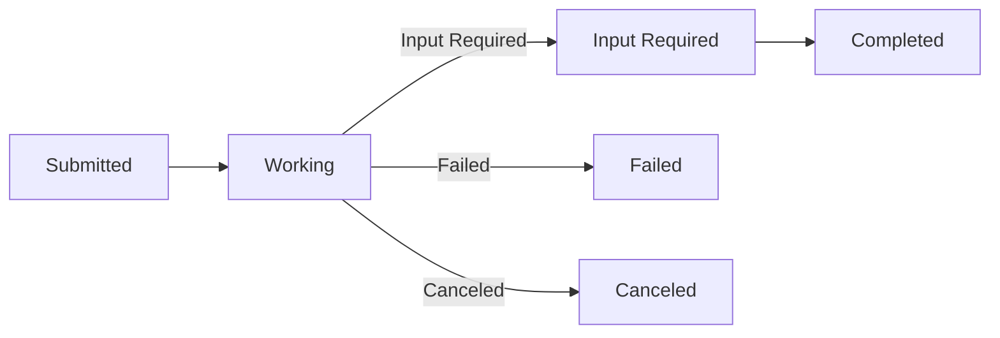
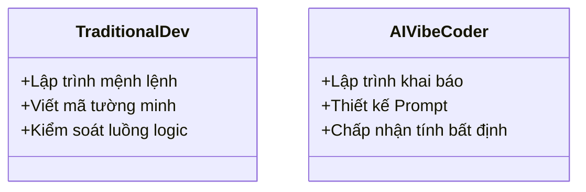

# Day 26 - RAG Data

> **Câu hỏi cốt lõi:** *"Agent gọi agent — infra của bạn có scale được cho multi-agent choreography không?"*

---

### 🗺️ 1. Bản đồ Kiến thức Hệ thống (Structured Knowledge Map)

Để tối ưu hóa việc tiếp cận kiến thức, bản đồ hệ thống được chia làm 3 sơ đồ độc lập biểu diễn 3 khía cạnh: Model Context Protocol (MCP), Agent-to-Agent (A2A) Protocol, và các chiến lược Routing.

#### 1.1. Model Context Protocol (MCP)
MCP là giao thức mở cho các công cụ LLM và dữ liệu:

```mermaid
graph LR
    LLMClient[LLM Client (ADK Orchestrator)] --> MCP[MCP Protocol]
    MCP --> ToolsServer[Tools Server]
    MCP --> ResourcesServer[Resources Server]
    MCP --> PromptsServer[Prompts Server]
```

- **Transport:** `stdio`, `HTTP+SSE`, `WebSocket`
- **Chạy trên nhiều nền tảng:** Claude, GPT, ADK, LangChain

#### 1.2. Agent-to-Agent (A2A) Protocol
Giao thức A2A cho phép các agent giao tiếp và phối hợp:

```mermaid
graph LR
    AgentA[Agent A (Orchestrator)] -->|Task / Message| AgentB[Agent B (Specialist)]
    AgentA --> AgentCard[Agent Card]
```

- **Agent Card:** JSON chứa thông tin về khả năng và schema
- **Auth:** OAuth 2.0 + JWT

#### 1.3. Routing Strategies
So sánh các chiến lược routing:

| Strategy        | Ưu điểm               | Nhược điểm        | Khi nào dùng          |
| :-------------- | :-------------------- | :----------------- | :-------------------- |
| Keyword-based   | Nhanh, đơn giản       | Dễ bị hỏng         | ≤5 agents             |
| Embedding-based | Bền vững, mở rộng     | Cần embeddings      | 5-50 agents           |
| LLM-based       | Linh hoạt, nhận thức ngữ cảnh | Đắt, chậm         | Routing phức tạp     |

---

### 📌 2. Khái niệm Cơ bản & Từ khóa Nền tảng (Core Concepts & Glossary)

| Thuật ngữ | Khái niệm Kỹ thuật & Bản chất | Tại sao cần quan tâm? |
| :--- | :--- | :--- |
| **MCP** | Giao thức chuẩn hóa cho các công cụ LLM, cho phép tích hợp dễ dàng. | Giúp xây dựng hạ tầng AI đồng nhất và dễ bảo trì. |
| **A2A** | Giao thức cho phép các agent giao tiếp và phối hợp hiệu quả. | Tạo ra hệ sinh thái agent có khả năng tương tác linh hoạt. |
| **Routing** | Chiến lược định tuyến thông minh cho các yêu cầu giữa các agent. | Tối ưu hóa hiệu suất và độ chính xác trong xử lý yêu cầu. |
| **Agent Card** | Tài liệu JSON mô tả khả năng và thông tin của agent. | Cung cấp thông tin cần thiết cho việc giao tiếp giữa các agent. |
| **Governance** | Các quy trình và kiểm soát để đảm bảo an toàn và hiệu quả. | Bảo vệ hệ thống khỏi các hành vi không mong muốn và đảm bảo tuân thủ. |

---

### 📐 3. Quy tắc, Công thức & Tham số Kỹ thuật (Hard Rules & Formulas)

#### 3.1. MCP Server Implementation
Cấu trúc cơ bản của MCP server:

```python
from mcp.server import Server

app = Server("research-tools")

@app.tool()
async def search(query: str) -> str:
    """Search documents."""
    return format_results(await db.search(query))

@app.tool()
async def sql_query(sql: str) -> str:
    """Execute read-only SQL."""
    return await db.execute(sql)
```

- **Docstring rõ ràng** giúp LLM quyết định sử dụng tool nào.
- **Type hints** và validate inputs trước khi thực thi.

#### 3.2. A2A Task Lifecycle
Luồng công việc của A2A:



---

### 💻 4. Hành trang Kỹ thuật & Mã nguồn (Technical Hands-on)

#### 4.1. Triển khai MCP Server
Hướng dẫn triển khai MCP server:

```bash
bash scripts/start_capstone.sh
```

#### 4.2. Triển khai A2A Communication
Cách thức giao tiếp giữa các agent:

```python
# Ví dụ về cách dispatch task giữa các agent
ADK.transfer_to_agent(agent_id, task)
```

---

### 🧠 5. Tư duy Chuyển dịch: Từ Truyền thống đến AI Vibe Coder

Sự chuyển mình từ lập trình truyền thống sang lập trình dựa trên AI:



---

### 🔑 6. Tổng kết – Key Takeaways

1. **MCP chuẩn hóa giao diện công cụ** — xây dựng một lần, sử dụng trên nhiều nền tảng LLM.
2. **A2A = microservices cho AI** — áp dụng các nguyên tắc tương tự: hợp đồng, xác thực, quan sát.
3. **Routing thông minh tại layer orchestrator** — đầu tư vào semantic routing và fallback chains.
4. **Governance là yêu cầu bắt buộc** — capability matrix, audit, HITL là cần thiết cho sản xuất.

---

### 📅 7. Tiếp theo & Bài tập

**Ngày 27: Data Observability & Advanced Monitoring**  
- Hoàn thành Lab 26: Multi-Agent Infrastructure
- Đọc trước: Great Expectations checkpoint documentation

---

### ❓ 8. Hỏi & Đáp

Câu hỏi nào về MCP, A2A protocol, agentic routing, hay multi-agent observability?