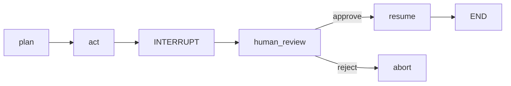
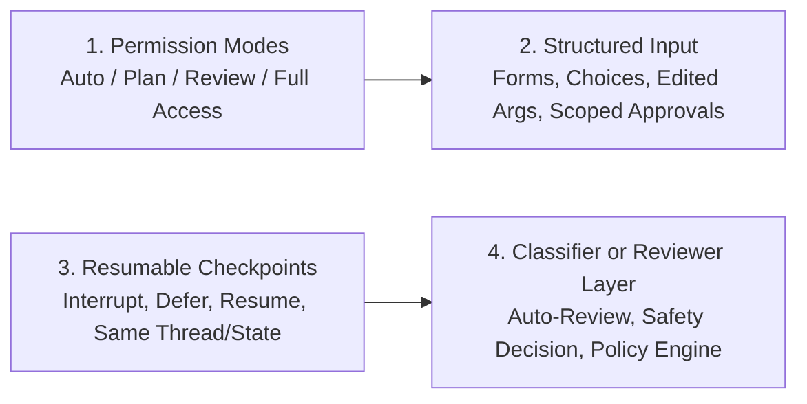

# Day 27 - Human-in-the-Loop UX

> **Câu hỏi cốt lõi:** *"Agent tự quyết hay hỏi người dùng – ranh giới nào là an toàn và không làm phiền?"*

---

### 🗺️ 1. Bản đồ Kiến thức Hệ thống (Structured Knowledge Map)

#### 1.1. Tại sao Full Autonomy nguy hiểm?
- **Vấn đề:** Agent tự ý hành động mà không có sự kiểm tra có thể dẫn đến mất dữ liệu hoặc hậu quả nghiêm trọng.
- **Bài học từ sản phẩm agent 2025-2026:** 
  - Các hành động như đọc, tìm kiếm, và gỡ lỗi có thể tự động hóa vì dễ kiểm tra.
  - Các hành động viết, xóa, và triển khai cần có checkpoint của con người.

#### 1.2. HITL Taxonomy – 6 Interaction Patterns
Phân loại cách con người tham gia vào quyết định của agent:

| # | Pattern               | Khi nào?                                   | Ví dụ                                                 |
|---|-----------------------|-------------------------------------------|-------------------------------------------------------|
| 1 | Approval              | Side effect / policy boundary             | Deploy, xóa data, gửi email                           |
| 2 | Clarification         | Input mơ hồ                               | "Report Q1 hay Q2?"                                   |
| 3 | Structured Elicitation | Thiếu field bắt buộc                      | Form chọn env, repo, approver                         |
| 4 | Review Checkpoint     | Output cần kiểm                            | Draft email, code PR, SQL patch                       |
| 5 | Edit / Correction     | Human muốn chỉnh                           | Sửa args trước khi chạy tool                          |
| 6 | Escalation            | Vượt thẩm quyền                          | Pháp lý, tài chính, security                          |

#### 1.3. Confidence Routing – Khi nào interrupt?
- **Luồng quyết định:** 
  - Nếu confidence thấp hoặc có rủi ro cao, agent sẽ hỏi hoặc yêu cầu sự phê duyệt của con người.

---

### 📌 2. Khái niệm Cơ bản & Từ khóa Nền tảng (Core Concepts & Glossary)

| Thuật ngữ | Khái niệm Kỹ thuật & Bản chất | Tại sao cần quan tâm? |
| :--- | :--- | :--- |
| **Bounded Autonomy** | Khả năng tự động hóa trong các giới hạn đã định, hỏi khi chạm vào rủi ro hoặc chính sách. | Giúp giảm thiểu rủi ro trong các hành động của agent. |
| **Audit Trail** | Ghi lại mọi quyết định của agent, bao gồm thời gian, hành động, và lý do. | Đảm bảo tuân thủ và có thể truy xuất thông tin khi cần. |
| **Decision Analytics** | Đo lường các chỉ số như tỷ lệ phê duyệt, độ trễ review, và tỷ lệ hối tiếc. | Cải thiện quy trình và tăng cường độ tin cậy của agent. |

---

### 📐 3. Quy tắc, Công thức & Tham số Kỹ thuật (Hard Rules & Formulas)

#### 3.1. Quy trình duyệt chi công ty
- **Nguyên tắc:** Chi phí sai lầm quyết định mức kiểm soát.
- **Mô hình duyệt:**
  - Dưới 5 triệu: Tự duyệt
  - 5-50 triệu: Cần trưởng phòng ký
  - Trên 50 triệu: Cần giám đốc phê duyệt

#### 3.2. Luồng quyết định Confidence Routing

```mermaid
graph LR
    ActionRequest --> LowRisk[Low Risk]
    LowRisk --> AutoExecute[Auto Execute]
    AutoExecute --> Reversible[Reversible + In-Boundary]
    Reversible --> NeedsConfirmation[Needs Confirmation]
    NeedsConfirmation --> HumanChecks[Human Checks Proposed Args]
    HumanChecks --> Blocked[Blocked / Unclear]
    Blocked --> Ask[Ask / Escalate]
    Ask --> HighRisk[High Risk]
    HighRisk --> HardGates[Hard Gates]
```


---

### 💻 4. Hành trang Kỹ thuật & Mã nguồn (Technical Hands-on)

#### 4.1. LangGraph HITL – Interrupt & Resume


#### 4.2. LangGraph HITL – Code-Level
```python
from langchain.agents import create_agent
from langchain.agents.middleware import HumanInTheLoopMiddleware
from langgraph.checkpoint.memory import InMemorySaver

agent = create_agent(
    model="gpt-5.5",
    tools=[write_file, send_email, ask_user],
    middleware=[HumanInTheLoopMiddleware(
        interrupt_on={
            "write_file": {"allowed_decisions": ["approve", "edit", "reject"]},
            "send_email": {"allowed_decisions": ["approve", "edit", "reject"]},
            "ask_user": {"allowed_decisions": ["respond"]},
        })],
)
checkpointer = InMemorySaver()
```

---

### 🧠 5. Tư duy Chuyển dịch: Từ Truyền thống sang HITL

#### 5.1. Các mẫu thiết kế đang hội tụ


---

### 🔍 6. Feedback Loops & Audit Trails

#### 6.1. Audit Trail – Mỗi quyết định đều được ghi lại
```python
class AuditEntry(BaseModel):
    timestamp: datetime
    agent_id: str
    action: str
    confidence: float
    risk_level: str # low/med/high
    reviewer_id: str | None
    decision: str # auto/approve/reject
    reason: str | None
    execution_time_ms: int
```

---

### 💡 7. HITL UX Best Practices

#### 7.1. 5 Nguyên tắc vàng
1. Hỏi sớm khi thiếu input, hỏi muộn khi có side effect.
2. Hiện rõ what / why / risk / diff / rollback.
3. Sử dụng dropdown / checkbox cho các field đã biết.
4. Hỗ trợ approve once, approve this session, hoặc approve for this destination.
5. Log decision, latency, regret, rollback để cải thiện quy trình.

---

### 🔚 8. Tổng kết – Key Takeaways
1. Xu hướng mới là bounded autonomy: agent tự làm trong boundary, hỏi khi chạm risk / policy / ambiguity.
2. HITL hiện đại không chỉ có approve/reject – còn có edit, respond, và structured form input.
3. Audit trail + decision analytics là bắt buộc nếu muốn tăng autonomy mà vẫn giữ compliance.
4. Progressive autonomy chỉ nên tăng khi approval cao và regret thấp.

---

### 📅 9. Tiếp theo & Bài tập
- Ngày 28: Workshop Tổng Hợp – Full Production Agent System
- Hoàn thành Lab 27: HITL agent + audit trail
- Review lại tất cả labs N16-N27 – chuẩn bị integration.