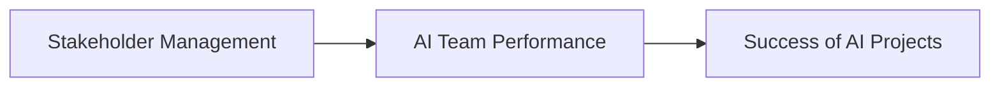

# Day 27 - Con Người Trong Dự Án AI (Human in AI Projects)

> **Câu hỏi cốt lõi:** *"Tại sao một sản phẩm AI tốt vẫn có thể thất bại?"*

---

### 🗺️ 1. Bản đồ Kiến thức Stakeholder và AI Team Performance

Để hiểu rõ vai trò của con người trong dự án AI, chúng ta cần nắm vững các khái niệm về stakeholder và cách thức tổ chức đội ngũ AI.

#### 1.1. Stakeholder Management
Quản lý stakeholder là quá trình xác định, phân tích và xây dựng chiến lược làm việc với những người có ảnh hưởng đến dự án hoặc bị ảnh hưởng bởi kết quả của dự án.

> 🧠 **Định nghĩa:** Stakeholder là những cá nhân hoặc nhóm có quyền lợi liên quan đến dự án, bao gồm nhà đầu tư, khách hàng, nhân viên, và các bên liên quan khác.

#### 1.2. Sơ đồ 4 Nhóm Stakeholder
Xếp loại stakeholder theo ảnh hưởng và sự quan tâm đến dự án:

| **Ảnh hưởng cao** | **Quan tâm: Thấp** | **Quan tâm: Cao** |
| :---------------- | :------------------ | :----------------- |
| Người cần thuyết phục (Blockers) | Đồng minh thân thiết (Champions) | Người ủng hộ nhiệt tình (Supporters) |
| Người ít liên quan (Bystanders) | | |

#### 1.3. Chiến lược cho từng nhóm Stakeholder
Mỗi nhóm cần một cách tiếp cận riêng:

| Nhóm        | Mục tiêu chiến lược   | Hành động cụ thể |
| :---------- | :--------------------- | :---------------- |
| Champions   | Duy trì & tận dụng     | Cập nhật tiến độ thường xuyên, nhờ giới thiệu thêm quan hệ. |
| Blockers    | Thuyết phục & giảm rủi ro | Chuẩn bị pitch/dữ liệu kỹ, giải quyết thẳng mối lo. |
| Supporters  | Trao quyền & khuếch đại    | Mời tham gia sớm, biến họ thành người giới thiệu. |
| Bystanders  | Theo dõi, không đầu tư quá nhiều | Thông báo định kỳ, quan sát xem họ có chuyển nhóm không. |

---

### 📌 2. Khái niệm Cơ bản & Từ khóa Nền tảng (Core Concepts & Glossary)

| Thuật ngữ | Khái niệm Kỹ thuật & Bản chất | Tại sao cần quan tâm? |
| :--- | :--- | :--- |
| **RACI Matrix** | Phân công trách nhiệm rõ ràng cho từng thành viên trong dự án. | Giúp cả team không nhầm lẫn ai chịu trách nhiệm việc gì. |
| **Forward Deployed Engineer** | Kỹ sư AI làm việc trực tiếp trong hệ thống của khách hàng. | Đảm bảo AI được triển khai hiệu quả trong thực tế. |
| **Agentic SDLC** | Quy trình phát triển phần mềm trong đó AI agent tham gia vào toàn bộ vòng đời. | Tối ưu hóa quy trình phát triển và nâng cao hiệu suất. |

---

### 📐 3. Quy tắc, Công thức & Tham số Kỹ thuật (Hard Rules & Formulas)

#### 3.1. Nguyên tắc "Kết luận trước"
Mỗi stakeholder nghe một ngôn ngữ khác nhau. Cấu trúc trình bày hiệu quả:

1. **Kết luận**: Nói ngay điều quan trọng nhất.
2. **Lý do chính**: Đưa ra vài lý do hỗ trợ.
3. **Số liệu/ví dụ minh hoạ**: Cung cấp thông tin cụ thể để thuyết phục.

#### 3.2. RACI Matrix
| Công việc              | PM / Founder | Kỹ thuật | PO | Nhà đầu tư |
| :--------------------- | :----------- | :-------- | :- | :--------- |
| Xác định vấn đề & use case | R            | C         | A  | I          |
| Xây dựng MVP           | C            | R         | A  | I          |

- R = Responsible (người thực hiện)
- A = Accountable (chịu trách nhiệm cuối)
- C = Consulted (hỏi ý kiến trước)
- I = Informed (chỉ cần biết sau)

---

### 💻 4. Hành trang Kỹ thuật & Mã nguồn (Technical Hands-on)

#### 4.1. Thiết kế Al Team
- **Core Team**: Al Product Manager, Al Engineer, Data Engineer, UX Designer, Fullstack Developer.
- **Extended Team**: ML Research Engineer, Forward Deployed Engineer, Al Ethics Researcher.

#### 4.2. Mô hình Squad
- **Squad**: Đội nhỏ, tự chủ, đa chức năng.
- **Tribe**: Tập hợp nhiều Squad liên quan.
- **Chapter**: Nhóm chuyên môn họp định kỳ để chia sẻ kỹ thuật.

---

### 🧠 5. Tư duy Chuyển dịch: Từ Stakeholder Đến AI Team Performance

Sự thành công của dự án AI không chỉ phụ thuộc vào công nghệ mà còn vào cách thức quản lý con người và tổ chức đội ngũ:

> ⚠️ **Cảnh báo:** Không để truyền thông đi trước năng lực thực tế. Hãy luôn đưa các "Blockers" vào cuộc sớm để đảm bảo sự ủng hộ.

---

### 🔍 6. Tổng kết – Những điều cần nhớ

1. Vẽ sơ đồ stakeholder trước khi bắt tay vào làm.
2. Kết luận trước giúp thuyết phục nhanh, nhưng lời hứa phải có chất lượng thật.
3. RACI Matrix giúp cả team không nhầm lẫn ai chịu trách nhiệm việc gì.
4. Al team hiện đại cần cả Al Engineer lẫn Forward Deployed Engineer.
5. Chọn kiến trúc team phù hợp với giai đoạn phát triển.
6. Vận hành hiệu quả = phương pháp phù hợp + competency framework rõ ràng + an toàn tâm lý.

---

### 📋 7. Checklist hoàn thành

- [ ] Phần 1 — Sơ đồ stakeholder + chiến lược
- [ ] Phần 2 — Pitch "kết luận trước" + RACI Matrix
- [ ] Phần 3 — Thiết kế cấu trúc Al team
- [ ] Phần 4 — Team Health & Growth Plan

---

### ❓ Hỏi & Đáp

Có điều gì về stakeholder, RACI, cấu trúc Al team, hay cách vận hành hiệu suất cao bạn muốn hỏi thêm không?