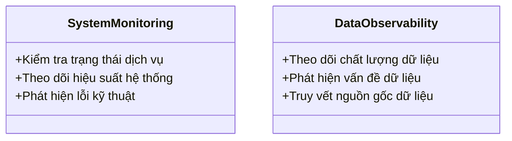

# Day 27 - Data Observability & Lineage

> **Câu hỏi cốt lõi:** *"Tại sao việc quan sát dữ liệu lại quan trọng hơn chỉ giám sát hệ thống?"*

---

### 🗺️ 1. Bản đồ Kiến thức Hệ thống (Structured Knowledge Map)

#### 1.1. Tại sao quan sát DỮ LIỆU, không chỉ hệ thống
- **Pipeline/System Monitoring:** Tập trung vào hạ tầng, kiểm tra trạng thái dịch vụ.
- **Data Observability:** Tập trung vào chất lượng dữ liệu, đảm bảo dữ liệu đúng, tươi, đầy đủ và có thể truy vết.

#### 1.2. 7 chiều của Data Observability
| Chiều | Mô tả |
|-------|-------|
| **Freshness** | Dữ liệu mới? Trễ bao lâu? |
| **Volume** | Đủ records? Đột biến? |
| **Distribution** | Giá trị hợp lý? Outliers? |
| **Schema** | Cột có thay đổi? Type drift? |
| **Lineage** | Nguồn nào? Impact gì? |
| **Trust** | Điểm tin cậy? |
| **Contract** | Đúng cam kết? |

---

### 📌 2. Khái niệm Cơ bản & Từ khóa Nền tảng (Core Concepts & Glossary)

| Thuật ngữ | Khái niệm Kỹ thuật & Bản chất | Tại sao cần quan tâm? |
| :--- | :--- | :--- |
| **Data Observability** | Khả năng theo dõi và đánh giá chất lượng dữ liệu trong thời gian thực. | Giúp phát hiện vấn đề dữ liệu trước khi ảnh hưởng đến mô hình hoặc báo cáo. |
| **Data Contracts** | Thỏa thuận giữa nhà sản xuất và người tiêu dùng dữ liệu, định nghĩa chất lượng và cấu trúc dữ liệu. | Đảm bảo dữ liệu đáp ứng yêu cầu chất lượng và có thể kiểm tra tự động. |
| **Lineage** | Lịch sử và nguồn gốc của dữ liệu, cho phép truy vết và phân tích tác động. | Giúp xác định nguyên nhân gốc rễ của sự cố dữ liệu và đánh giá rủi ro. |

---

### 📐 3. Quy tắc, Công thức & Tham số Kỹ thuật (Hard Rules & Formulas)

#### 3.1. Công thức tính Data Downtime
$$\text{Data Downtime} = N_{\text{incidents}} \times (TTD + TTR)$$
- **TTD:** Thời gian phát hiện sự cố.
- **TTR:** Thời gian khắc phục sự cố.

#### 3.2. Phân tích nguyên nhân gốc sự cố dữ liệu
| Nguyên nhân gốc | % |
| :--- | :--- |
| Lỗi pipeline | 26.2% |
| Biến động dữ liệu thực tế | 20.0% |
| Ingestion | 16.6% |
| Hạ tầng | 15.2% |
| Thay đổi chủ ý | 14.2% |
| Schema drift | 7.8% |

---

### 💻 4. Hành trang Kỹ thuật & Mã nguồn (Technical Hands-on)

#### 4.1. Mã gọi API cho Data Observability
```python
import great_expectations as gx

context = gx.get_context()
ds = context.data_sources.add_pandas("src")
asset = ds.add_dataframe_asset("orders")
bd = ds.add_batch_definition_whole_dataframe("bd")
suite = context.suites.add(gx.ExpectationSuite("orders"))
suite.add_expectation(gx.expectations.ExpectColumnValuesToNotBeNull(column="user_id"))
suite.add_expectation(gx.expectations.ExpectColumnValuesToBeBetween(column="amount", min_value=0, max_value=1e6))
vd = gx.validation_definitions.add(gx.ValidationDefinition(data=bd, suite=suite, name="vd"))
cp = context.checkpoints.add(gx.Checkpoint(name="cp", validation_definitions=[vd], actions=[]))
print(cp.run(batch_parameters={"dataframe": df}).success)
```

#### 4.2. Sử dụng Soda Core cho Data Contracts
```python
import soda

soda.check("data_contract.yaml")
```

---

### 🧠 5. Tư duy Chuyển dịch: Từ Giám sát Hệ thống sang Quan sát Dữ liệu



---

### 📊 6. Tình huống Thực tế & Bài học Nghề

#### 6.1. Chi phí của dữ liệu xấu
- **Chi phí hàng năm:** $12.9M cho chất lượng dữ liệu kém (Gartner).
- **Thời gian phát hiện sự cố:** 68% sự cố mất ≥4 giờ để phát hiện.

#### 6.2. Sự cố thực tế
| Sự cố | Nguyên nhân | Hậu quả |
| :--- | :--- | :--- |
| Unity Software | Dữ liệu huấn luyện xấu | -$110M |
| Equifax | Lỗi code | Phạt $725K |

---

### 🔑 7. Tổng kết — Key Takeaways

1. **Data Observability ≠ System Monitoring:** Đảm bảo dữ liệu đúng là ưu tiên hàng đầu.
2. **Data Contracts:** Là thỏa thuận chất lượng giữa nhà sản xuất và người tiêu dùng.
3. **Lineage:** Cung cấp khả năng truy vết và phân tích tác động của dữ liệu.

---

### 📚 8. Tài liệu Tham khảo

- OpenLineage spec/object-model
- Great Expectations GX Core 1.0
- Soda Core 4.0 release notes

---

### ❓ 9. Hỏi & Đáp

Câu hỏi về `data observability`, `contracts` (ODCS), `lineage` (OpenLineage), hay quan sát `feature/vector/training data`?