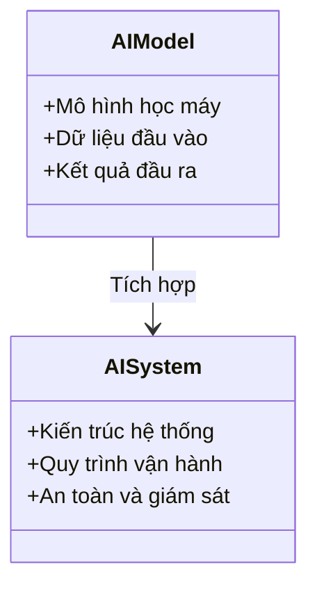

# Day 28 - Kiến trúc Hệ thống AI Thực tế (Real-World AI System Architecture)

> **Câu hỏi cốt lõi:** *"Làm thế nào để chuyển đổi từ một mô hình chạy được thành một hệ thống vận hành hiệu quả trong thực tế?"*

---

### 🗺️ 1. Bản đồ Kiến thức Hệ thống (Structured Knowledge Map)

Kiến trúc tổng quan của các hệ thống AI thực tế thường bao gồm 6 lớp chính, xuất hiện lặp lại trong các ứng dụng như xe tự hành, robot giao hàng, CCTV AI, và GeoAI:

| Lớp | Mô tả |
|---|---|
| **1. Data / Sensor** | camera, radar, lidar, logs, satellite, user event |
| **2. Perception** | detection, segmentation, tracking, embedding |
| **3. World State** | BEV, map, scene graph, geo-index, memory |
| **4. Decision / Policy** | planner, VLA, anomaly scorer, change detector |
| **5. Action / Product** | control, alert, delivery, dashboard, tasking |
| **6. Ops / Safety** | ODD, HITL, telemetry, audit, retraining |

---

### 📌 2. Khái niệm Cơ bản & Từ khóa Nền tảng (Core Concepts & Glossary)

Để hiểu rõ hơn về kiến trúc hệ thống AI, hãy xem xét các khái niệm và từ khóa sau:

| Thuật ngữ | Khái niệm Kỹ thuật & Bản chất | Tại sao cần quan tâm? |
| :--- | :--- | :--- |
| **Latency** | Thời gian phản hồi của hệ thống, có thể từ ms ở edge đến giây ở cloud. | Ảnh hưởng đến trải nghiệm người dùng và hiệu suất hệ thống. |
| **Risk Surface** | Các yếu tố rủi ro liên quan đến sai sót trong nhận diện hoặc điều khiển. | Cần được đánh giá để đảm bảo an toàn cho hệ thống. |
| **Human-in-loop (HITL)** | Sự tham gia của con người trong các bước như label, review, hoặc phê duyệt cuối cùng. | Giúp cải thiện độ chính xác và độ tin cậy của hệ thống. |

---

### 📐 3. Quy tắc, Công thức & Tham số Kỹ thuật (Hard Rules & Formulas)

#### 3.1. Bản đồ 5 hệ thống AI
Các hệ thống AI khác nhau có thể được so sánh dựa trên các yếu tố như độ trễ, rủi ro và chiến lược xác thực:

| Hệ thống | Sensor/Data | Latency | Output | Bottleneck | Validation chính |
|---|---|---|---|---|---|
| **ADAS** | Camera/radar/lidar | 10-100 ms | Control/trajectory | Rare cases + safety | Scenario sim, HIL, road test, shadow mode |
| **Delivery Robot** | Camera/lidar/GPS/map | 100 ms-giây | Navigation + delivery | Sidewalk variability | Remote assist rate, disengagement, delivery success |
| **CCTV AI** | Video streams | Edge real-time hoặc async | Alert/search | False alarms + privacy | Precision/recall per site, human review |
| **Humanoid** | Vision/tactile/proprioception | 1-200 Hz | Motion/manipulation | Contact + data | Sim-to-real, task success, safety tests |
| **Satellite AI** | Optical/SAR/time series | Batch-near-real-time | Map/insight/tasking | Data normalization | Ground truth, analyst QA, temporal consistency |

---

### 💻 4. Hành trang Kỹ thuật & Mã nguồn (Technical Hands-on)

#### 4.1. Mô hình Hệ thống AI
Mỗi hệ thống AI cần một kiến trúc rõ ràng để đảm bảo tính hiệu quả và an toàn. Dưới đây là một số yếu tố cần thiết:

- **Safety Envelope:** ODD, fallback state machine, rule-based guard independent, emergency stop.
- **Observability:** Trace theo request/mission/clip, sensor health, latency, cost.
- **Governance:** Data retention policy, access control, audit trail.

---

### 🧠 5. Tư duy Chuyển dịch: Từ Mô hình đến Hệ thống

Sự chuyển đổi từ mô hình AI sang hệ thống AI thực tế không chỉ phụ thuộc vào công nghệ mà còn vào cách thức tích hợp các thành phần khác nhau:

---

### 🔍 6. Khung thảo luận cho học viên

Sử dụng checklist dưới đây để phân tích bất kỳ AI system nào:

1. **Input nào đáng tin?** Sensor/data nào noisy, missing, drift?
2. **State biểu diễn ra sao?** BEV, scene graph, vector index, geo tile, memory?
3. **Decision có fail-safe?** Fallback, rule guard, human review ở đâu?
4. **Feedback nào thành label?** Disengagement, assist, alert reject, task fail?
5. **Metrics nào phục vụ business?** Cost/order, trips/week, alert precision, analyst time saved?
6. **Reference nào nên đọc tiếp?** Paper để hiểu hướng nghiên cứu, product docs để hiểu constraint.

---

### 📚 7. Reading Path sau buổi học

Đọc theo "stack” sẽ hiệu quả hơn đọc rời rạc từng paper:

- **Nếu quan tâm Autonomous / Robotics:** ADAS → Delivery Robot → Humanoid.
- **Nếu quan tâm Vision / GeoAI / Product:** CCTV → Satellite AI.

---

### 📝 8. Tổng kết: 5 Takeaways lớn

1. **Kiến trúc quan trọng hơn benchmark:** Mô hình tốt cần đúng data path, right latency, safety shell và ops loop.
2. **End-to-end không có nghĩa “không cần hệ thống”:** E2E policy vẫn cần ODD, guard, monitoring.

---

### 📖 9. Tài liệu tham khảo

Nguồn học thêm cho học viên sẽ được cung cấp trong các phần tài liệu chi tiết hơn về từng hệ thống AI cụ thể.

---

Hãy nhớ rằng, việc xây dựng một hệ thống AI không chỉ là về công nghệ mà còn là về cách thức tích hợp và vận hành các thành phần khác nhau để tạo ra giá trị thực tế.