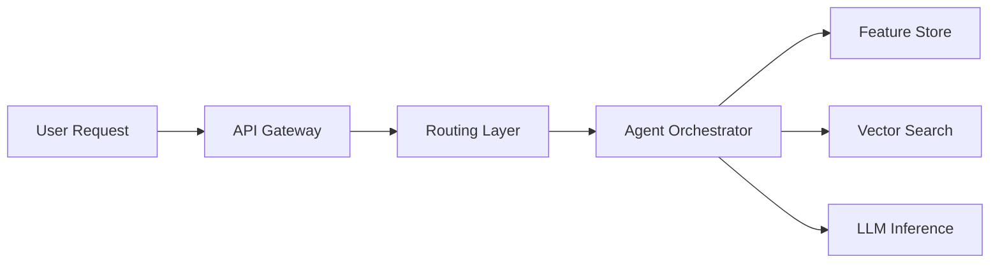
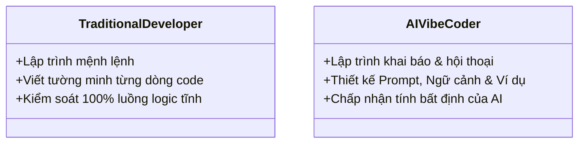

# Day 28 - RAG Data

> **Câu hỏi cốt lõi:** *"Từng piece hoạt động riêng lẻ – nhưng khi ghép lại thành platform, thách thức mới xuất hiện ở đâu?"*

---

### 🗺️ 1. Bản đồ Kiến thức Hệ thống (Structured Knowledge Map)

#### 1.1. 5 Layers of the AI Platform
Mô hình 5 lớp của nền tảng AI, từ quản lý đến tính toán:

#### 1.2. Anti-patterns vs Patterns
So sánh giữa các mẫu thiết kế tốt và xấu trong tích hợp:

| Anti-pattern                             | Pattern                                                                  | Tool                                    |
| :--------------------------------------- | :----------------------------------------------------------------------- | :-------------------------------------- |
| Tightly coupled components               | Event-driven integration                                                 | Kafka, Redis Streams                    |
| Hardcoded config                         | GitOps — all config in Git, deployed via ArgoCD                         | ArgoCD, Helm                            |
| Shared mutable state                     | Immutable events + event sourcing                                         | Kafka topics                            |
| Manual deployment                        | CI/CD pipeline — automated build, test, deploy                           | GitHub Actions                          |
| Failure cascading across services        | Bulkhead pattern – tách critical path khỏi non-critical                 | K8s namespaces, resource quotas         |

---

### 📌 2. Khái niệm Cơ bản & Từ khóa Nền tảng (Core Concepts & Glossary)

| Thuật ngữ | Khái niệm Kỹ thuật & Bản chất | Tại sao cần quan tâm? |
| :--- | :--- | :--- |
| **Event-Driven Architecture** | Kiến trúc cho phép các thành phần sản xuất và tiêu thụ dữ liệu độc lập. | Giúp tăng tính linh hoạt và khả năng mở rộng của hệ thống. |
| **Integration Testing** | Kiểm tra tính hợp lệ của các hợp đồng API giữa các dịch vụ. | Đảm bảo rằng các dịch vụ tương tác đúng cách và không bị lỗi. |
| **Production Readiness** | Đánh giá khả năng của hệ thống để hoạt động trong môi trường sản xuất. | Đảm bảo độ tin cậy, hiệu suất và bảo mật của hệ thống. |

---

### 📐 3. Quy tắc, Công thức & Tham số Kỹ thuật (Hard Rules & Formulas)

#### 3.1. Anatomy of a Production AI Request
Luồng yêu cầu AI trong sản xuất:

#### 3.2. Request Audit Trail
Các thông tin cần ghi lại trong quá trình xử lý yêu cầu:

- Input hash (privacy-safe)
- Output hash + response length
- End-to-end latency breakdown
- Token cost per component

---

### 💻 4. Hành trang Kỹ thuật & Mã nguồn (Technical Hands-on)

#### 4.1. Profiling Tools & Techniques
Các công cụ và kỹ thuật để phân tích hiệu suất:

| Tool                      | Target                       | Khi nào dùng                                    |
| :------------------------ | :--------------------------- | :---------------------------------------------- |
| Jaeger                    | E2E latency breakdown        | Xác định các điểm nghẽn trong hệ thống        |
| cProfile / py-spy        | CPU profiling                | Tìm các điểm nóng trong quá trình xử lý       |
| tracemalloc               | Memory allocation            | Phát hiện rò rỉ bộ nhớ trong dịch vụ dài hạn  |

#### 4.2. Production Readiness Checklist
Danh sách kiểm tra sẵn sàng sản xuất:

- `[ ]` Health checks (liveness + readiness)
- `[ ]` Circuit breakers configured
- `[ ]` Retries with exponential backoff
- `[ ]` Graceful shutdown handles in-flight

---

### 🧠 5. Tư duy Chuyển dịch: Từ Lập trình Truyền thống đến AI Vibe Coder

Sự chuyển mình từ lập trình truyền thống sang lập trình dựa trên AI:

> [!WARNING]  
> **Cảnh báo quan trọng cho kỹ sư tương lai:** Hãy nắm vững cả hai kỹ năng lập trình truyền thống và lập trình dựa trên AI để tạo ra sản phẩm bền vững và hiệu quả.

---

### 🔑 6. Tổng kết – Key Takeaways

1. Tích hợp là nơi “works on my machine" gặp thực tế – kiểm tra các bề mặt tích hợp trước khi đưa vào sản xuất.
2. Danh sách kiểm tra sẵn sàng sản xuất phải được tự động hóa – không dựa vào trí nhớ con người.
3. Nền tảng nghĩa là đội khác có thể sử dụng được – hợp đồng API, tài liệu và SLAs quan trọng hơn chất lượng mã nội bộ.

--- 

### ❓ Hỏi & Đáp

Câu hỏi nào về tích hợp nền tảng, sẵn sàng sản xuất, hay demo Milestone 3? 

---

### 🙏 Cảm ơn!

AICB-P2T2 Ngày 28  
Platform Engineering & Documentation  
lms.vinuni.edu.vn Slide & template trên LMS