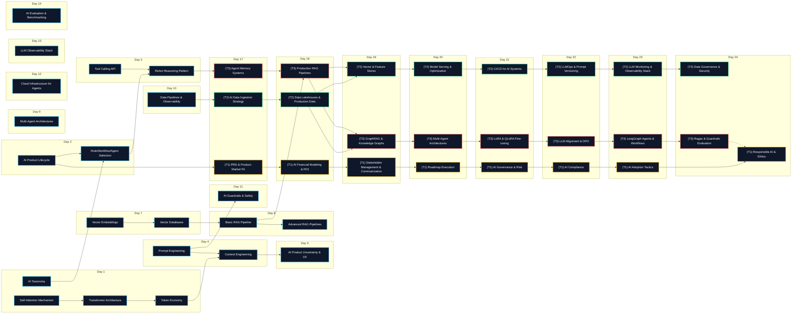

# Curriculum dependency graph - Mermaid Flowchart
This file contains the Mermaid representation of the fused curriculum graph.

```mermaid
flowchart LR
    %% Theme and styling configurations
    classDef general fill:#0f172a,stroke:#38bdf8,stroke-width:2px,color:#f8fafc;
    classDef track1 fill:#0f172a,stroke:#fbbf24,stroke-width:2px,color:#f8fafc;
    classDef track2 fill:#0f172a,stroke:#34d399,stroke-width:2px,color:#f8fafc;
    classDef track3 fill:#0f172a,stroke:#f87171,stroke-width:2px,color:#f8fafc;

    subgraph Day1 [Day 1]
        ai-taxonomy["AI Taxonomy"]
        self-attention["Self-Attention Mechanism"]
        transformer-architecture["Transformer Architecture"]
        token-economy["Token Economy"]
    end

    subgraph Day2 [Day 2]
        ai-product-lifecycle["AI Product Lifecycle"]
        solution-levels["Rule/Workflow/Agent Selection"]
    end

    subgraph Day3 [Day 3]
        agentic-agent-react["ReAct Reasoning Pattern"]
        tool-calling["Tool Calling API"]
    end

    subgraph Day4 [Day 4]
        prompt-engineering["Prompt Engineering"]
        context-engineering["Context Engineering"]
    end

    subgraph Day5 [Day 5]
        ai-product-uncertainty["AI Product Uncertainty & UX"]
    end

    subgraph Day7 [Day 7]
        vector-embeddings["Vector Embeddings"]
        vector-databases["Vector Databases"]
    end

    subgraph Day8 [Day 8]
        basic-rag["Basic RAG Pipeline"]
        advanced-rag["Advanced RAG Pipelines"]
    end

    subgraph Day9 [Day 9]
        multi-agent-architectures["Multi-Agent Architectures"]
    end

    subgraph Day10 [Day 10]
        data-pipelines-observability["Data Pipelines & Observability"]
    end

    subgraph Day11 [Day 11]
        guardrails-safety["AI Guardrails & Safety"]
    end

    subgraph Day12 [Day 12]
        cloud-infrastructure-agents["Cloud Infrastructure for Agents"]
    end

    subgraph Day13 [Day 13]
        observability-stack["LLM Observability Stack"]
    end

    subgraph Day14 [Day 14]
        ai-evaluation["AI Evaluation & Benchmarking"]
    end

    subgraph Day17 [Day 17]
        t1-d17-prd-pmf["(T1) PRD & Product-Market Fit"]
        t2-d17-data-ingestion-strategy["(T2) AI Data Ingestion Strategy"]
        t3-d17-agent-memory-systems["(T3) Agent Memory Systems"]
    end

    subgraph Day18 [Day 18]
        t1-d18-financial-modeling-roi["(T1) AI Financial Modeling & ROI"]
        t2-d18-data-lakehouses["(T2) Data Lakehouses & Production Data"]
        t3-d18-production-rag["(T3) Production RAG Pipelines"]
    end

    subgraph Day19 [Day 19]
        t1-d19-stakeholder-management["(T1) Stakeholder Management & Communication"]
        t2-d19-vector-feature-stores["(T2) Vector & Feature Stores"]
        t3-d19-graph-rag["(T3) GraphRAG & Knowledge Graphs"]
    end

    subgraph Day20 [Day 20]
        t1-d20-roadmap-execution["(T1) Roadmap Execution"]
        t2-d20-model-serving-optimization["(T2) Model Serving & Optimization"]
        t3-d20-multi-agent-architectures["(T3) Multi-Agent Architectures"]
    end

    subgraph Day21 [Day 21]
        t1-d21-governance-risk["(T1) AI Governance & Risk"]
        t2-d21-cicd-ai-systems["(T2) CI/CD for AI Systems"]
        t3-d21-lora-qlora-tuning["(T3) LoRA & QLoRA Fine-tuning"]
    end

    subgraph Day22 [Day 22]
        t1-d22-compliance["(T1) AI Compliance"]
        t2-d22-llmops-versioning["(T2) LLMOps & Prompt Versioning"]
        t3-d22-alignment-dpo["(T3) LLM Alignment & DPO"]
    end

    subgraph Day23 [Day 23]
        t1-d23-ai-adoption["(T1) AI Adoption Tactics"]
        t2-d23-observability-monitoring["(T2) LLM Monitoring & Observability Stack"]
        t3-d23-langgraph-agents["(T3) LangGraph Agents & Workflows"]
    end

    subgraph Day24 [Day 24]
        t1-d24-responsible-ai["(T1) Responsible AI & Ethics"]
        t2-d24-data-governance-security["(T2) Data Governance & Security"]
        t3-d24-ragas-guardrails["(T3) Ragas & Guardrails Evaluation"]
    end

    ai-taxonomy --> solution-levels
    self-attention --> transformer-architecture
    transformer-architecture --> token-economy
    token-economy --> context-engineering
    ai-product-lifecycle --> solution-levels
    ai-product-lifecycle --> t1-d17-prd-pmf
    solution-levels --> agentic-agent-react
    agentic-agent-react --> t3-d17-agent-memory-systems
    tool-calling --> agentic-agent-react
    prompt-engineering --> context-engineering
    prompt-engineering --> guardrails-safety
    context-engineering --> ai-product-uncertainty
    vector-embeddings --> vector-databases
    vector-databases --> basic-rag
    basic-rag --> advanced-rag
    basic-rag --> t3-d18-production-rag
    data-pipelines-observability --> t2-d17-data-ingestion-strategy
    t1-d17-prd-pmf --> t1-d18-financial-modeling-roi
    t2-d17-data-ingestion-strategy --> t2-d18-data-lakehouses
    t3-d17-agent-memory-systems --> t3-d18-production-rag
    t1-d18-financial-modeling-roi --> t1-d19-stakeholder-management
    t2-d18-data-lakehouses --> t2-d19-vector-feature-stores
    t2-d18-data-lakehouses --> t3-d19-graph-rag
    t3-d18-production-rag --> t3-d19-graph-rag
    t1-d19-stakeholder-management --> t1-d20-roadmap-execution
    t2-d19-vector-feature-stores --> t2-d20-model-serving-optimization
    t3-d18-production-rag --> t2-d19-vector-feature-stores
    t3-d19-graph-rag --> t3-d20-multi-agent-architectures
    t1-d20-roadmap-execution --> t1-d21-governance-risk
    t2-d20-model-serving-optimization --> t2-d21-cicd-ai-systems
    t3-d20-multi-agent-architectures --> t3-d21-lora-qlora-tuning
    t1-d21-governance-risk --> t1-d22-compliance
    t2-d21-cicd-ai-systems --> t2-d22-llmops-versioning
    t3-d21-lora-qlora-tuning --> t3-d22-alignment-dpo
    t1-d22-compliance --> t1-d23-ai-adoption
    t2-d22-llmops-versioning --> t2-d23-observability-monitoring
    t3-d22-alignment-dpo --> t3-d23-langgraph-agents
    t1-d23-ai-adoption --> t1-d24-responsible-ai
    t2-d23-observability-monitoring --> t2-d24-data-governance-security
    t3-d23-langgraph-agents --> t3-d24-ragas-guardrails
    t3-d24-ragas-guardrails -.-> t1-d24-responsible-ai
    class ai-taxonomy,self-attention,transformer-architecture,token-economy,ai-product-lifecycle,solution-levels,agentic-agent-react,tool-calling,prompt-engineering,context-engineering,ai-product-uncertainty,vector-embeddings,vector-databases,basic-rag,advanced-rag,multi-agent-architectures,data-pipelines-observability,guardrails-safety,cloud-infrastructure-agents,observability-stack,ai-evaluation general;
    class t1-d17-prd-pmf,t1-d18-financial-modeling-roi,t1-d19-stakeholder-management,t1-d20-roadmap-execution,t1-d21-governance-risk,t1-d22-compliance,t1-d23-ai-adoption,t1-d24-responsible-ai track1;
    class t2-d17-data-ingestion-strategy,t2-d18-data-lakehouses,t2-d19-vector-feature-stores,t2-d20-model-serving-optimization,t2-d21-cicd-ai-systems,t2-d22-llmops-versioning,t2-d23-observability-monitoring,t2-d24-data-governance-security track2;
    class t3-d17-agent-memory-systems,t3-d18-production-rag,t3-d19-graph-rag,t3-d20-multi-agent-architectures,t3-d21-lora-qlora-tuning,t3-d22-alignment-dpo,t3-d23-langgraph-agents,t3-d24-ragas-guardrails track3;
```