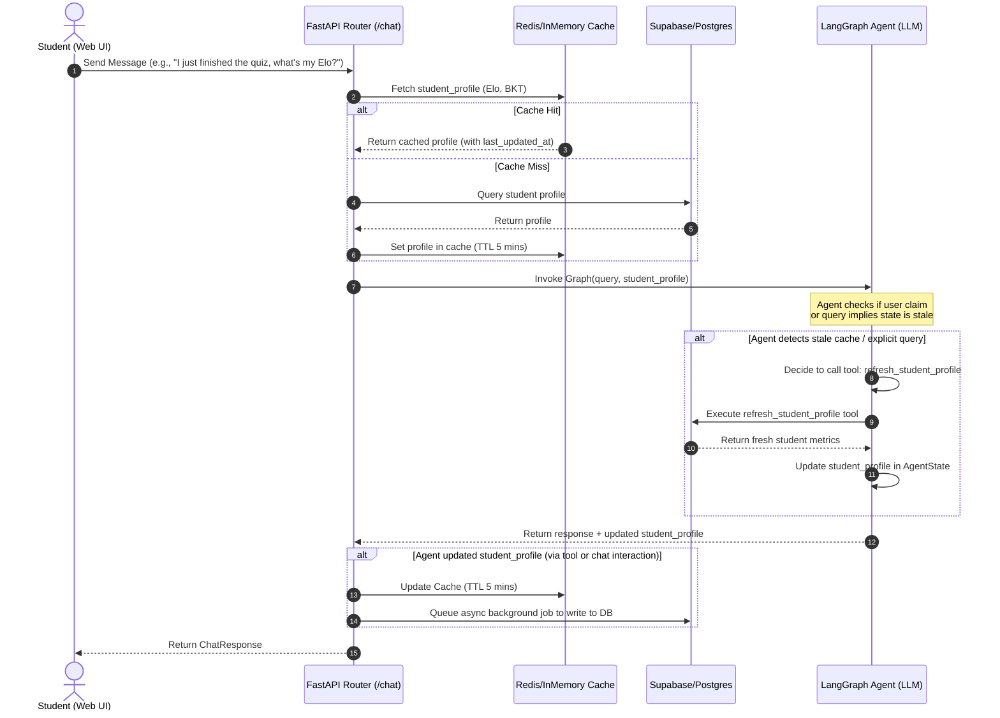

# Plan: Hybrid Smart Cache & AI Agent Tool-Calling Flow

This plan outlines the design and implementation steps for a hybrid execution flow where the LangGraph Agent can dynamically call a tool to refresh student profile metrics (Elo, BKT, weaknesses) from the database when it detects that the cached state is stale.

## Trade-off Analysis: Pre-fetching vs. Tool-Calling

| Strategy | Pros | Cons |
| :--- | :--- | :--- |
| **Always Pre-fetching** | - Minimum API/DB latency during chat turns. - Simpler LangGraph state management. | - Stale data if student completes quizzes in another tab. - Cannot adapt to real-time status updates mid-session. |
| **Always Tool-Calling** | - Data is always 100% fresh. - No cache management needed on API level. | - LLM has to make tool-calling turns on *every* request, doubling token cost and adding 1.5s - 3s latency. |
| **Hybrid Smart Cache (Proposed)** | - **Fast response time** in 95% of cases using pre-fetched cache. - **Self-correcting**: AI can invoke `refresh_student_profile` tool *only* when needed (e.g. user asks "what is my score?" or claims "I finished a quiz"). | - Slightly higher complexity in LangGraph state and System Prompt instructions. |

---

## Execution Flow (Mermaid Diagram)

---

## Proposed Changes

We will modify or create the following files to implement this hybrid flow:

### 1. [MODIFY] [example_tool.py](file:///d:/CODE/AITHUCCHIEN/PROJECT/C2-App-125/src/agents/tools/example_tool.py)
- Implement `refresh_student_profile(student_id: str, course_id: str, concept_id: str) -> dict` tool using the DB interface.

### 2. [MODIFY] [example_node.py](file:///d:/CODE/AITHUCCHIEN/PROJECT/C2-App-125/src/agents/nodes/example_node.py)
- Bind the new tool `refresh_student_profile` to the LLM.
- Update `analyze_node` to pass the tool definition and update the System Prompt instructing the LLM when to invoke this tool.
- Add tool outputs processing to merge fresh profile data into `AgentState`.

### 3. [MODIFY] [graph.py](file:///d:/CODE/AITHUCCHIEN/PROJECT/C2-App-125/src/agents/graph.py)
- Introduce a `ToolNode` containing the tools (specifically the new `refresh_student_profile` tool).
- Update the StateGraph structure to allow transition from the LLM/analyze node to the tool node and back:
  `analyze` -> (conditional edge: has tool calls?) -> `tools` -> `analyze`
  `analyze` -> (conditional edge: no tool calls) -> `respond` -> `END`.

### 4. [MODIFY] [routes.py](file:///d:/CODE/AITHUCCHIEN/PROJECT/C2-App-125/src/api/routes.py)
- Include student, course, and concept IDs in the metadata or agent state during `ainvoke` so that the tool can use them if needed.

---

## Tasks

- [ ] Task 1: Create `refresh_student_profile` tool in `src/agents/tools/example_tool.py` → Verify: Import the tool and check docstrings/schema.
- [ ] Task 2: Modify `src/agents/graph.py` to include `ToolNode` and add conditional edge transitions to handle tool execution → Verify: Graph compiles successfully.
- [ ] Task 3: Update `src/agents/nodes/example_node.py` to bind tools to the ChatOpenAI model, instruct LLM about cache checking, and handle merging tool results back to state → Verify: LLM accepts tool bindings.
- [ ] Task 4: Run unit tests / simulation chat endpoint to confirm the agent successfully calls the tool when asked "what is my latest Elo?" → Verify: Inspect logs/response showing tool call execution.

## Done When
- [ ] LangGraph Agent compiles with the new state transitions (LLM -> Tools -> LLM).
- [ ] AI Agent successfully executes the `refresh_student_profile` tool and returns updated metrics.
- [ ] All existing test cases pass successfully.
