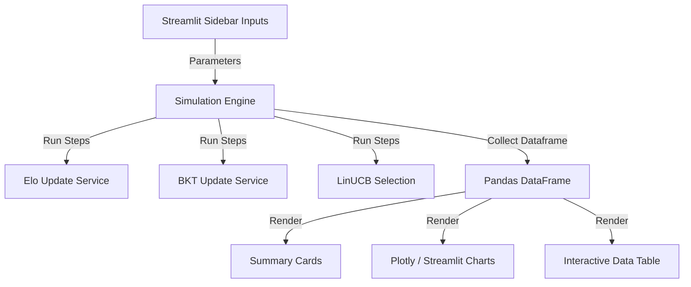

# Phase 01: Streamlit Dashboard for Adaptive Learning Simulation

## Context Links
- **Simulation Reference Script**: [simulation_adaptive.py](file:///d:/CODE/AITHUCCHIEN/PROJECT/C2-App-125/eval/simulation_adaptive.py)
- **Elo Rating Service**: [elo.py](file:///d:/CODE/AITHUCCHIEN/PROJECT/C2-App-125/src/services/adaptive/elo.py)
- **BKT Service**: [bkt.py](file:///d:/CODE/AITHUCCHIEN/PROJECT/C2-App-125/src/services/adaptive/bkt.py)
- **LinUCB Service**: [bandit.py](file:///d:/CODE/AITHUCCHIEN/PROJECT/C2-App-125/src/services/adaptive/bandit.py)

## Overview
- **Priority**: P1 (Important for algorithm debugging and demonstration)
- **Status**: Planning
- **Description**: Triển khai giao diện web tương tác Streamlit giả lập hành vi học sinh làm bài để trực quan hóa cách Elo của học sinh hội tụ, độ khó câu hỏi tự hiệu chuẩn, xác suất làm chủ của BKT cập nhật, và cách thuật toán LinUCB đưa ra quyết định chọn câu hỏi thích ứng (ZPD target 75%).

## Key Insights
1. **Simulation Loop**: Tận dụng engine mô phỏng của `simulation_adaptive.py` nhưng đóng gói thành các helper có thể cấu hình tham số động trực tiếp từ Streamlit Sidebar.
2. **Interactive Visualization**: Cần hiển thị đồ thị dạng line chart cho sự biến động Elo (Student Elo vs True Elo) và BKT mastery probability. Dùng plotly/matplotlib/streamlit line_chart để hiển thị mượt mà.
3. **Bandit Arm Analysis**: Hiển thị bảng UCB scores của các candidate questions (arms) tại mỗi step để người dùng thấy rõ cơ chế Exploration (khám phá) vs Exploitation (khai thác) của LinUCB dựa trên giá trị $\alpha$.

## Requirements
### Functional Requirements
- **Sidebar Configurations**:
  - `True Student Elo` (Slider: 600 - 2400, default 1500)
  - `Initial Student Elo` (Slider: 600 - 2000, default 1200)
  - `Initial BKT Mastery` (Slider: 0.0 - 1.0, default 0.25)
  - BKT Parameters: `Transition Learn` (default 0.10), `Guess` (default 0.20), `Slip` (default 0.10)
  - LinUCB `Alpha` (Exploration parameter, Slider: 0.0 - 5.0, default 1.0)
  - `Simulation Steps` (Slider: 10 - 100, default 30)
- **Dashboard Sections**:
  - **Metrics**: Hiển thị Final Estimated Student Elo, True Student Elo, Final BKT Mastery.
  - **Visualization charts**:
    - **Elo Convergence Chart**: Đường biểu diễn sự hội tụ của Estimated Student Elo tiệm cận True Student Elo.
    - **BKT Mastery Probability Chart**: Đường biểu diễn sự tiến bộ (xác suất làm chủ) qua các bước trả lời.
    - **Question Difficulty Calibration**: Đồ thị sự thay đổi độ khó ước lượng (Est Difficulty Elo) của 10 câu hỏi để thấy rõ hiệu chuẩn độ khó tự động (Auto-calibration).
    - **Arm Selection Histogram**: Số lần mỗi câu hỏi được LinUCB chọn để người dùng đánh giá độ bao phủ (coverage).
  - **Simulation Logs Table**: Bảng lịch sử các bước giả lập chi tiết dạng Pandas DataFrame.

### Non-functional Requirements
- Phản hồi tương tác (re-run simulation) ngay khi người dùng thay đổi tham số trên sidebar.
- Sử dụng cấu trúc file ngăn nắp, tách biệt module streamlit UI với logic giả lập cốt lõi nếu cần thiết.

## Architecture & Data Flow

## Related Code Files

### [NEW] [simulation_app.py](file:///d:/CODE/AITHUCCHIEN/PROJECT/C2-App-125/src/dashboard/simulation_app.py)
File chứa giao diện Streamlit và logic bọc bộ giả lập thích ứng.

## Implementation Steps
1. **Thiết lập thư mục**: Tạo folder `src/dashboard/` nếu chưa có.
2. **Xây dựng module giả lập cấu hình được**: Viết hàm `run_adaptive_simulation(...)` nhận tham số cấu hình đầu vào (True Elo, Initial Elo, BKT params, Bandit alpha, steps) và trả về một Pandas DataFrame ghi nhận lịch sử từng step cùng trạng thái cuối cùng của mô hình.
3. **Xây dựng giao diện Streamlit**:
   - Sử dụng `st.sidebar` để gom nhóm các tham số cấu hình.
   - Thêm các container hiển thị Metrics tóm tắt kết quả cuối cùng.
   - Vẽ các đồ thị trực quan hóa bằng `st.line_chart` hoặc `plotly.express` để tăng tính thẩm mỹ.
   - Hiển thị bảng chi tiết `st.dataframe` có hỗ trợ highlight màu sắc (ví dụ: highlight dòng trả lời đúng màu xanh lá nhạt, sai màu đỏ nhạt).
4. **Viết tài liệu hướng dẫn chạy thử** trong README.md của dashboard.

## Todo List
- [ ] Thiết kế và khởi tạo file `src/dashboard/simulation_app.py`.
- [ ] Chuyển đổi logic từ `eval/simulation_adaptive.py` thành dạng hàm nhận tham số động.
- [ ] Xây dựng Sidebar điều khiển trong Streamlit.
- [ ] Thiết lập vẽ đồ thị Elo convergence, BKT mastery progress, Question Calibration và Arm Selection.
- [ ] Triển khai bảng log chi tiết tương tác.
- [ ] Chạy kiểm thử thủ công và căn chỉnh UI/UX để đảm bảo giao diện premium, chuyên nghiệp.

## Success Criteria
- Dashboard chạy không lỗi khi khởi chạy lệnh `streamlit run src/dashboard/simulation_app.py`.
- Đồ thị phản hồi tức thì và chính xác theo các thông số cấu hình của thanh bên (sidebar).
- Đồ thị Elo hội tụ thể hiện rõ xu hướng tiến gần tới True Elo của học sinh sau khoảng 20-30 steps trả lời.

## Risk Assessment & Mitigation
- **Numerical Overflow**: Elo hoặc BKT cập nhật quá mức gây lỗi tràn số.
  *Biện pháp*: Đã có cơ chế clamping tích hợp sẵn trong `elo.py` và `bkt.py`.
- **Performance Lag**: Re-run 100 steps có thể gây trễ giao diện.
  *Biện pháp*: Giới hạn steps tối đa là 100 và tối ưu hóa vòng lặp mô phỏng (Sherman-Morrison của LinUCB đã là O(d^2) cực kỳ nhanh).
