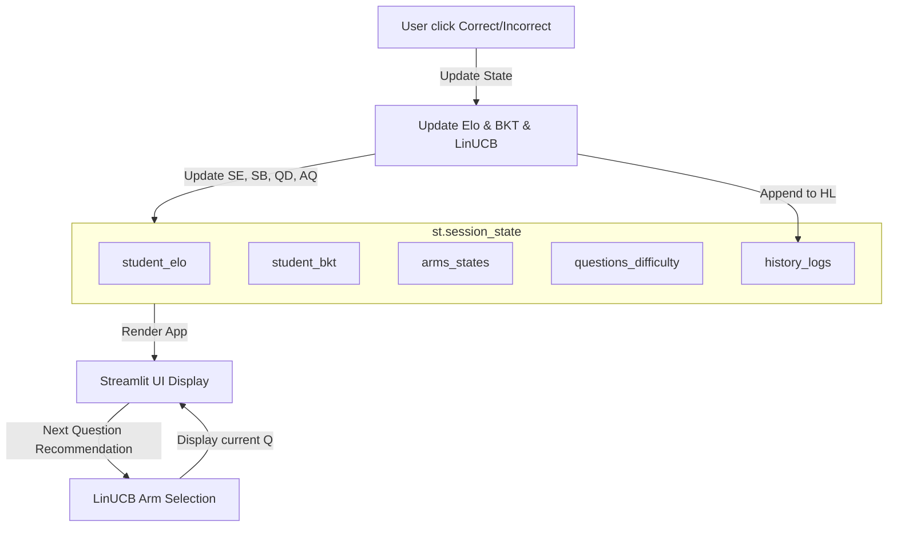

# Phase 02: Interactive User Mode on Streamlit Dashboard

## Context Links
- **Simulation Reference Script**: [simulation_adaptive.py](file:///d:/CODE/AITHUCCHIEN\PROJECT/C2-App-125/eval/simulation_adaptive.py)
- **Streamlit App**: [simulation_app.py](file:///d:/CODE/AITHUCCHIEN/PROJECT/C2-App-125/src/dashboard/simulation_app.py)

## Overview
- **Priority**: P1 (Important for real-world user validation of adaptive recommendation flow)
- **Status**: Planning
- **Description**: Bổ sung chế độ **"Interactive User Mode" (Người dùng trải nghiệm)** vào Streamlit Dashboard. Thay vì giả lập tự động bằng xác suất toán học, người dùng thật sẽ tự đóng vai trò là học sinh, trực tiếp trả lời (Đúng/Sai) các câu hỏi được LinUCB đề xuất, quan sát trực quan sự thay đổi tức thì của Elo, BKT và các chỉ số liên quan sau mỗi lượt click.

## Key Insights
1. **Streamlit Session State**: Streamlit chạy lại toàn bộ script từ đầu mỗi khi có tương tác (click nút). Cần sử dụng `st.session_state` để lưu trữ trạng thái bền vững (student_elo, student_bkt, history_logs, questions_difficulty, bandit_arms_states).
2. **Real-time Chart Updates**: Ngay khi click "Đúng" hoặc "Sai", app sẽ cập nhật trạng thái trong `st.session_state`, sinh ra câu hỏi mới bằng LinUCB, đồng thời vẽ lại đồ thị lịch sử chứa điểm dữ liệu mới nhất.
3. **Interactive Control Loop**: 
   - Hệ thống gợi ý câu hỏi ZPD -> Hiển thị câu hỏi cho User -> User chọn kết quả -> Hệ thống cập nhật thuật toán -> Lưu lịch sử -> Gợi ý câu hỏi tiếp theo.

## Requirements
### Functional Requirements
- **Chuyển đổi chế độ (Mode Selector)**: Thanh bên (Sidebar) cho phép chọn giữa "Auto Simulation (Giả lập tự động)" và "Interactive Play (Trải nghiệm thực tế)".
- **Nút điều khiển trạng thái**:
  - Nút "Khởi tạo học sinh mới (Reset)": Reset Elo học sinh về 1200, BKT về 0.25, làm sạch lịch sử và đặt lại độ khó câu hỏi về 1200.
- **Khu vực tương tác làm bài (Interactive Exercise Area)**:
  - Hiển thị thông tin câu hỏi hiện tại được LinUCB gợi ý: Mã câu hỏi, Độ khó hiện tại của câu hỏi.
  - Cho phép người dùng nhập kết quả: Click nút **"Trả lời ĐÚNG (Correct)"** hoặc **"Trả lời SAI (Incorrect)"**.
- **Hiển thị thông số thay đổi tức thì**:
  - Elo học sinh thay đổi như thế nào sau lượt vừa làm (ví dụ: `1200.0` -> `1215.4` [**+15.4**]).
  - Xác suất làm chủ BKT thay đổi (ví dụ: `25.0%` -> `38.5%` [**+13.5%**]).
  - Độ khó ước lượng của câu hỏi vừa làm được hiệu chuẩn lại (ví dụ: từ `1200.0` giảm xuống `1184.6` do học sinh làm đúng câu này).
- **Trực quan hóa Live Charts**:
  - Đồ thị đường (Line chart) cập nhật động lịch sử Elo học sinh và BKT Mastery qua mỗi lượt làm bài thực tế.
  - Bảng log lịch sử hiển thị đầy đủ các câu đã làm.

## Architecture & State Management

## Related Code Files

### [MODIFY] [simulation_app.py](file:///d:/CODE/AITHUCCHIEN/PROJECT/C2-App-125/src/dashboard/simulation_app.py)
Cập nhật file Streamlit để tích hợp `st.session_state` quản lý trạng thái, bổ sung Sidebar Toggle, khối giao diện Interactive Play Area, và chia nhánh luồng xử lý dữ liệu giữa Auto Simulation và Interactive Mode.

## Implementation Steps
1. **Thiết kế State Management**: Định nghĩa hàm `init_interactive_state(force=False)` để khởi tạo các biến trong `st.session_state` nếu chưa tồn tại.
2. **Xây dựng Giao diện Interactive Mode**:
   - Dùng `st.sidebar.radio` để cho phép chọn Mode.
   - Nếu chọn "Interactive Mode", hiển thị bảng thông tin học sinh hiện tại, câu hỏi đang làm và 2 nút bấm lớn: **"Đúng (Correct)"** và **"Sai (Incorrect)"**.
3. **Triển khai Logic Cập Nhật**:
   - Viết callback handler cho nút Đúng/Sai:
     - Lấy câu hỏi hiện tại, tính toán Elo và BKT mới.
     - Cập nhật độ khó câu hỏi và trạng thái LinUCB.
     - Ghi nhận phần thưởng LinUCB.
     - Thêm dòng mới vào danh sách history logs.
     - Tự động gọi LinUCB chọn câu hỏi tiếp theo cho lượt kế tiếp.
4. **Vẽ biểu đồ thời gian thực**: Sử dụng Plotly để vẽ đồ thị dựa trên DataFrame được build từ `st.session_state.history_logs`.

## Todo List
- [ ] Tích hợp `st.session_state` cho các biến Elo, BKT, Lịch sử, Khối LinUCB.
- [ ] Viết hàm khởi tạo và reset trạng thái học sinh.
- [ ] Xây dựng widget lựa chọn Mode (Auto vs Interactive) ở Sidebar.
- [ ] Thiết kế Layout interactive: khu vực hiển thị câu hỏi và 2 nút tương tác Đúng / Sai.
- [ ] Triển khai callback xử lý toán học (Elo update, BKT update, Bandit update) khi click nút.
- [ ] Cập nhật đồ thị Live Chart phản hồi ngay lập tức sau click.

## Success Criteria
- Người dùng chuyển sang chế độ Interactive Mode mà không gây crash app.
- Khi nhấn nút "Đúng" hoặc "Sai", giao diện cập nhật ngay lập tức: Elo thay đổi rõ rệt, BKT tăng/giảm, và đồ thị vẽ thêm 1 điểm dữ liệu mới.
- Câu hỏi gợi ý tiếp theo thay đổi linh hoạt dựa trên trạng thái năng lực mới của người dùng (Ví dụ: làm Đúng nhiều câu dễ thì LinUCB sẽ gợi ý câu khó hơn).
