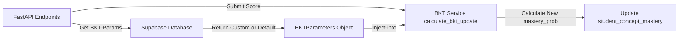

# Phase 01: Database Schema & Backend Service Integration

## Context Links
- **BKT Service**: [bkt.py](file:///d:/CODE/AITHUCCHIEN/PROJECT/C2-App-125/src/services/adaptive/bkt.py)
- **Supabase DB Adapter**: [supabase_database.py](file:///d:/CODE/AITHUCCHIEN/PROJECT/C2-App-125/src/services/adaptive/supabase_database.py)

## Overview
- **Priority**: P2 (Important requirement for adaptive personalization)
- **Status**: Planning
- **Description**: Khởi tạo cấu trúc bảng lưu trữ tham số BKT tĩnh của từng Concept trong database và cập nhật adapter kết nối của backend để lấy động các tham số này khi tính toán độ làm chủ của học sinh.

## Requirements
### Functional Requirements
- **SQL Migration**:
  - Tạo bảng `app.bkt_concept_parameters` lưu trữ 4 tham số: `prior_learned`, `transition_learn`, `guess`, `slip` theo khóa chính `concept_id`.
  - Thiết lập các ràng buộc check constraint hợp lệ: các xác suất phải nằm trong khoảng `[0.0, 1.0]`.
- **Database Service Updates**:
  - Bổ sung interface `get_bkt_parameters(concept_id: UUID) -> BKTParameters` vào lớp `AdaptiveDatabaseInterface` và triển khai trong `SupabaseAdaptiveDatabase`.
  - Nếu bản ghi của concept đó chưa tồn tại trong bảng `bkt_concept_parameters`, trả về một đối tượng `BKTParameters` mặc định (prior=0.25, transition=0.1, guess=0.2, slip=0.1) thay vì lỗi.
- **FastAPI / Logic updates**:
  - Tại luồng xử lý nộp bài (`submit_attempt` hoặc RPC), gọi hàm lấy tham số BKT trước khi chạy hàm cập nhật BKT mastery probability cho học sinh.

## Architecture & Data Flow

## Related Code Files

### [NEW] [20260613_create_bkt_params_table.sql](file:///d:/CODE/AITHUCCHIEN/PROJECT/C2-App-125/supabase/migrations/20260613_create_bkt_params_table.sql)
Chứa lệnh khởi tạo bảng `app.bkt_concept_parameters` và nạp một số dữ liệu mặc định.

### [MODIFY] [database_interface.py](file:///d:/CODE/AITHUCCHIEN/PROJECT/C2-App-125/src/services/adaptive/database_interface.py)
Khai báo phương thức mới `get_bkt_parameters`.

### [MODIFY] [supabase_database.py](file:///d:/CODE/AITHUCCHIEN/PROJECT/C2-App-125/src/services/adaptive/supabase_database.py)
Triển khai phương thức `get_bkt_parameters` để lấy động dữ liệu từ bảng.

## Implementation Steps
1. **Viết Migration Script**: Soạn thảo file SQL tạo bảng `bkt_concept_parameters` có kèm các ràng buộc `CHECK`.
2. **Cập nhật database_interface**: Thêm định nghĩa hàm mới vào abstract class.
3. **Cập nhật supabase_database**: 
   - Triển khai hàm `get_bkt_parameters(self, concept_id: UUID)`.
   - Sử dụng client `app_client` để query bảng `bkt_concept_parameters`.
   - Trả về fallback mặc định nếu bảng trống hoặc không tìm thấy bản ghi.
4. **Tích hợp vào luồng Logic**: Thay đổi đoạn code nộp bài để thay thế việc khởi tạo `BKTParameters` tĩnh bằng việc lấy từ DB.
5. **Viết Unit Tests**: Viết các test case mô phỏng mock database và database thật để đảm bảo logic chạy chính xác.

## Todo List
- [ ] Viết file migration SQL.
- [ ] Cập nhật file `database_interface.py`.
- [ ] Cập nhật file `supabase_database.py`.
- [ ] Tích hợp lấy tham số động vào logic API endpoint nộp bài.
- [ ] Viết unit tests kiểm thử luồng database.

## Success Criteria
- SQL script chạy không lỗi trên Supabase PostgreSQL.
- Khi API nộp bài nhận kết quả, hệ thống tự động tìm và áp dụng đúng tham số BKT đặc thù của concept đó để tính toán độ làm chủ cho học sinh.
