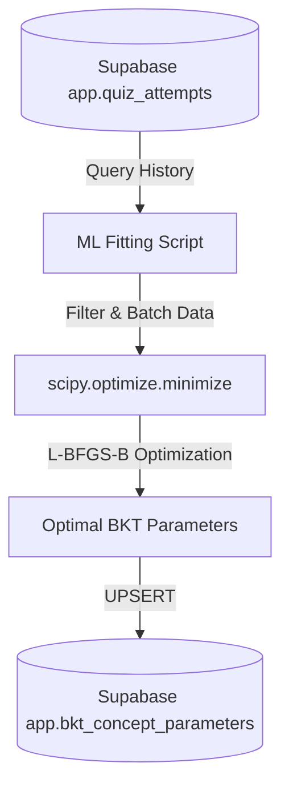

# Phase 02: Offline ML Fitting Pipeline

## Context Links
- **BKT Service**: [bkt.py](file:///d:/CODE/AITHUCCHIEN/PROJECT/C2-App-125/src/services/adaptive/bkt.py)
- **Supabase DB Adapter**: [supabase_database.py](file:///d:/CODE/AITHUCCHIEN/PROJECT/C2-App-125/src/services/adaptive/supabase_database.py)

## Overview
- **Priority**: P2 (Important for data-driven personalization)
- **Status**: Planning
- **Description**: Phát triển pipeline chạy offline (hoặc background cron job) thu thập toàn bộ lịch sử tương tác làm bài tập của học sinh từ database, thực hiện thuật toán tối ưu hóa (parameter fitting) để cập nhật và hiệu chuẩn lại 4 tham số BKT của từng Concept.

## Requirements
### Functional Requirements
- **Data Gathering**:
  - Truy xuất lịch sử làm bài từ bảng `app.quiz_attempts` nhóm theo học sinh (`student_id`) và concept (`concept_id`), sắp xếp theo thời gian tăng dần (`created_at`).
  - Lọc ra các Concept có tối thiểu **100 lượt trả lời** từ tối thiểu **10 học sinh khác nhau** để đảm bảo dữ liệu huấn luyện có tính đại diện cao.
- **Optimization Fitting Engine**:
  - Viết module sử dụng `scipy.optimize.minimize` (thuật toán L-BFGS-B hoặc SLSQP) để khớp (fit) các tham số.
  - Hàm mục tiêu (Objective Function): Tối thiểu hóa hàm lỗi Mean Squared Error (MSE) hoặc Binary Cross-Entropy giữa xác suất đúng kỳ vọng của BKT và kết quả thực tế (Đúng = 1.0, Sai = 0.0) của các chuỗi câu hỏi.
  - Áp dụng các ràng buộc toán học (Constraints/Bounds):
    - `prior_learned (P(L0))`: `[0.05, 0.95]`
    - `transition_learn (P(T))`: `[0.01, 0.50]`
    - `guess (P(G))`: `[0.01, 0.30]` (Đoán bừa tối đa 30%)
    - `slip (P(S))`: `[0.01, 0.30]` (Làm sai ngớ ngẩn tối đa 30%)
- **Database Synchronization**:
  - Chạy cơ chế `UPSERT` ghi nhận bộ tham số mới vào bảng `app.bkt_concept_parameters`.

## Architecture & Data Flow

## Related Code Files

### [NEW] [bkt_parameter_fitter.py](file:///d:/CODE/AITHUCCHIEN/PROJECT/C2-App-125/src/pipeline/ml/bkt_parameter_fitter.py)
Script chạy offline chứa logic query dữ liệu, huấn luyện mô hình BKT HMM tối ưu và đồng bộ lại vào DB.

## Implementation Steps
1. **Truy vấn và chuẩn bị dữ liệu**: Viết truy vấn SQL lấy chuỗi lịch sử học tập Đúng/Sai của từng học sinh theo concept và định dạng thành danh sách các mảng nhị phân.
2. **Xây dựng hàm giả lập chuỗi BKT**: Viết hàm nhận đầu vào là chuỗi đáp án Đúng/Sai thực tế, bộ tham số thử nghiệm, và trả về chuỗi xác suất làm đúng kỳ vọng tại mỗi step.
3. **Xây dựng hàm Objective (Hàm mục tiêu)**: Tính tổng Cross-Entropy hoặc MSE của dự báo so với thực tế trên toàn bộ học sinh của một concept.
4. **Triển khai Tối ưu hóa**: Gọi `scipy.optimize.minimize` với các giới hạn ràng buộc (bounds).
5. **Ghi nhận và log kết quả**: Cập nhật lại vào DB bảng `bkt_concept_parameters` và ghi nhật ký quá trình tối ưu (audit logs).

## Todo List
- [ ] Xây dựng logic query dữ liệu lịch sử trong Python.
- [ ] Viết hàm tính loss BKT cho chuỗi dữ liệu.
- [ ] Tích hợp bộ tối ưu hóa SciPy và các giới hạn ràng buộc.
- [ ] Triển khai hàm lưu ngược kết quả tối ưu vào bảng `bkt_concept_parameters`.
- [ ] Thiết lập job chạy tự động định kỳ (PgCron hoặc GitHub Actions).

## Success Criteria
- Script chạy thành công không có lỗi runtime.
- Sau khi chạy, các tham số $P(G), P(S)$ của các concept được hiệu chỉnh động và luôn nằm trong khoảng ràng buộc an toàn $\le 30\%$.
- Hàm loss trên tập dữ liệu lịch sử giảm so với khi sử dụng bộ tham số mặc định hardcode ban đầu.
