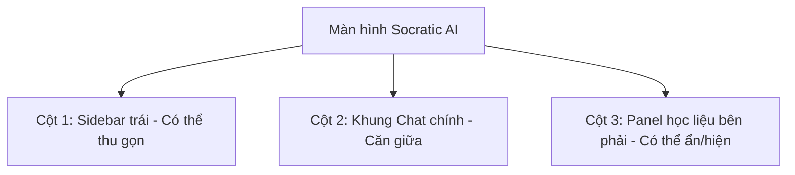

# Giai đoạn 1: Tái cấu trúc Layout & Panel

Tập trung vào việc chuyển đổi sơ đồ layout cũ (Chia đôi dọc trên-dưới) thành layout 3 cột ngang hiện đại (Gemini-style).

## Kiến trúc Giao diện mới

### Các Thay đổi cụ thể

#### 1. Cột 1: Sidebar trái (Trợ lý AI)
- **Cấu trúc mới (Từ trên xuống dưới)**:
  1. Nút `+ Cuộc hội thoại mới` (New Chat) đặt ở đầu.
  2. Nút/Khung `Instructor Dashboard` đặt ngay dưới nút New Chat.
  3. Tiêu đề `Lịch sử hỏi đáp` cùng danh sách lịch sử cuộc trò chuyện cuộn độc lập chiếm toàn bộ phần diện tích còn lại kéo xuống đáy.
- **Tính năng thu gọn (Collapsible)**:
  - Thêm nút menu hamburger ở góc trên bên trái khung chat chính.
  - Khi click, sidebar sẽ thu hẹp lại (chỉ hiển thị icon hoặc ẩn hoàn toàn giống Gemini) để mở rộng tối đa không gian chat.
  - Trạng thái expand/collapse được lưu vào `localStorage` hoặc state.

#### 2. Cột 3: Panel Học Liệu bên phải (Slide Viewer Panel)
- Thay thế phần `Slide Viewer` ở nửa dưới màn hình bằng một panel đứng đặt ở bên phải khung chat chính.
- **Cách thức hoạt động**:
  - Khi có slide trích dẫn được chọn hoặc AI trả về tài liệu trích dẫn, panel này tự động trượt ra (Slide-in).
  - Có nút đóng `X` ở góc trên bên phải để người dùng chủ động đóng lại bất kỳ lúc nào.
  - Khi panel này mở, không gian chat chính sẽ tự động co lại. Khi panel đóng, không gian chat chính sẽ giãn ra chiếm toàn bộ chiều rộng.

#### 3. Responsive trên Thiết bị di động (Mobile)
- Trên mobile (màn hình nhỏ):
  - Sidebar trái sẽ ẩn hoàn toàn và kích hoạt bằng menu trượt (drawer).
  - Panel Học Liệu phải cũng sẽ trượt lên từ dưới hoặc trượt tràn màn hình dạng drawer để người dùng dễ dàng thao tác mà không bị chen chúc giao diện.

## Các file chỉnh sửa
- [socratic-chat-tab.tsx](file:///d:/CODE/AITHUCCHIEN/PROJECT/C2-App-125/frontend/components/dashboard/socratic-chat-tab.tsx)

## Tiêu chí thành công
- Màn hình chat và học liệu nằm cạnh nhau trên màn hình lớn.
- Bấm ẩn/hiện học liệu hoạt động trơn tru với các hiệu ứng chuyển cảnh của Framer Motion.
- Các nút bên sidebar được xếp đặt chính xác theo thứ tự yêu cầu.
