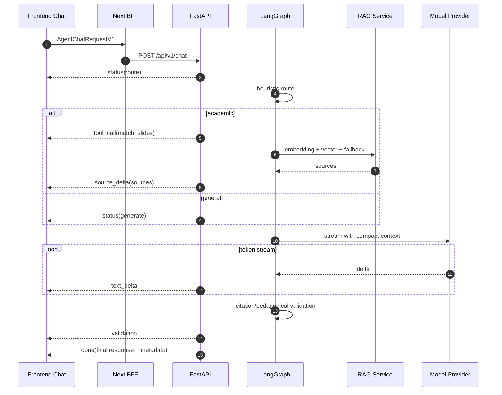

# Research Report: Modern Agent Chat Interface, Unified Schema, and RAG Streaming

Generated: 2026-06-30 09:25 Asia/Bangkok

## Executive Summary

Repo hiện tại đã đi đúng hướng cho AI tutor production: Next.js BFF proxy stream SSE, FastAPI `/api/v1/chat`, LangGraph `astream_events`, RAG Supabase pgvector, citation validator, fast path cho general chat, rAF token batching trên UI, Braintrust timing logs, prompt split để tận dụng cache. Đây không phải hệ thống "chat demo"; đã có nền cho agent chat có tool traces.

Vấn đề chính không nằm ở thiếu feature, mà ở thiếu contract thống nhất end-to-end. Backend stream event đang là convention tự phát (`thinking`, `tool_call`, `tool_result`, `token`, `analysis`, `done`), frontend parse bằng `any`, session vẫn lệch giữa localStorage và DB, metadata RAG/citation chưa có schema version, interactive widgets phase 03 còn planned. Khi scale thêm Gemini/OpenAI/ChatGPT-like use cases, thiếu typed protocol sẽ làm UI và agent graph dính chặt nhau.

Khuyến nghị: giữ SSE hiện tại trong MVP, nhưng chuẩn hóa thành `AgentChatStreamEventV1`, thêm `conversation/message/artifact/citation/tool_call` schema chung, tách "accuracy path" và "latency path" bằng policy rõ ràng, đưa RAG stream thành progressive retrieval: nhận câu hỏi -> route -> emit tool call -> retrieve/cache -> emit sources -> stream answer -> emit validation/done. Không chuyển sang WebSocket trừ khi cần bidirectional realtime/collab.

## Research Methodology

- Scope: modern AI chat UI, agent chat protocol, frontend-backend schema, RAG streaming latency vs accuracy, Gemini/OpenAI/ChatGPT-style use cases.
- Repo inspected:
  - `frontend/lib/chat/stream.ts`
  - `frontend/app/api/v1/[...path]/route.ts`
  - `frontend/components/dashboard/socratic-chat/`
  - `src/api/routes.py`
  - `src/services/rag.py`
  - `src/services/llm.py`
  - `src/agents/graph.py`
  - `src/agents/nodes/*.py`
  - `docs/engineering/system-architecture.md`
  - `docs/diagram/04_ai_chatbot_flow.md`
  - `ADR/adr-007-hybrid-smart-cache-tool-calling.md`
  - `ADR/adr-010-personalized-semantic-cache.md`
  - `tests/test_api/test_chat_stream.py`
- External sources prioritized:
  - OpenAI official docs: Responses streaming, Agents SDK streaming, File Search, Prompt Caching, ChatKit.
  - Google official docs: Gemini streaming, function calling, Google Search grounding, thinking.
  - Vercel AI SDK docs: UI message stream protocol.

## Current Project Fit

### Frontend

Current shape:

- `streamChatRequest()` posts to `/api/v1/chat`, asks for `Accept: text/event-stream`.
- `readStreamEvents()` parses SSE manually.
- Token batching uses `requestAnimationFrame`, good for UI latency.
- `buildChatArtifacts()` derives slides/citations/confidence from metadata.
- Chat history and active session are mostly browser-local (`localStorage` / `sessionStorage`), while backend can also create `chat_sessions`.

Good:

- SSE is enough for one-way agent output.
- Event model already exposes tool activity.
- rAF batching prevents per-token rerender stalls.
- BFF preserves streaming and sets `X-Accel-Buffering: no`.

Weak:

- No typed discriminated union for stream events.
- Event payload names are inconsistent (`tool_name` vs `toolName`, `duration_ms` vs `durationMs`).
- No stream protocol version.
- No event id/sequence for replay or debugging.
- Local session state can drift from backend session.

### Backend

Current shape:

- `/api/v1/chat` can return regular JSON or SSE.
- `stream_chat_response()` emits SSE events.
- LangGraph maps `on_custom_event` and chain lifecycle to stream events.
- `analyze_node` routes intent, retrieves RAG slides, emits tool events.
- `respond_node` streams LLM chunks, validates citations after generation.
- `pedagogical_reflection_node` only runs on risk triggers.

Good:

- Fast path exists for static/general answers.
- RAG has embedding cache, retrieval cache, keyword fallback, global fallback, neighbor slide expansion, dedupe.
- Retrieval timeout is bounded.
- Timings are already included in `metadata.timings_ms`.

Weak:

- `ChatRequest` and `ChatResponse` are thin; metadata is untyped `dict[str, Any]`.
- Provider abstraction is minimal: `get_llm()` supports OpenAI/OpenRouter via LangChain, not Gemini-native capabilities.
- Citation validation runs after full answer, so UI can display hallucinated citation text while streaming unless answer style avoids inline citations until done.
- Accuracy fallback turns weak RAG into `general`, which helps avoid bad citations but can reduce course-grounded accuracy for ambiguous academic queries.

## External Patterns

### OpenAI / ChatGPT-Like

Relevant official patterns:

- Responses API streams typed events and separates text deltas from final response state.
- Agents SDK exposes raw model stream events and higher-level run item events.
- File Search returns retrieval-backed answers with citation annotations.
- Prompt Caching is automatic when stable prompt prefixes are reused.
- ChatKit positions chat UI as a composable agent interface with widgets/tools.

Fit for project:

- Your current `static_prompt` then `dynamic_prompt` pattern matches prompt-cache direction.
- Your `tool_call/tool_result` events mirror agent run item events.
- Next step is not a UI rewrite; it is making your stream protocol explicit and provider-neutral.

Best use cases:

- Socratic tutor with course citations.
- Draft/explain/debug learning assistant.
- Agent-visible tool timeline.
- Multi-turn projects/session memory.
- Teacher/admin review of traces.

### Gemini-Like

Relevant official patterns:

- Gemini supports streaming generation.
- Function calling/tool use is first-class.
- Search grounding can attach sources for recency-sensitive answers.
- Thinking/reasoning controls are explicit for some models/features.

Fit for project:

- Gemini is useful as a secondary provider for summarization, grounded web/current topics, multimodal slide/image understanding, and cost/latency routing.
- Do not expose Gemini-specific output directly to frontend. Normalize into the same `AgentChatStreamEventV1`.

Best use cases:

- Multimodal slide/image explanation.
- Grounded web search when course material is insufficient and policy allows external sources.
- Low-cost draft/routing/classification.
- Teacher content generation and rubric review.

### Vercel AI SDK Pattern

Relevant pattern:

- A UI message stream protocol separates text parts, tool calls, tool results, data parts, and final metadata.

Fit for project:

- Even if you do not adopt the SDK, copy the idea: message is not just string; it is parts.
- Your future widget phase should use structured message parts, not markdown conventions.

## Proposed Unified Schema

### Request Contract

```ts
type AgentChatRequestV1 = {
  schemaVersion: "agent-chat.v1";
  conversationId?: string;
  clientMessageId: string;
  userMessage: {
    role: "user";
    content: Array<
      | { type: "text"; text: string }
      | { type: "image"; url: string; mimeType?: string }
      | { type: "file"; fileId: string; name?: string }
    >;
  };
  context: {
    studentId: string;
    courseId: string;
    conceptId?: string;
    mode: "Explain" | "Practice" | "Hint" | "Debug" | string;
    locale?: "vi-VN" | "en-US";
  };
  options?: {
    stream?: true;
    providerHint?: "openai" | "gemini" | "auto";
    latencyBudgetMs?: number;
    accuracyMode?: "fast" | "balanced" | "strict";
  };
};
```

### Stream Contract

```ts
type AgentChatStreamEventV1 =
  | { v: 1; seq: number; event: "status"; message: string; stage: "route" | "retrieve" | "generate" | "validate" }
  | { v: 1; seq: number; event: "tool_call"; id: string; name: string; input: unknown }
  | { v: 1; seq: number; event: "tool_result"; id: string; name: string; output: unknown; durationMs?: number }
  | { v: 1; seq: number; event: "source_delta"; sources: RagSource[] }
  | { v: 1; seq: number; event: "text_delta"; messageId: string; delta: string }
  | { v: 1; seq: number; event: "artifact"; artifact: ChatArtifact }
  | { v: 1; seq: number; event: "validation"; result: CitationValidation | PedagogicalValidation }
  | { v: 1; seq: number; event: "done"; response: AgentChatResponseV1 }
  | { v: 1; seq: number; event: "error"; code: string; message: string; retryable: boolean };
```

Keep backward compatibility:

- Backend still emits current events for old UI.
- New UI parser accepts both old and v1.
- Tests assert both event order and v1 payload shape.

### Stored Message Contract

```ts
type AgentMessageV1 = {
  id: string;
  conversationId: string;
  role: "user" | "assistant" | "system" | "tool";
  parts: ChatPart[];
  createdAt: string;
  metadata: {
    provider?: string;
    model?: string;
    mode?: string;
    intent?: "academic" | "general" | "clarify_practice_concept";
    timingsMs?: Record<string, number>;
    tokenUsage?: Record<string, number>;
  };
};
```

## RAG Streaming: Accuracy vs Latency

### Recommended Flow



### Policy

Use three modes, not one global behavior:

| Mode | Latency target | Accuracy policy | Use case |
| --- | ---: | --- | --- |
| `fast` | TTFT < 700ms | heuristic route, cached RAG only, no critic unless trigger | greeting, simple definition, review UX |
| `balanced` | TTFT 1-2.5s | current vector RAG + fallback + citation validation | default student chat |
| `strict` | 2.5-6s accepted | multi-query retrieval, rerank, answer only from sources, critic always | assessment, teacher-facing answer, high-stakes content |

Do not let weak RAG silently become open-ended answer for academic requests. Better:

- emit `source_delta` with `confidence: low`;
- answer with "mình chưa tìm thấy slide đủ chắc";
- ask a clarifying question or show top candidate sources;
- only use general model knowledge if `allowExternalKnowledge=true`.

### Retrieval Improvements

Priority order:

1. Add typed `RagSource` with `sourceId`, `documentName`, `slideNumber`, `chunkId`, `similarity`, `retrievalMethod`, `isNeighbor`, `imageUrl`.
2. Add query rewrite only in `strict` or cache miss path.
3. Add lightweight reranker for top 10 -> top 4, only when similarity band is ambiguous.
4. Add negative cache for no-result queries for 60-180s.
5. Add source coverage metric: each answer paragraph should map to at least one source in strict mode.

## Modern Agent Chat Interface Recommendations

### UI Structure

Keep current full-height Socratic chat. Improve internals:

- Left rail: conversations, mode, course/concept context.
- Center: message stream with message parts.
- Right rail/drawer: sources, slides, tool timeline, confidence.
- Composer: text + mode + context chip + attachment/image later.
- Each assistant message: answer, citations, "why these sources", feedback.

Avoid:

- Exposing raw `thinking` as hidden chain-of-thought. Keep status labels only.
- Showing citations before source validation if inline citation format is generated by model.
- Mixing local-only sessions with server sessions long term.

### Agent Transparency

Show:

- "Đang tìm học liệu..."
- tool name and count of sources
- top slides with confidence
- final validation status

Do not show:

- raw prompts
- model private reasoning
- secret metadata

## Provider Routing Proposal

```text
ProviderRouter
  input: task, mode, latencyBudget, modality, sourcePolicy
  output: provider + model + generation config

OpenAI:
  default tutor generation, structured outputs, tool/agent flow, prompt caching

Gemini:
  multimodal slide/image understanding, grounded web search if allowed, cheaper classification/summarization candidates

OpenRouter:
  fallback and model experiments, not primary contract owner
```

Implementation rule: providers are adapters. They must output the same internal events:

- `ModelTextDelta`
- `ModelToolCall`
- `ModelToolResult`
- `ModelUsage`
- `ModelError`

## Roadmap

### Phase 1: Contract Stabilization

- Create shared schema package/file:
  - Python Pydantic models in `src/models/chat_contracts.py`
  - TypeScript types in `frontend/lib/chat/contracts.ts`
- Add `schemaVersion`, `seq`, `messageId`, `conversationId`.
- Normalize event names: `text_delta` replaces `token`; `status` replaces `thinking`.
- Keep legacy event adapter.
- Add tests for event sequence and malformed event payload.

### Phase 2: Backend Session Truth

- Server owns conversation/session.
- Frontend localStorage becomes cache, not source of truth.
- Add endpoint:
  - `GET /api/v1/chat/conversations`
  - `GET /api/v1/chat/conversations/{id}`
  - `POST /api/v1/chat/conversations`
- Persist citations/artifacts linked to assistant messages.

### Phase 3: RAG Accuracy Controls

- Add `accuracyMode`.
- Add `RagSource` schema.
- Emit `source_delta` before answer generation.
- Add low-confidence answer policy.
- Add strict mode rerank and source coverage.

### Phase 4: Interactive Widgets

- Implement planned `interactive_widget` as message `artifact`.
- Widget types:
  - `mcq`
  - `fill_blank`
  - `code_skeleton`
  - `slide_carousel`
  - `concept_map`
- Widgets are generated as structured JSON, not markdown.

### Phase 5: Provider Router

- Add provider adapter interface.
- Keep OpenAI/OpenRouter current path.
- Add Gemini adapter only after schema is stable.
- Route Gemini to multimodal/grounded/search tasks first.

## Acceptance Criteria

- Frontend and backend share the same event names and payload schema.
- No `any` required in normal stream parsing.
- Existing chat stream tests still pass.
- New tests verify:
  - event order: `status` -> optional `tool_call` -> optional `source_delta` -> `text_delta` -> `validation` -> `done`
  - `seq` monotonic
  - `done.response.message.parts` includes final text
  - low-confidence RAG does not fabricate course citations
- Balanced mode maintains current UX latency.
- Strict mode improves citation faithfulness, allowed to be slower.

## Key Decisions

1. Keep SSE. It matches one-way model streaming and avoids WebSocket complexity.
2. Use a typed event protocol. This is the highest ROI improvement.
3. Treat chat messages as structured parts, not strings plus metadata.
4. Make backend session authoritative.
5. Add provider adapters after contract stabilization, not before.
6. Do not stream raw reasoning; stream safe status/tool/source events.

## Sources

- OpenAI Responses streaming docs: https://platform.openai.com/docs/guides/streaming-responses
- OpenAI Agents SDK streaming docs: https://openai.github.io/openai-agents-python/streaming/
- OpenAI File Search docs: https://platform.openai.com/docs/guides/tools-file-search
- OpenAI Prompt Caching docs: https://platform.openai.com/docs/guides/prompt-caching
- OpenAI ChatKit docs: https://platform.openai.com/docs/chatkit
- Google Gemini text generation/streaming docs: https://ai.google.dev/gemini-api/docs/text-generation
- Google Gemini function calling docs: https://ai.google.dev/gemini-api/docs/function-calling
- Google Gemini grounding/search docs: https://ai.google.dev/gemini-api/docs/google-search
- Google Gemini thinking docs: https://ai.google.dev/gemini-api/docs/thinking
- Vercel AI SDK stream protocol docs: https://ai-sdk.dev/docs/ai-sdk-ui/stream-protocol

## Unresolved Questions

- Có muốn cho AI dùng external web knowledge khi RAG course thấp confidence không, hay bắt buộc chỉ trả lời theo học liệu?
- Strict mode cần phục vụ student thường xuyên hay chỉ mentor/admin/assessment?
- Session migration: giữ local history cũ bao lâu và có cần import lên backend không?
- Gemini được dùng vì cost/latency, multimodal, hay search grounding? Mỗi mục tiêu dẫn tới adapter khác nhau.
