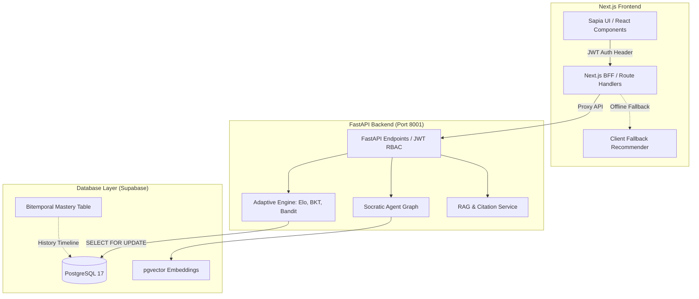

# Báo Cáo Đánh Giá Toàn Diện Dự Án EduGap (AI20K-C2-HE-01)

> **Tài liệu đánh giá hệ thống (Project Evaluation Report)**
> **Ngày lập:** 2026-06-29
> **Đối tượng đánh giá:** Hệ thống Gia sư AI Thích ứng EduGap (Next.js Frontend & FastAPI Backend)

---

## 1. Tổng Quan Ý Tưởng & Giá Trị Sư Phạm (Educational Value)

EduGap giải quyết triệt để ba bài toán cốt lõi của EdTech hiện đại: **Giảng viên quá tải**, **Bài tập không cá nhân hóa**, và **Học sinh lạm dụng AI để chép giải**.

### Điểm sáng Sư phạm:
*   **Vùng Phát triển Gần nhất (ZPD - Zone of Proximal Development):** Việc đặt mục tiêu tỷ lệ làm đúng ở ngưỡng **70% - 75%** là một lựa chọn tối ưu dựa trên lý thuyết tâm lý học giáo dục của Vygotsky. Ngưỡng này đủ thử thách để giữ học viên tập trung (Flow state) nhưng không quá khó để gây nản lòng.
*   **Tone Socratic & Guardrails:** Cơ chế chặn tuyệt đối mã nguồn/đáp án trực tiếp, thay vào đó sử dụng gợi ý gián tiếp (Scaffolding) thông qua 3 cấp độ gợi ý (Hint Levels) giúp định hướng người học tự chủ tư duy.
*   **Khung Kiến thức Tương thích (ZPD + Mastery):** Sử dụng các mô hình đo lường năng lực chuẩn hóa (Elo + BKT) thay thế cho việc đếm phần trăm hoàn thành bài học truyền thống.

---

## 2. Đánh Giá Kiến Trúc Kỹ Thuật (Technical Architecture)

Kiến trúc hệ thống của EduGap được xây dựng theo mô hình phân lớp rõ ràng và có tính dự phòng cao:

### Ưu điểm kiến trúc:
1.  **BFF & Static Fallback:** Next.js BFF (Backend-for-Frontend) Proxy có cơ chế tự phục hồi (static mock fallback). Khi backend FastAPI hoặc database bị offline, Client vẫn có thể tải các câu hỏi tĩnh để học viên tiếp tục làm bài không bị gián đoạn.
2.  **pgvector Integration:** Việc gộp Vector Store trực tiếp vào PostgreSQL qua `pgvector` thay vì dùng các DB Vector rời (như Pinecone/Chroma) giúp giảm tối đa độ phức tạp vận hành, đồng thời cho phép thực hiện các truy vấn `JOIN` lấy metadata slide siêu tốc.
3.  **Pessimistic Locking:** Sử dụng `SELECT FOR UPDATE` trong các giao dịch ghi nhận kết quả bài làm để chặn race condition khi người dùng click submit liên tục.
4.  **Bitemporal Mastery History:** Hỗ trợ lưu trữ lịch sử tiến hóa năng lực học sinh dạng dải thời gian bitemporal (valid_time và transaction_time) giúp thực hiện truy vấn du hành thời gian (Time-Travel query) để vẽ biểu đồ năng lực chính xác theo từng mốc quá khứ.

---

## 3. Phân Tích Sâu Bộ Máy Thích Ứng & Toán Học (Adaptive Engine)

Hệ thống toán học của EduGap là sự kết hợp nhuần nhuyễn giữa đo lường tĩnh (IRT), ước lượng thời gian thực (Elo, BKT) và học máy tăng cường (Contextual Bandit):

### 3.1. Phép cập nhật Elo Kép (Dual Elo Update)
$$P(\text{correct}) = \frac{1}{1 + 10^{\frac{d - \theta}{400}}}$$
*   **Nhận xét:** Việc cập nhật đồng thời cả năng lực học sinh ($\theta$) và độ khó câu hỏi ($d$) sau mỗi lượt làm bài giúp ngân hàng đề tự hiệu chuẩn (self-calibration) liên tục.
*   **Cơ chế Hint Discount:** Khấu trừ Elo nhận được khi lạm dụng gợi ý:
    $$\text{Discount}_{\text{hint}} = \max(0.1, 1.0 - 0.3 \times \text{hint\_count})$$
    Đây là một luật heuristics thực tế rất tốt để phạt hành vi lười suy nghĩ của học viên.

### 3.2. Bayesian Knowledge Tracing (BKT)
Ước lượng liên tục xác suất nắm vững kiến thức $P(L)$ dựa trên HMM:
*   **Nhận xét:** Việc áp dụng BKT cho từng concept giúp định vị chính xác lỗ hổng kiến thức. Hệ thống hỗ trợ chấm điểm một phần (Partial Credit Interpolation) cho bài tự luận giúp BKT làm việc được với cả các câu hỏi tự luận chứ không chỉ trắc nghiệm Đúng/Sai.
*   **Bẫy hấp thụ:** Việc clamp $P(L) \in [0.0001, 0.9999]$ ngăn chặn triệt để hiện tượng học viên bị kẹt vĩnh viễn ở trạng thái "mất gốc" hoặc "làm chủ".

### 3.3. Khuyến nghị ZPD qua LinUCB Contextual Bandit
*   **Ngữ cảnh (Context Vector):** Vector $x = [1.0, P(L)_{\text{BKT}}, \text{Normalized\_Elo}]$ liên kết chặt chẽ năng lực hiện tại của học viên với thuộc tính câu hỏi.
*   **Sherman-Morrison Formula:** Áp dụng công thức cập nhật nghịch đảo ma trận trực tiếp tức thời giúp giảm độ phức tạp tính toán xuống $O(d^2)$, đảm bảo thời gian gợi ý câu hỏi cực nhanh ($< 10\text{ms}$).
*   **Hàm Reward ZPD:** Phạt nặng những câu hỏi có độ khó lệch xa vùng ZPD lý thuyết (75% cơ hội làm đúng):
    $$\text{Reward} = \text{Score} \times (1.0 - 2.0 \times |P(\text{correct}) - 0.75|)$$

### 3.4. Đột phá Graphusion (Concept Graph)
*   **Cold Start:** Giải quyết bài toán khởi đầu lạnh khi sang ngày học mới bằng cách lan truyền năng lực xuôi (Forward Propagation) theo quan hệ `Prerequisite_of` trên đồ thị tri thức.
*   **Credit/Blame Assignment:** Lan truyền ngược (Backward Propagation) để phạt nhẹ các khái niệm cha khi học viên làm sai khái niệm nâng cao, giúp phát hiện lỗ hổng gốc rễ nhanh chóng.

---

## 4. Thiết Kế Giao Diện & Trải Nghiệm Người Dùng (UI/UX)

Hệ thống thiết kế Sapia đem lại một phong cách thẩm mỹ nổi bật, trẻ trung và độc bản:

*   **Sapia Identity:** Sự kết hợp của Cozy Avocado làm nền và Sapia Green tạo cảm giác thư giãn cho mắt khi học tập kéo dài.
*   **Tactile 3D Buttons:** Nút bấm nổi 3D có chiều sâu vật lý đem lại phản hồi xúc giác (tactile feedback) rất tốt khi tương tác.
*   **Interactive Socratic Widgets:**
    *   **Foxy Card tương tác:** Thẻ thông báo sai cam bo tròn mỏng, nhấp nháy chú cáo Sofi thu hút sự chú ý một cách tinh tế mà không gây phiền nhiễu không gian.
    *   **Accordion Terminal:** Stream tiến trình suy nghĩ của AI theo thời gian thực (RAG query, Python sandbox run, Critic checks) tạo tính minh bạch và cảm giác trực quan.
    *   **Horizontal Citation Badges:** Các nguồn slide dẫn chứng xếp ngang gọn gàng, tiết kiệm diện tích.
    *   **Slide Zoom Lightbox Modal:** Xem slide học liệu độ phân giải cao bằng hiệu ứng thu phóng spring mượt mà, giúp học viên đối chiếu kiến thức ngay tại chỗ.

---

## 5. Hiện Trạng Hệ Thống & Kiểm Thử (System Verification)

Hệ thống kiểm thử của EduGap cực kỳ đồ sộ và nghiêm ngặt với tổng cộng **331 test cases** tự động (trong đó 327 test cases hoạt động ngoại tuyến được đảm bảo đạt trạng thái 100% xanh lá trên CI runner) bao phủ toàn diện:
1.  **Unit Tests thuật toán:** Xác thực tính hội tụ của LinUCB, tính nhất quán của EloRating, BKT HMM equations và cơ chế Decay quên lãng.
2.  **API Integration Tests:** Xác thực hoạt động của endpoint `/chat`, `/submit`, `/recommend`, `/sync-mastery`, bitemporal time-travel và phân quyền bảo mật RBAC.
3.  **CI/CD Gated Pipeline:** Tích hợp tự động chạy Ruff linter, Pytest suite, quét lỗ hổng bảo mật Trivy Container, và kiểm định chất lượng RAG qua tập dữ liệu Golden Test Cases (`run_golden_eval.py`). Để đảm bảo kiểm định CI tự động từ xa luôn pass, ngân hàng câu hỏi `questions.json` và cấu trúc tri thức `knowledge_graph.json` đã được đưa vào hệ thống quản lý phiên bản (Git tracking).

---

## 6. Điểm Mạnh & Lợi Thế Cạnh Tranh (Strengths)

1.  **Toán học vững chắc:** Sự kết hợp giữa Elo, BKT và Contextual Bandit tạo nên một bộ máy thích ứng có cơ sở lý thuyết giáo dục và toán học vô cùng chặt chẽ, vượt trội hoàn toàn so với các hệ thống phân phối tĩnh.
2.  **Bảo mật & Nhất quán:** Phân quyền RBAC chặt chẽ, bảo vệ RLS trên Supabase và cơ chế Pessimistic Locking chống race condition tối đa.
3.  **Trải nghiệm người học tối ưu:** AI Tutor không bao giờ chép giải hộ học sinh, giao diện tương tác Socratic tự nhiên, trực quan hóa slide ngay trong phòng thi.
4.  **Hạ tầng CD tự động:** Pipeline CD tự động deploy backend Docker lên Render và frontend lên Vercel kèm theo cơ chế tự động ping giữ Render thức 24/7.

---

## 7. Khuyết Điểm & Roadmap Đề Xuất (Recommendations)

Mặc dù hệ thống đã rất hoàn thiện, tôi đề xuất 3 cải tiến tiếp theo cho sản phẩm:

### 🚀 Roadmap Giai Đoạn Tiếp Theo:
1.  **Tích hợp UI Biểu đồ Bitemporal History:**
    *   *Mục tiêu:* Sử dụng dữ liệu lịch sử từ endpoint `/api/v1/student/mastery/history` để vẽ biểu đồ tiến trình năng lực (Elo/BKT) của học viên theo dạng dòng thời gian, giúp họ thấy rõ sự tiến bộ qua các ngày.
2.  **Hiện thực hóa hệ thống Support Ticket & Mentor Takeover:**
    *   *Mục tiêu:* Khi học sinh gửi feedback tiêu cực (Unhelpful/Incorrect) về câu trả lời của AI Tutor quá 2 lần, hệ thống sẽ tự động tạo một `mentor_ticket`. Mentor có thể truy cập dashboard để xem toàn bộ lịch sử chat và trả lời trực tiếp cho học sinh thông qua hòm thư hỗ trợ (Student Inbox).
3.  **Tối ưu hóa Indexing Bitemporal Range Queries:**
    *   *Mục tiêu:* Khi số lượng attempts của sinh viên tăng lên hàng triệu bản ghi, các truy vấn dải thời gian `tstzrange` sẽ chậm đi. Cần lập các chỉ mục nâng cao (GiST/SP-GiST indexes) trên cột hiệu lực thời gian của bảng bitemporal để đảm bảo tốc độ phản hồi luôn dưới 10ms.
