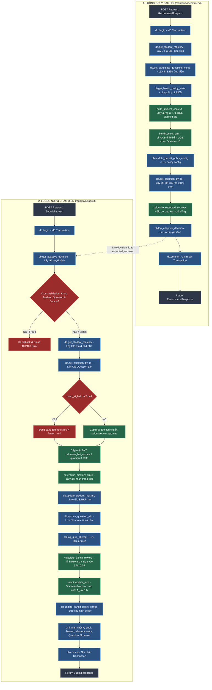

```mermaid
graph TD
    %% Styling
    classDef route fill:#2d3748,stroke:#4a5568,stroke-width:2px,color:#fff;
    classDef db fill:#2c5282,stroke:#3182ce,stroke-width:2px,color:#fff;
    classDef math fill:#276749,stroke:#38a169,stroke-width:2px,color:#fff;
    classDef check fill:#9b2c2c,stroke:#e53e3e,stroke-width:2px,color:#fff;

    subgraph RecommendFlow ["1. LUỒNG GỢI Ý CÂU HỎI (/adaptive/recommend)"]
        R1[POST Request: RecommendRequest]:::route --> R2[db.begin - Mở Transaction]:::db
        R2 --> R3[db.get_student_mastery - Lấy Elo & BKT học viên]:::db
        R3 --> R4[db.get_candidate_questions_meta - Lấy ID & Elo ứng viên]:::db
        R4 --> R5[db.get_bandit_policy_state - Lấy policy LinUCB]:::db
        R5 --> R6[build_student_context - Xây dựng X: 1.0, BKT, Sigmoid Elo]:::math
        R6 --> R7[bandit.select_arm - LinUCB tính điểm UCB chọn Question ID]:::math
        R7 --> R8[db.update_bandit_policy_config - Lưu policy config]:::db
        R8 --> R9[db.get_question_by_id - Lấy chi tiết câu hỏi được chọn]:::db
        R9 --> R10[calculate_expected_success - Elo dự báo xác suất đúng]:::math
        R10 --> R11[db.log_adaptive_decision - Lưu vết quyết định]:::db
        R11 --> R12[db.commit - Ghi nhận Transaction]:::db
        R12 --> R13[Return RecommendResponse]:::route
    end

    subgraph SubmitFlow ["2. LUỒNG NỘP & CHẤM ĐIỂM (/adaptive/submit)"]
        S1[POST Request: SubmitRequest]:::route --> S2[db.begin - Mở Transaction]:::db
        S2 --> S3[db.get_adaptive_decision - Lấy vết quyết định]:::db
        
        S3 --> S4{Cross-validation: Khớp Student, Question & Course?}:::check
        S4 -- NO / Fraud --> S5[db.rollback & Raise 400/403 Error]:::check
        
        S4 -- YES / Match --> S6[db.get_student_mastery - Lấy Old Elo & Old BKT]:::db
        S6 --> S7[db.get_question_by_id - Lấy Old Question Elo]:::db
        
        S7 --> S8{used_ai_help là True?}:::check
        S8 -- YES --> S9[Đóng băng Elo học sinh: K-factor = 0.0]:::check
        S8 -- NO --> S10[Cập nhật Elo tiêu chuẩn: calculate_elo_updates]:::math
        
        S9 & S10 --> S11[Cập nhật BKT: calculate_bkt_update & giới hạn 0.9999]:::math
        S11 --> S12[determine_mastery_state - Quy đổi nhãn trạng thái]:::math
        
        S12 --> S13[db.update_student_mastery - Lưu Elo & BKT mới]:::db
        S13 --> S14[db.update_question_elo - Lưu Elo mới của câu hỏi]:::db
        S14 --> S15[db.log_quiz_attempt - Lưu lịch sử quiz]:::db
        
        S15 --> S16[calculate_bandit_reward - Tính Reward Y dựa vào ZPD 0.75]:::math
        S16 --> S17[bandit.update_arm - Sherman-Morrison cập nhật A_inv & b]:::math
        S17 --> S18[db.update_bandit_policy_config - Lưu cấu hình policy]:::db
        
        S18 --> S19[Ghi nhận nhật ký audit: Reward, Mastery event, Question Elo event]:::db
        S19 --> S20[db.commit - Ghi nhận Transaction]:::db
        S20 --> S21[Return SubmitResponse]:::route
    end

    %% Connection between flows
    R11 -.->|Lưu decision_id & expected_success| S3
```